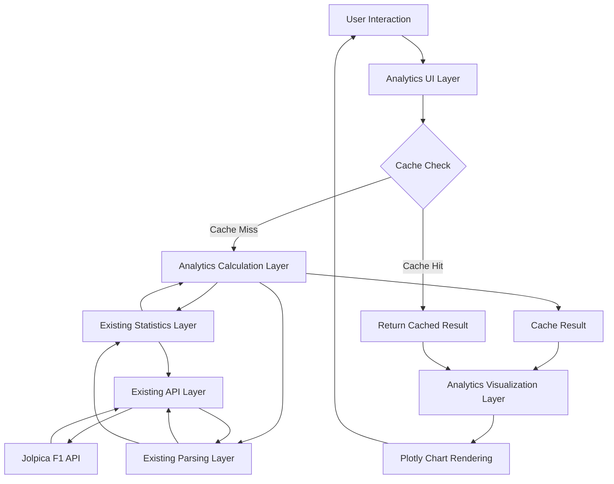

# Advanced Analytics Feature Design

## Overview

The Advanced Analytics feature extends the existing Streamlit F1 Dashboard with sophisticated statistical analysis capabilities. This feature adds a new "📊 Advanced Analytics" tab containing five analytical subsections: Driver Analytics, Team Analytics, Circuit Analytics, Comparative Analytics, and Statistical Insights.

The design maintains the existing single-file architecture (app.py), leverages the current caching strategy, and follows established patterns for data fetching, transformation, and visualization. All analytics calculations will be implemented as pure functions that transform cached API data into statistical insights, displayed through interactive Plotly visualizations.

### Key Design Principles

1. **Single-File Integration**: All new code integrates into app.py following existing organizational patterns
2. **Leverage Existing Functions**: Reuse fetch_* and parse_* functions wherever possible
3. **Consistent Caching**: Apply @st.cache_data decorators with 1-hour TTL to all analytics calculations
4. **Pure Calculation Functions**: Analytics functions are stateless transformations of input data
5. **Progressive Enhancement**: New tab doesn't affect existing functionality
6. **Responsive Visualization**: Charts adapt to viewport size using Plotly's responsive features

## Architecture

### High-Level Component Structure

```
app.py (single file)
├── [Existing] API Layer (fetch_* functions)
├── [Existing] Parsing Layer (parse_* functions)
├── [Existing] Statistics Layer (calculate_driver_statistics, calculate_constructor_statistics)
├── [NEW] Analytics Calculation Layer (calculate_analytics_* functions)
├── [NEW] Analytics Visualization Layer (create_analytics_* chart functions)
├── [NEW] Analytics UI Layer (render_analytics_* page functions)
└── [Modified] Main Navigation (add Advanced Analytics tab)
```

### Data Flow Architecture




### Integration Points with Existing Code

**Reused Functions:**
- `fetch_driver_standings(year)` - Driver list and championship data
- `fetch_constructor_standings(year)` - Team list and championship data
- `fetch_all_races(year)` - Race schedule and results
- `fetch_driver_race_results(driver_id, year)` - Individual driver race data
- `fetch_constructor_race_results(constructor_id, year)` - Team race data
- `parse_driver_standings(data)` - Standardized driver data format
- `calculate_driver_statistics(race_results)` - Base statistics (wins, podiums, DNFs)
- `get_team_color(team_name)` - Consistent color scheme

**New Functions to Add:**
- Analytics calculation functions (calculate_analytics_*)
- Analytics chart creation functions (create_analytics_*)
- Analytics page rendering functions (render_analytics_*)

## Components and Interfaces

### 1. Analytics Calculation Layer

This layer contains pure functions that transform API data into statistical metrics. All functions are decorated with @st.cache_data for performance.


#### Function Signatures

```python
@st.cache_data(ttl=3600)
def calculate_analytics_performance_trends(
    race_results: list,
    metric: str = "position"  # "position" or "points"
) -> pd.DataFrame:
    """
    Calculate performance trends over time.
    
    Args:
        race_results: List of race result dicts from API
        metric: Which metric to track ("position" or "points")
    
    Returns:
        DataFrame with columns: race_name, race_date, round, metric_value
    """
    pass

@st.cache_data(ttl=3600)
def calculate_analytics_consistency_score(
    race_results: list,
    min_races: int = 5
) -> Dict[str, float]:
    """
    Calculate consistency metrics for a driver.
    
    Args:
        race_results: List of race result dicts from API
        min_races: Minimum completed races required
    
    Returns:
        Dict with keys: consistency_score (0-100), std_dev, avg_position,
        completed_races, total_races
    """
    pass

@st.cache_data(ttl=3600)
def calculate_analytics_qualifying_race_correlation(
    race_results: list,
    min_races: int = 5
) -> Dict[str, Any]:
    """
    Calculate correlation between qualifying and race performance.
    
    Args:
        race_results: List of race result dicts from API
        min_races: Minimum races required for correlation
    
    Returns:
        Dict with keys: correlation_coefficient, avg_position_change,
        classification, scatter_data (list of {grid, finish} dicts)
    """
    pass

@st.cache_data(ttl=3600)
def calculate_analytics_dnf_rate(
    race_results: list,
    time_period: str = "season"  # "season", "career", "last_n"
) -> Dict[str, Any]:
    """
    Calculate DNF rate and categorization.
    
    Args:
        race_results: List of race result dicts from API
        time_period: Time period for calculation
    
    Returns:
        Dict with keys: dnf_percentage, dnf_count, total_races,
        dnf_causes (dict of cause: count)
    """
    pass

@st.cache_data(ttl=3600)
def calculate_analytics_points_per_race(
    race_results: list,
    exclude_dnf: bool = False
) -> Dict[str, float]:
    """
    Calculate points per race averages.
    
    Args:
        race_results: List of race result dicts from API
        exclude_dnf: Whether to exclude DNF races from calculation
    
    Returns:
        Dict with keys: points_per_race, total_points, races_counted
    """
    pass

@st.cache_data(ttl=3600)
def calculate_analytics_form_indicator(
    race_results: list,
    n_races: int = 5
) -> Dict[str, Any]:
    """
    Calculate recent form indicators.
    
    Args:
        race_results: List of race result dicts from API (most recent first)
        n_races: Number of recent races to analyze
    
    Returns:
        Dict with keys: avg_position, total_points, trend_direction,
        trend_slope, races_analyzed
    """
    pass

@st.cache_data(ttl=3600)
def calculate_analytics_team_reliability(
    constructor_results: list,
    season: str
) -> Dict[str, Any]:
    """
    Calculate team reliability metrics.
    
    Args:
        constructor_results: List of constructor race results from API
        season: Season year for context
    
    Returns:
        Dict with keys: both_finished_pct, avg_finish_position,
        mechanical_dnf_rate, total_races
    """
    pass

@st.cache_data(ttl=3600)
def calculate_analytics_constructor_development(
    constructor_results: list,
    window_size: int = 3
) -> pd.DataFrame:
    """
    Calculate rolling development trends for a constructor.
    
    Args:
        constructor_results: List of constructor race results from API
        window_size: Rolling window size for averages
    
    Returns:
        DataFrame with columns: race_name, round, rolling_avg_points,
        rolling_avg_position, trend_classification
    """
    pass

@st.cache_data(ttl=3600)
def calculate_analytics_driver_pairing(
    driver1_results: list,
    driver2_results: list,
    driver1_name: str,
    driver2_name: str
) -> Dict[str, Any]:
    """
    Calculate driver pairing effectiveness metrics.
    
    Args:
        driver1_results: Race results for first driver
        driver2_results: Race results for second driver
        driver1_name: Name of first driver
        driver2_name: Name of second driver
    
    Returns:
        Dict with keys: points_ratio, quali_gap, race_gap, balance_flag,
        driver1_points, driver2_points
    """
    pass

@st.cache_data(ttl=3600)
def calculate_analytics_circuit_performance(
    driver_results: list,
    circuit_name: str,
    min_appearances: int = 3
) -> Dict[str, Any]:
    """
    Calculate driver performance at a specific circuit.
    
    Args:
        driver_results: All race results for driver (filtered to circuit)
        circuit_name: Name of the circuit
        min_appearances: Minimum races for reliable statistics
    
    Returns:
        Dict with keys: avg_finish, win_rate, podium_rate, points_rate,
        appearances, low_sample_warning
    """
    pass

@st.cache_data(ttl=3600)
def calculate_analytics_circuit_difficulty(
    all_races_data: list,
    seasons: list
) -> pd.DataFrame:
    """
    Calculate difficulty ratings for all circuits.
    
    Args:
        all_races_data: Race results across multiple seasons
        seasons: List of season years included
    
    Returns:
        DataFrame with columns: circuit_name, dnf_rate, avg_position_change,
        difficulty_score (0-100), races_analyzed
    """
    pass

@st.cache_data(ttl=3600)
def calculate_analytics_multi_driver_comparison(
    drivers_data: Dict[str, list],
    metrics: list = None
) -> pd.DataFrame:
    """
    Compare multiple drivers across standardized metrics.
    
    Args:
        drivers_data: Dict mapping driver_name to race_results list
        metrics: List of metrics to compare (default: all)
    
    Returns:
        DataFrame with columns: driver_name, avg_finish, points_per_race,
        consistency_score, dnf_rate, [other metrics]
    """
    pass

@st.cache_data(ttl=3600)
def calculate_analytics_season_comparison(
    entity_results_by_season: Dict[str, list],
    entity_type: str = "driver"  # "driver" or "constructor"
) -> pd.DataFrame:
    """
    Compare performance across multiple seasons.
    
    Args:
        entity_results_by_season: Dict mapping season to race_results list
        entity_type: Type of entity being compared
    
    Returns:
        DataFrame with columns: season, avg_finish, total_points,
        points_per_race, consistency_score, yoy_change_pct
    """
    pass

@st.cache_data(ttl=3600)
def calculate_analytics_percentile_rankings(
    driver_results: list,
    all_drivers_results: Dict[str, list],
    season: str
) -> Dict[str, float]:
    """
    Calculate percentile rankings for a driver within the field.
    
    Args:
        driver_results: Race results for target driver
        all_drivers_results: Dict mapping all driver names to their results
        season: Season year for context
    
    Returns:
        Dict with keys: avg_finish_percentile, points_percentile,
        consistency_percentile, field_size
    """
    pass

@st.cache_data(ttl=3600)
def calculate_analytics_win_probability_by_grid(
    all_races_data: list,
    seasons: list
) -> pd.DataFrame:
    """
    Calculate win/podium/points probability by starting grid position.
    
    Args:
        all_races_data: Race results across multiple seasons
        seasons: List of season years included
    
    Returns:
        DataFrame with columns: grid_position, win_pct, podium_pct,
        points_pct, total_starts
    """
    pass

@st.cache_data(ttl=3600)
def calculate_analytics_championship_projection(
    current_standings: list,
    recent_form_data: Dict[str, list],
    remaining_races: int
) -> pd.DataFrame:
    """
    Project championship outcomes based on current form.
    
    Args:
        current_standings: Current driver standings
        recent_form_data: Dict mapping driver to recent race results
        remaining_races: Number of races left in season
    
    Returns:
        DataFrame with columns: driver_name, current_points, projected_points,
        optimistic_total, realistic_total, pessimistic_total
    """
    pass
```

### 2. Analytics Visualization Layer

This layer creates Plotly chart objects for analytics displays.


#### Chart Creation Functions

```python
def create_analytics_trend_chart(
    trend_data: pd.DataFrame,
    metric_name: str,
    driver_name: str,
    team_color: str = None
) -> go.Figure:
    """
    Create line chart for performance trends.
    
    Args:
        trend_data: DataFrame with race_name, round, metric_value columns
        metric_name: Display name for the metric
        driver_name: Driver name for title
        team_color: Optional team color for line
    
    Returns:
        Plotly Figure object with interactive line chart
    """
    pass

def create_analytics_scatter_chart(
    scatter_data: list,
    x_label: str,
    y_label: str,
    title: str,
    correlation: float = None
) -> go.Figure:
    """
    Create scatter plot with optional trend line.
    
    Args:
        scatter_data: List of dicts with x and y values
        x_label: X-axis label
        y_label: Y-axis label
        title: Chart title
        correlation: Optional correlation coefficient for trend line
    
    Returns:
        Plotly Figure object with scatter plot
    """
    pass

def create_analytics_radar_chart(
    comparison_data: pd.DataFrame,
    metrics: list,
    entity_names: list
) -> go.Figure:
    """
    Create radar chart for multi-entity comparison.
    
    Args:
        comparison_data: DataFrame with entity names and metric columns
        metrics: List of metric names to display
        entity_names: List of entity names (drivers/teams)
    
    Returns:
        Plotly Figure object with radar chart
    """
    pass

def create_analytics_grouped_bar_chart(
    comparison_data: pd.DataFrame,
    x_col: str,
    y_cols: list,
    title: str
) -> go.Figure:
    """
    Create grouped bar chart for metric comparison.
    
    Args:
        comparison_data: DataFrame with comparison data
        x_col: Column name for x-axis (categories)
        y_cols: List of column names for grouped bars
        title: Chart title
    
    Returns:
        Plotly Figure object with grouped bar chart
    """
    pass

def create_analytics_horizontal_percentile_chart(
    percentile_data: Dict[str, float],
    driver_name: str
) -> go.Figure:
    """
    Create horizontal bar chart showing percentile rankings.
    
    Args:
        percentile_data: Dict mapping metric names to percentile values
        driver_name: Driver name for title
    
    Returns:
        Plotly Figure object with horizontal bar chart
    """
    pass
```

### 3. Analytics UI Layer

This layer renders the analytics pages using Streamlit components.

#### Page Structure

```python
def render_analytics_main_page(year: str = "current"):
    """
    Main analytics page with subsection navigation.
    
    Displays:
    - Subsection selector (tabs or selectbox)
    - Conditional rendering of selected subsection
    """
    pass

def render_analytics_driver_page(year: str = "current"):
    """
    Driver analytics subsection.
    
    Controls:
    - Driver selector (dropdown)
    - Season selector (dropdown or multi-select)
    - Metric toggles (checkboxes)
    
    Displays:
    - Performance trends chart
    - Consistency metrics (st.metric cards)
    - Qualifying vs race correlation scatter plot
    - DNF rate analysis
    - Points per race comparison
    - Form indicator with trend arrows
    """
    pass

def render_analytics_team_page(year: str = "current"):
    """
    Team analytics subsection.
    
    Controls:
    - Constructor selector (dropdown)
    - Season selector (dropdown or multi-select)
    
    Displays:
    - Reliability metrics (st.metric cards)
    - Development trends chart
    - Driver pairing effectiveness comparison
    """
    pass

def render_analytics_circuit_page(year: str = "current"):
    """
    Circuit analytics subsection.
    
    Controls:
    - Circuit selector (dropdown)
    - Driver selector (optional, for circuit-specific performance)
    - Season range selector
    
    Displays:
    - Circuit difficulty ratings table
    - Driver performance at circuit (if driver selected)
    - Historical performance trends at circuit
    """
    pass

def render_analytics_comparative_page(year: str = "current"):
    """
    Comparative analytics subsection.
    
    Controls:
    - Multi-select for drivers (3-10)
    - Season selector (single or multi)
    - Comparison type selector (current season vs season-over-season)
    
    Displays:
    - Radar chart for multi-driver comparison
    - Grouped bar charts for direct metric comparison
    - Season-over-season line charts
    - Percentile rankings
    """
    pass

def render_analytics_statistical_page(year: str = "current"):
    """
    Statistical insights subsection.
    
    Controls:
    - Season range selector
    - Analysis type selector
    
    Displays:
    - Qualifying-race correlation analysis
    - Win probability by grid position chart
    - Championship projections (if mid-season)
    - Statistical summary cards
    """
    pass
```

### 4. Navigation Integration

Modify the main() function to add the Advanced Analytics tab:

```python
def main():
    # ... existing code ...
    
    # Tab configuration
    tabs = st.tabs([
        "🏁 Overview",
        "🏆 Driver Standings",
        "🏗️ Constructor Standings",
        "📅 Race Calendar",
        "🏁 All Races",
        "⚔️ Head-to-Head",
        "🎯 Qualifying Analysis",
        "📊 Championship Battle",
        "⏱️ Lap Times",
        "📊 Advanced Analytics"  # NEW TAB
    ])
    
    # ... existing tab rendering ...
    
    with tabs[9]:  # Advanced Analytics tab
        render_analytics_main_page(selected_year)
```

## Data Models

### Analytics Data Structures

 

#### Input Data Models (from API)

All analytics functions consume data from existing API fetch functions. The API returns JSON structures that are already handled by the existing codebase.

**Race Result Structure** (from fetch_driver_race_results):
```python
{
    "season": "2024",
    "round": "1",
    "raceName": "Bahrain Grand Prix",
    "date": "2024-03-02",
    "Results": [{
        "position": "1",
        "points": "25",
        "Driver": {
            "driverId": "verstappen",
            "givenName": "Max",
            "familyName": "Verstappen"
        },
        "Constructor": {
            "constructorId": "red_bull",
            "name": "Red Bull"
        },
        "grid": "1",
        "status": "Finished" | "Accident" | "Engine" | etc.
    }]
}
```

**Standings Structure** (from fetch_driver_standings):
```python
[{
    "position": "1",
    "points": "575",
    "wins": "19",
    "Driver": {
        "driverId": "verstappen",
        "givenName": "Max",
        "familyName": "Verstappen"
    },
    "Constructors": [{
        "constructorId": "red_bull",
        "name": "Red Bull"
    }]
}]
```

#### Output Data Models

**Performance Trends DataFrame**:
```python
pd.DataFrame({
    "race_name": ["Bahrain GP", "Saudi Arabian GP", ...],
    "race_date": ["2024-03-02", "2024-03-09", ...],
    "round": [1, 2, ...],
    "metric_value": [1, 2, ...]  # position or points
})
```

**Consistency Metrics Dict**:
```python
{
    "consistency_score": 85.5,  # 0-100 scale
    "std_dev": 2.3,
    "avg_position": 3.2,
    "completed_races": 18,
    "total_races": 22
}
```

**Qualifying-Race Correlation Dict**:
```python
{
    "correlation_coefficient": 0.75,
    "avg_position_change": -1.2,  # negative = gained positions
    "classification": "qualifying-dependent performer",
    "scatter_data": [
        {"grid": 1, "finish": 1},
        {"grid": 3, "finish": 2},
        ...
    ]
}
```

**DNF Rate Dict**:
```python
{
    "dnf_percentage": 15.5,
    "dnf_count": 3,
    "total_races": 22,
    "dnf_causes": {
        "Engine": 2,
        "Accident": 1
    }
}
```

**Form Indicator Dict**:
```python
{
    "avg_position": 2.4,
    "total_points": 98,
    "trend_direction": "improving",  # "improving", "declining", "stable"
    "trend_slope": -0.5,  # negative = improving positions
    "races_analyzed": 5
}
```

**Multi-Driver Comparison DataFrame**:
```python
pd.DataFrame({
    "driver_name": ["Verstappen", "Hamilton", "Leclerc"],
    "avg_finish": [1.5, 3.2, 4.1],
    "points_per_race": [22.5, 15.3, 13.8],
    "consistency_score": [92.3, 85.1, 78.5],
    "dnf_rate": [5.0, 10.0, 15.0]
})
```

**Win Probability DataFrame**:
```python
pd.DataFrame({
    "grid_position": [1, 2, 3, ..., 20],
    "win_pct": [45.2, 18.3, 8.1, ...],
    "podium_pct": [72.5, 55.3, 38.2, ...],
    "points_pct": [95.1, 88.7, 82.3, ...],
    "total_starts": [500, 500, 500, ...]
})
```

### Calculation Algorithms

#### Consistency Score Algorithm

```python
def calculate_consistency_score(positions: list) -> float:
    """
    Normalize standard deviation to 0-100 scale.
    Lower std_dev = higher consistency score.
    
    Formula: 100 - (std_dev * scaling_factor)
    Scaling factor chosen so std_dev of 10 = score of 0
    """
    if len(positions) < 5:
        return None
    
    std_dev = np.std(positions)
    consistency_score = max(0, 100 - (std_dev * 10))
    return round(consistency_score, 1)
```

#### Trend Classification Algorithm

```python
def classify_trend(slope: float, threshold: float = 0.3) -> str:
    """
    Classify trend direction based on linear regression slope.
    For positions: negative slope = improving (lower positions)
    
    Args:
        slope: Linear regression slope
        threshold: Minimum absolute slope for non-stable classification
    
    Returns:
        "improving", "declining", or "stable"
    """
    if abs(slope) < threshold:
        return "stable"
    return "improving" if slope < 0 else "declining"
```

#### Correlation Classification Algorithm

```python
def classify_correlation(correlation: float) -> str:
    """
    Classify driver performance based on quali-race correlation.
    
    Args:
        correlation: Pearson correlation coefficient
    
    Returns:
        Performance classification string
    """
    if correlation < -0.3:
        return "strong race performer"
    elif correlation > 0.7:
        return "qualifying-dependent performer"
    else:
        return "balanced performer"
```

#### Circuit Difficulty Score Algorithm

```python
def calculate_difficulty_score(dnf_rate: float, avg_pos_change: float) -> float:
    """
    Combine DNF rate and position volatility into difficulty score.
    
    Formula: (dnf_rate * 0.6) + (abs(avg_pos_change) * 4.0)
    Normalized to 0-100 scale.
    
    Args:
        dnf_rate: Percentage of DNFs at circuit
        avg_pos_change: Average position change from grid to finish
    
    Returns:
        Difficulty score (0-100)
    """
    raw_score = (dnf_rate * 0.6) + (abs(avg_pos_change) * 4.0)
    return min(100, max(0, raw_score))
```

## Caching Strategy

### Cache Configuration

All analytics calculation functions use Streamlit's @st.cache_data decorator with consistent TTL:

```python
@st.cache_data(ttl=3600)  # 1 hour cache
def calculate_analytics_*(...):
    pass
```

### Cache Key Strategy

Cache keys are automatically generated from function arguments:
- Driver ID / Constructor ID
- Season year(s)
- Metric type
- Time period parameters

Example cache key: `calculate_analytics_consistency_score(race_results=[...], min_races=5)`

### Cache Invalidation

Users can manually refresh cached data through:
1. Streamlit's built-in cache clearing (Ctrl+R or browser refresh)
2. Optional "Refresh Data" button in analytics UI
3. Automatic expiration after 1 hour TTL

### Performance Optimization

**Vectorized Operations**: Use pandas/numpy for calculations instead of loops
```python
# Good: Vectorized
positions = df['position'].values
std_dev = np.std(positions)

# Avoid: Iterative
std_dev = 0
for pos in positions:
    std_dev += (pos - mean) ** 2
```

**Lazy Loading**: Only fetch data when user selects specific analytics view
```python
if analytics_type == "Driver Performance":
    driver_results = fetch_driver_race_results(driver_id, year)
    # Only fetch when needed
```

**Progressive Rendering**: Display metrics as they're calculated
```python
with st.spinner("Calculating consistency metrics..."):
    consistency = calculate_analytics_consistency_score(results)
    st.metric("Consistency Score", consistency['consistency_score'])

with st.spinner("Calculating form indicators..."):
    form = calculate_analytics_form_indicator(results)
    st.metric("Recent Form", form['avg_position'])
```


## Correctness Properties

*A property is a characteristic or behavior that should hold true across all valid executions of a system-essentially, a formal statement about what the system should do. Properties serve as the bridge between human-readable specifications and machine-verifiable correctness guarantees.*

### Property 1: Performance Trends Calculation

*For any* driver's race results and metric type (position or points), calculating performance trends should produce a DataFrame with one row per race containing race metadata and the specified metric value.

**Validates: Requirements 1.1, 1.2, 1.5**

### Property 2: Consistency Score Calculation

*For any* set of race results with at least 5 completed races, the consistency score should be in the range 0-100, inversely proportional to standard deviation of finishing positions, and should exclude DNF results from the calculation.

**Validates: Requirements 2.1, 2.2, 2.3**

### Property 3: Qualifying-Race Correlation Calculation

*For any* driver's race results with sufficient data, the correlation analysis should produce a valid Pearson correlation coefficient between -1 and 1, an average position change value, and scatter plot data with matching grid and finish positions for each race.

**Validates: Requirements 3.1, 3.2**

### Property 4: Performance Trend Chart Structure

*For any* performance trend data, the generated Plotly figure should contain a line trace with hover data including race name, date, and metric values, and should have properly labeled axes.

**Validates: Requirements 1.3, 1.4**

### Property 5: Scatter Plot Chart Structure

*For any* correlation analysis data, the generated scatter plot should have grid position on x-axis, race result on y-axis, display the correlation coefficient, and include a trend line when correlation is provided.

**Validates: Requirements 3.3, 3.4**

### Property 6: DNF Rate Calculation

*For any* driver's race results and time period parameter, the DNF rate calculation should produce a percentage between 0-100, count DNFs correctly, categorize DNF causes when available, and work across different time period selections.

**Validates: Requirements 4.1, 4.2, 4.3**

### Property 7: Points Per Race Calculation

*For any* driver's race results, the points per race calculation should correctly divide total points by races counted, optionally exclude DNF races from the denominator, and work across different time period selections.

**Validates: Requirements 5.1, 5.2, 5.3**

### Property 8: Form Indicator Calculation

*For any* driver's recent race results, the form indicator should calculate average position and total points for the specified number of recent races, determine trend direction based on linear regression slope, and indicate the actual number of races analyzed.

**Validates: Requirements 6.1, 6.2, 6.3**

### Property 9: Team Reliability Calculation

*For any* constructor's race results, the reliability metrics should calculate the percentage of races where both drivers finished, average finishing position across both drivers, mechanical DNF rate, and work across different time period selections.

**Validates: Requirements 7.1, 7.2, 7.3, 7.5**

### Property 10: Constructor Development Trends

*For any* constructor's race results and window size, the development calculation should produce rolling averages for points and positions over the specified window, classify the overall trend direction based on slope, and generate one data point per race.

**Validates: Requirements 8.1, 8.2, 8.4**

### Property 11: Driver Pairing Effectiveness

*For any* two drivers' race results from the same team, the pairing analysis should calculate the points ratio between drivers, average qualifying position gap, average race finishing position gap, and flag pairings as imbalanced when the points ratio exceeds 70:30.

**Validates: Requirements 9.1, 9.2, 9.3**

### Property 12: Circuit-Specific Performance

*For any* driver's race results filtered to a specific circuit, the circuit performance calculation should produce average finishing position, win rate, podium rate, points rate, and include a low-sample-size warning when appearances are below the minimum threshold.

**Validates: Requirements 10.1, 10.2, 10.3**

### Property 13: Circuit Difficulty Rating

*For any* collection of race results across multiple circuits, the difficulty calculation should produce DNF rate, average position change, and a normalized difficulty score between 0-100 for each circuit.

**Validates: Requirements 11.1, 11.2, 11.3, 11.4**

### Property 14: Multi-Driver Comparison

*For any* collection of 3 or more drivers' race results, the comparison should retrieve data for all selected drivers and calculate standardized metrics (average finish, points per race, consistency score, DNF rate) for each driver.

**Validates: Requirements 12.1, 12.2**

### Property 15: Season-Over-Season Comparison

*For any* entity's (driver or team) race results across multiple seasons, the comparison should calculate key metrics for each season, compute year-over-year percentage changes, and normalize points when scoring systems differ between seasons.

**Validates: Requirements 13.1, 13.2, 13.4, 13.5**

### Property 16: Percentile Rankings

*For any* driver's race results and the full field's results for a season, the percentile calculation should produce rankings between 0-100 for average finishing position, points scored, and consistency score, calculated relative to drivers who competed in at least 50% of races.

**Validates: Requirements 14.1, 14.2, 14.3, 14.4**

### Property 17: Qualifying-Race Correlation Analysis

*For any* season's race results, the statistical analysis should calculate the Pearson correlation coefficient between grid position and race result, percentage of races won from pole, average position gain/loss, and optionally calculate correlations separately by circuit type when classification data is available.

**Validates: Requirements 15.1, 15.2, 15.3, 15.5**

### Property 18: Win Probability by Grid Position

*For any* collection of race results across selected time periods, the probability calculation should produce win percentage, podium percentage, and points-scoring percentage for each grid position (P1-P20), along with the total number of starts from each position.

**Validates: Requirements 16.1, 16.2, 16.3, 16.4**

### Property 19: Championship Projections

*For any* current standings and recent form data during an active season, the projection calculation should produce projected points for remaining races based on recent form, calculate projected final standings, and provide three scenarios (optimistic, realistic, pessimistic).

**Validates: Requirements 17.1, 17.2, 17.3**

### Property 20: Cache Key Generation

*For any* analytics calculation function call, the cache key should include all parameters that affect the result (driver ID, team ID, season, metric type, time period) to ensure different parameter combinations don't return incorrect cached results.

**Validates: Requirements 18.3, 18.4**

### Property 21: Chart Interactivity Configuration

*For any* analytics chart generated by the visualization layer, the Plotly figure should have hover tooltips enabled, zoom and pan functionality enabled, and legend-based series toggling enabled for multi-series charts.

**Validates: Requirements 19.1, 19.2, 19.3**

### Property 22: Error Handling and Messages

*For any* analytics calculation that encounters an error condition (API failure, insufficient data, missing data, incomplete data, rate limits), the system should display a user-friendly error or warning message that clearly indicates the specific issue and any available remediation.

**Validates: Requirements 20.1, 20.2, 20.3, 20.4, 20.5**

### Property 23: Session State Preservation

*For any* user selections made in analytics views (driver, team, season, metrics), navigating between related analytics subsections should preserve those selections in session state.

**Validates: Requirements 21.4**

### Property 24: URL State Round-Trip

*For any* analytics view configuration (selected drivers, seasons, metrics), encoding the state into a shareable URL and then decoding that URL should restore the exact same view configuration.

**Validates: Requirements 23.3, 23.4**

### Property 25: Export Metadata Inclusion

*For any* exported analytics file (chart PNG or data CSV), the export should include attribution and data source information indicating the data comes from the Jolpica F1 API.

**Validates: Requirements 23.5**

### Property 26: Input Data Validation

*For any* analytics calculation, the function should validate that required input fields contain no null values, denominators in percentage calculations are non-zero, and variables in correlation calculations have sufficient variance (standard deviation > 0), and should display appropriate error messages when validation fails.

**Validates: Requirements 25.1, 25.2, 25.3, 25.4**


## Error Handling

### Error Categories and Handling Strategies

#### 1. API Errors

**Scenario**: Jolpica F1 API is unavailable or returns error responses

**Handling**:
```python
def fetch_analytics_data(driver_id: str, year: str) -> Optional[list]:
    try:
        results = fetch_driver_race_results(driver_id, year)
        if results is None:
            st.error(f"Unable to retrieve race data for {driver_id} in {year}. "
                    "The API may be temporarily unavailable. Please try again later.")
            return None
        return results
    except Exception as e:
        st.error(f"Error fetching data: {str(e)}")
        return None
```

#### 2. Insufficient Data Errors

**Scenario**: User selects parameters that result in too few data points for meaningful analysis

**Handling**:
```python
def calculate_analytics_consistency_score(race_results: list, min_races: int = 5):
    completed_races = [r for r in race_results if r['status'] == 'Finished']
    
    if len(completed_races) < min_races:
        st.warning(f"Insufficient data: {len(completed_races)} completed races found. "
                  f"Minimum {min_races} races required for consistency analysis.")
        return None
    
    # Proceed with calculation
    ...
```

#### 3. Missing Data Errors

**Scenario**: Expected data fields are missing from API responses

**Handling**:
```python
def calculate_analytics_qualifying_race_correlation(race_results: list):
    valid_results = []
    missing_count = 0
    
    for result in race_results:
        if 'grid' in result and 'position' in result:
            valid_results.append(result)
        else:
            missing_count += 1
    
    if missing_count > 0:
        st.info(f"Note: {missing_count} races excluded due to missing qualifying or race data.")
    
    if len(valid_results) < 5:
        st.warning("Insufficient complete data for correlation analysis.")
        return None
    
    # Proceed with calculation
    ...
```

#### 4. Validation Errors

**Scenario**: Input data fails validation checks

**Handling**:
```python
def validate_analytics_input(data: list, required_fields: list) -> bool:
    if not data:
        st.error("No data provided for analysis.")
        return False
    
    for item in data:
        for field in required_fields:
            if field not in item or item[field] is None:
                st.error(f"Invalid data: missing required field '{field}'.")
                return False
    
    return True
```

#### 5. Calculation Errors

**Scenario**: Mathematical operations fail (division by zero, invalid correlation)

**Handling**:
```python
def safe_divide(numerator: float, denominator: float, default: float = 0.0) -> float:
    """Safely perform division with zero-denominator handling."""
    if denominator == 0:
        return default
    return numerator / denominator

def safe_correlation(x: list, y: list) -> Optional[float]:
    """Safely calculate correlation with variance checking."""
    if len(x) < 2 or len(y) < 2:
        return None
    
    if np.std(x) == 0 or np.std(y) == 0:
        st.warning("Cannot calculate correlation: one or both variables have zero variance.")
        return None
    
    return np.corrcoef(x, y)[0, 1]
```

#### 6. Rate Limit Errors

**Scenario**: API rate limits are exceeded

**Handling**:
```python
def handle_rate_limit_error():
    st.error("API rate limit exceeded. Please wait a few minutes before trying again.")
    st.info("Tip: Use the cached data by refreshing the page, or try a different analysis.")
```

### Error Recovery Strategies

1. **Graceful Degradation**: Display partial results when some data is unavailable
2. **Cached Fallback**: Suggest using cached data when API is unavailable
3. **User Guidance**: Provide clear instructions on how to resolve errors
4. **Logging**: Log errors for debugging (using Streamlit's logging capabilities)
5. **Default Values**: Use sensible defaults when optional data is missing

### User Feedback Patterns

**Success State**:
```python
st.success("✓ Analysis complete")
```

**Loading State**:
```python
with st.spinner("Calculating performance trends..."):
    trends = calculate_analytics_performance_trends(results)
```

**Warning State**:
```python
st.warning("⚠ Limited data: Results based on only 3 races")
```

**Error State**:
```python
st.error("✗ Unable to load data. Please try again.")
```

**Info State**:
```python
st.info("ℹ Using cached data from 45 minutes ago")
```

## Testing Strategy

### Dual Testing Approach

The advanced analytics feature requires both unit testing and property-based testing for comprehensive coverage:

- **Unit tests**: Verify specific examples, edge cases, and error conditions
- **Property tests**: Verify universal properties across all inputs
- Both approaches are complementary and necessary

### Unit Testing

Unit tests focus on specific scenarios and edge cases that demonstrate correct behavior.

#### Test Organization

```python
# test_analytics.py

import pytest
import pandas as pd
from app import (
    calculate_analytics_consistency_score,
    calculate_analytics_dnf_rate,
    calculate_analytics_form_indicator,
    # ... other analytics functions
)

class TestConsistencyScore:
    """Unit tests for consistency score calculation."""
    
    def test_perfect_consistency(self):
        """Test driver with identical finishing positions."""
        results = [
            {'position': '3', 'status': 'Finished'},
            {'position': '3', 'status': 'Finished'},
            {'position': '3', 'status': 'Finished'},
            {'position': '3', 'status': 'Finished'},
            {'position': '3', 'status': 'Finished'},
        ]
        score = calculate_analytics_consistency_score(results)
        assert score['consistency_score'] == 100.0
        assert score['std_dev'] == 0.0
    
    def test_excludes_dnf(self):
        """Test that DNF results are excluded from consistency calculation."""
        results = [
            {'position': '1', 'status': 'Finished'},
            {'position': '2', 'status': 'Finished'},
            {'position': '3', 'status': 'Finished'},
            {'position': 'R', 'status': 'Engine'},  # DNF
            {'position': '1', 'status': 'Finished'},
            {'position': '2', 'status': 'Finished'},
        ]
        score = calculate_analytics_consistency_score(results)
        assert score['completed_races'] == 5
        assert score['total_races'] == 6
    
    def test_insufficient_data(self):
        """Test handling of insufficient completed races."""
        results = [
            {'position': '1', 'status': 'Finished'},
            {'position': '2', 'status': 'Finished'},
            {'position': 'R', 'status': 'Accident'},
            {'position': 'R', 'status': 'Engine'},
        ]
        score = calculate_analytics_consistency_score(results, min_races=5)
        assert score is None

class TestDNFRate:
    """Unit tests for DNF rate calculation."""
    
    def test_no_dnfs(self):
        """Test driver with perfect reliability."""
        results = [
            {'status': 'Finished'},
            {'status': 'Finished'},
            {'status': 'Finished'},
        ]
        dnf_data = calculate_analytics_dnf_rate(results)
        assert dnf_data['dnf_percentage'] == 0.0
        assert dnf_data['dnf_count'] == 0
    
    def test_all_dnfs(self):
        """Test driver with all DNFs."""
        results = [
            {'status': 'Engine'},
            {'status': 'Accident'},
            {'status': 'Gearbox'},
        ]
        dnf_data = calculate_analytics_dnf_rate(results)
        assert dnf_data['dnf_percentage'] == 100.0
        assert dnf_data['dnf_count'] == 3
    
    def test_dnf_categorization(self):
        """Test DNF cause categorization."""
        results = [
            {'status': 'Engine'},
            {'status': 'Engine'},
            {'status': 'Accident'},
            {'status': 'Finished'},
        ]
        dnf_data = calculate_analytics_dnf_rate(results)
        assert dnf_data['dnf_causes']['Engine'] == 2
        assert dnf_data['dnf_causes']['Accident'] == 1

class TestFormIndicator:
    """Unit tests for form indicator calculation."""
    
    def test_improving_trend(self):
        """Test detection of improving performance trend."""
        results = [
            {'position': '5', 'points': '10'},
            {'position': '4', 'points': '12'},
            {'position': '3', 'points': '15'},
            {'position': '2', 'points': '18'},
            {'position': '1', 'points': '25'},
        ]
        form = calculate_analytics_form_indicator(results)
        assert form['trend_direction'] == 'improving'
        assert form['trend_slope'] < 0  # Negative slope = improving positions
    
    def test_declining_trend(self):
        """Test detection of declining performance trend."""
        results = [
            {'position': '1', 'points': '25'},
            {'position': '2', 'points': '18'},
            {'position': '3', 'points': '15'},
            {'position': '4', 'points': '12'},
            {'position': '5', 'points': '10'},
        ]
        form = calculate_analytics_form_indicator(results)
        assert form['trend_direction'] == 'declining'
        assert form['trend_slope'] > 0  # Positive slope = declining positions
    
    def test_fewer_than_n_races(self):
        """Test handling when fewer races available than requested."""
        results = [
            {'position': '1', 'points': '25'},
            {'position': '2', 'points': '18'},
            {'position': '3', 'points': '15'},
        ]
        form = calculate_analytics_form_indicator(results, n_races=5)
        assert form['races_analyzed'] == 3
```

### Property-Based Testing

Property tests verify universal properties across randomly generated inputs using a property-based testing library.

#### Library Selection

**For Python/Streamlit**: Use **Hypothesis** library
```bash
pip install hypothesis
```

#### Property Test Configuration

All property tests should run a minimum of 100 iterations to ensure comprehensive input coverage.

#### Property Test Examples

```python
# test_analytics_properties.py

import pytest
from hypothesis import given, strategies as st, settings
from hypothesis.strategies import integers, floats, lists, text
import pandas as pd
from app import (
    calculate_analytics_consistency_score,
    calculate_analytics_performance_trends,
    calculate_analytics_dnf_rate,
)

# Custom strategies for generating race results
@st.composite
def race_result(draw):
    """Generate a random race result."""
    position = draw(st.one_of(
        st.integers(min_value=1, max_value=20).map(str),
        st.just('R')  # DNF
    ))
    status = draw(st.sampled_from([
        'Finished', 'Engine', 'Accident', 'Gearbox', 'Collision'
    ]))
    points = draw(st.integers(min_value=0, max_value=25).map(str))
    
    return {
        'position': position,
        'status': status,
        'points': points,
        'grid': draw(st.integers(min_value=1, max_value=20).map(str))
    }

@st.composite
def race_results_list(draw, min_size=5, max_size=25):
    """Generate a list of race results."""
    return draw(lists(race_result(), min_size=min_size, max_size=max_size))

# Property tests

@given(race_results_list())
@settings(max_examples=100)
def test_property_consistency_score_range(results):
    """
    Feature: advanced-analytics, Property 2: Consistency Score Calculation
    
    For any set of race results with at least 5 completed races,
    the consistency score should be in the range 0-100.
    """
    score = calculate_analytics_consistency_score(results, min_races=5)
    
    if score is not None:
        assert 0 <= score['consistency_score'] <= 100
        assert score['std_dev'] >= 0
        assert score['completed_races'] >= 5

@given(race_results_list())
@settings(max_examples=100)
def test_property_dnf_rate_percentage(results):
    """
    Feature: advanced-analytics, Property 6: DNF Rate Calculation
    
    For any driver's race results, the DNF rate should be a percentage
    between 0-100 and should correctly count DNFs.
    """
    dnf_data = calculate_analytics_dnf_rate(results)
    
    assert 0 <= dnf_data['dnf_percentage'] <= 100
    assert dnf_data['dnf_count'] >= 0
    assert dnf_data['dnf_count'] <= dnf_data['total_races']
    
    # Verify percentage calculation
    expected_pct = (dnf_data['dnf_count'] / dnf_data['total_races']) * 100
    assert abs(dnf_data['dnf_percentage'] - expected_pct) < 0.01

@given(race_results_list(), st.sampled_from(['position', 'points']))
@settings(max_examples=100)
def test_property_performance_trends_structure(results, metric):
    """
    Feature: advanced-analytics, Property 1: Performance Trends Calculation
    
    For any driver's race results and metric type, calculating performance
    trends should produce a DataFrame with one row per race.
    """
    trends = calculate_analytics_performance_trends(results, metric=metric)
    
    assert isinstance(trends, pd.DataFrame)
    assert len(trends) == len(results)
    assert 'race_name' in trends.columns
    assert 'round' in trends.columns
    assert 'metric_value' in trends.columns

@given(
    lists(race_result(), min_size=10, max_size=10),
    integers(min_value=3, max_value=5)
)
@settings(max_examples=100)
def test_property_rolling_window_size(results, window_size):
    """
    Feature: advanced-analytics, Property 10: Constructor Development Trends
    
    For any constructor's race results and window size, the development
    calculation should produce rolling averages with correct window size.
    """
    from app import calculate_analytics_constructor_development
    
    trends = calculate_analytics_constructor_development(results, window_size=window_size)
    
    # First (window_size - 1) rows should have NaN for rolling averages
    # Remaining rows should have valid rolling averages
    assert len(trends) == len(results)
    assert trends['rolling_avg_points'].notna().sum() == len(results) - window_size + 1

@given(race_results_list(), race_results_list())
@settings(max_examples=100)
def test_property_driver_pairing_ratio(driver1_results, driver2_results):
    """
    Feature: advanced-analytics, Property 11: Driver Pairing Effectiveness
    
    For any two drivers' race results, the points ratio should sum to 100%
    and correctly identify imbalanced pairings.
    """
    from app import calculate_analytics_driver_pairing
    
    pairing = calculate_analytics_driver_pairing(
        driver1_results, driver2_results,
        "Driver1", "Driver2"
    )
    
    # Points ratio should sum to approximately 100
    ratio_parts = pairing['points_ratio'].split(':')
    if len(ratio_parts) == 2:
        ratio_sum = float(ratio_parts[0]) + float(ratio_parts[1])
        assert abs(ratio_sum - 100) < 0.1
    
    # Imbalance flag should be set correctly
    if pairing['driver1_points'] + pairing['driver2_points'] > 0:
        driver1_pct = (pairing['driver1_points'] / 
                      (pairing['driver1_points'] + pairing['driver2_points'])) * 100
        if driver1_pct > 70 or driver1_pct < 30:
            assert pairing['balance_flag'] == 'imbalanced'

@given(lists(integers(min_value=1, max_value=20), min_size=5, max_size=20))
@settings(max_examples=100)
def test_property_percentile_range(positions):
    """
    Feature: advanced-analytics, Property 16: Percentile Rankings
    
    For any driver's results, percentile rankings should be between 0-100.
    """
    from app import calculate_analytics_percentile_rankings
    
    # Create mock results
    driver_results = [{'position': str(p)} for p in positions]
    all_drivers = {
        f"Driver{i}": [{'position': str(p)} for p in positions]
        for i in range(10)
    }
    
    percentiles = calculate_analytics_percentile_rankings(
        driver_results, all_drivers, "2024"
    )
    
    for key, value in percentiles.items():
        if key != 'field_size':
            assert 0 <= value <= 100
```

### Test Coverage Goals

- **Unit Test Coverage**: Minimum 80% code coverage for analytics functions
- **Property Test Coverage**: All 26 correctness properties must have corresponding property tests
- **Edge Case Coverage**: All edge cases identified in requirements must have unit tests
- **Error Handling Coverage**: All error conditions must have tests verifying appropriate messages

### Test Execution

```bash
# Run all tests
pytest test_analytics.py test_analytics_properties.py -v

# Run only unit tests
pytest test_analytics.py -v

# Run only property tests
pytest test_analytics_properties.py -v

# Run with coverage report
pytest --cov=app --cov-report=html
```

### Continuous Testing

- Run tests before committing changes
- Property tests provide confidence that analytics work across wide input ranges
- Unit tests catch specific regressions and edge cases
- Together, they ensure the analytics feature is robust and reliable


## Implementation Notes

### Code Organization in app.py

The single-file architecture requires careful organization. Add new analytics code in the following order within app.py:

```python
# app.py structure

# 1. Imports (existing)
import streamlit as st
import requests
import pandas as pd
import plotly.graph_objects as go
import numpy as np  # ADD for analytics calculations
from scipy import stats  # ADD for correlation calculations
from typing import Dict, List, Any, Optional
# ... existing imports ...

# 2. Constants (existing)
BASE_URL = "https://api.jolpi.ca/ergast/f1"
# ... existing constants ...

# 3. Existing API Layer Functions
# fetch_with_retry()
# fetch_latest_race()
# fetch_driver_standings()
# ... all existing fetch_* functions ...

# 4. Existing Parsing Layer Functions
# parse_race_results()
# parse_driver_standings()
# ... all existing parse_* functions ...

# 5. Existing Statistics Layer Functions
# calculate_driver_statistics()
# calculate_constructor_statistics()
# ... existing calculate_* functions ...

# 6. NEW: Analytics Calculation Layer
# Add all calculate_analytics_* functions here
@st.cache_data(ttl=3600)
def calculate_analytics_performance_trends(...):
    pass

@st.cache_data(ttl=3600)
def calculate_analytics_consistency_score(...):
    pass

# ... all other analytics calculation functions ...

# 7. Existing Visualization Layer Functions
# create_horizontal_bar_chart()
# create_championship_progression_chart()
# ... existing create_* functions ...

# 8. NEW: Analytics Visualization Layer
# Add all create_analytics_* functions here
def create_analytics_trend_chart(...):
    pass

def create_analytics_scatter_chart(...):
    pass

# ... all other analytics chart functions ...

# 9. Existing UI Layer Functions
# render_overview_page()
# render_driver_standings_page()
# ... all existing render_* functions ...

# 10. NEW: Analytics UI Layer
# Add all render_analytics_* functions here
def render_analytics_main_page(year: str = "current"):
    pass

def render_analytics_driver_page(year: str = "current"):
    pass

# ... all other analytics page functions ...

# 11. Main Function (modify to add new tab)
def main():
    # ... existing setup code ...
    
    tabs = st.tabs([
        "🏁 Overview",
        "🏆 Driver Standings",
        "🏗️ Constructor Standings",
        "📅 Race Calendar",
        "🏁 All Races",
        "⚔️ Head-to-Head",
        "🎯 Qualifying Analysis",
        "📊 Championship Battle",
        "⏱️ Lap Times",
        "📊 Advanced Analytics"  # NEW
    ])
    
    # ... existing tab rendering ...
    
    with tabs[9]:  # NEW
        render_analytics_main_page(selected_year)

if __name__ == "__main__":
    main()
```

### Incremental Implementation Strategy

Implement analytics features in phases to manage complexity:

**Phase 1: Core Infrastructure**
1. Add analytics calculation helper functions (safe_divide, safe_correlation, etc.)
2. Implement basic analytics calculation functions (performance trends, consistency)
3. Create basic chart functions (trend chart, scatter chart)
4. Add main analytics page with subsection navigation

**Phase 2: Driver Analytics**
1. Implement all driver-specific calculation functions
2. Create driver analytics page with all visualizations
3. Add unit tests for driver analytics

**Phase 3: Team Analytics**
1. Implement team-specific calculation functions
2. Create team analytics page with visualizations
3. Add unit tests for team analytics

**Phase 4: Circuit and Comparative Analytics**
1. Implement circuit and comparative calculation functions
2. Create circuit and comparative analytics pages
3. Add unit tests for these features

**Phase 5: Statistical Insights**
1. Implement statistical calculation functions
2. Create statistical insights page
3. Add property-based tests for all analytics

**Phase 6: Polish and Optimization**
1. Add export functionality
2. Implement URL state sharing
3. Optimize performance for large datasets
4. Add comprehensive error handling

### Key Implementation Considerations

#### 1. Data Type Handling

API returns strings for numeric values - convert carefully:

```python
def safe_int(value: Any, default: int = 0) -> int:
    """Safely convert value to int."""
    try:
        if value == 'R' or value == 'W':  # DNF indicators
            return default
        return int(value)
    except (ValueError, TypeError):
        return default

def safe_float(value: Any, default: float = 0.0) -> float:
    """Safely convert value to float."""
    try:
        return float(value)
    except (ValueError, TypeError):
        return default
```

#### 2. DNF Detection

Multiple status values indicate DNF:

```python
def is_dnf(status: str) -> bool:
    """Check if race status indicates DNF."""
    dnf_statuses = [
        'Accident', 'Engine', 'Gearbox', 'Transmission', 'Clutch',
        'Hydraulics', 'Electrical', 'Collision', 'Spun off', 'Retired',
        'Mechanical', 'Brakes', 'Suspension', 'Fuel pressure', 'Overheating'
    ]
    return status in dnf_statuses or status.startswith('+')
```

#### 3. Team Color Consistency

Reuse existing get_team_color() function for consistent styling:

```python
# In chart creation functions
team_color = get_team_color(team_name)
fig.add_trace(go.Scatter(
    ...,
    line=dict(color=team_color, width=3)
))
```

#### 4. Responsive Layout Patterns

Use Streamlit columns for responsive layouts:

```python
# Desktop: 3 columns, Mobile: stacks automatically
col1, col2, col3 = st.columns(3)

with col1:
    st.metric("Consistency Score", consistency['consistency_score'])

with col2:
    st.metric("Avg Position", consistency['avg_position'])

with col3:
    st.metric("Completed Races", consistency['completed_races'])
```

#### 5. Progress Indicators

Show progress for long calculations:

```python
with st.spinner("Analyzing performance trends..."):
    trends = calculate_analytics_performance_trends(results)

st.success("Analysis complete!")
```

### Performance Optimization Tips

1. **Vectorize with Pandas/NumPy**: Avoid Python loops for calculations
2. **Cache Aggressively**: Use @st.cache_data on all calculation functions
3. **Lazy Load Data**: Only fetch data when user selects specific views
4. **Limit API Calls**: Reuse fetched data across multiple calculations
5. **Progressive Rendering**: Display results as they're calculated

### Testing During Development

Run tests frequently during implementation:

```bash
# After implementing each calculation function
pytest test_analytics.py::TestConsistencyScore -v

# After completing a feature area
pytest test_analytics.py::TestDriverAnalytics -v

# Before committing
pytest test_analytics.py test_analytics_properties.py --cov=app
```

### Deployment Considerations

1. **Dependencies**: Add scipy and hypothesis to requirements.txt
2. **Cache Warming**: Consider pre-loading common analytics on app startup
3. **Monitoring**: Track analytics page usage and performance
4. **Documentation**: Update README with analytics feature description

### Future Enhancements

Potential improvements for future iterations:

1. **Machine Learning Predictions**: Use historical data for race outcome predictions
2. **Advanced Visualizations**: 3D plots, animated charts, heatmaps
3. **Custom Metrics**: Allow users to define custom performance metrics
4. **Data Export**: Bulk export of analytics data for external analysis
5. **Comparison Presets**: Save and load comparison configurations
6. **Mobile App**: Native mobile interface for analytics
7. **Real-time Updates**: Live analytics during race weekends
8. **Social Sharing**: Share analytics insights on social media

## Summary

This design document provides a comprehensive blueprint for implementing advanced analytics features in the Streamlit F1 Dashboard. The design:

- Maintains the existing single-file architecture
- Leverages existing API and parsing functions
- Follows established patterns for caching and visualization
- Provides 26 testable correctness properties
- Includes comprehensive error handling
- Specifies both unit and property-based testing strategies
- Offers clear implementation guidance

The analytics feature will significantly enhance the dashboard's analytical capabilities while maintaining code quality, performance, and user experience standards.

