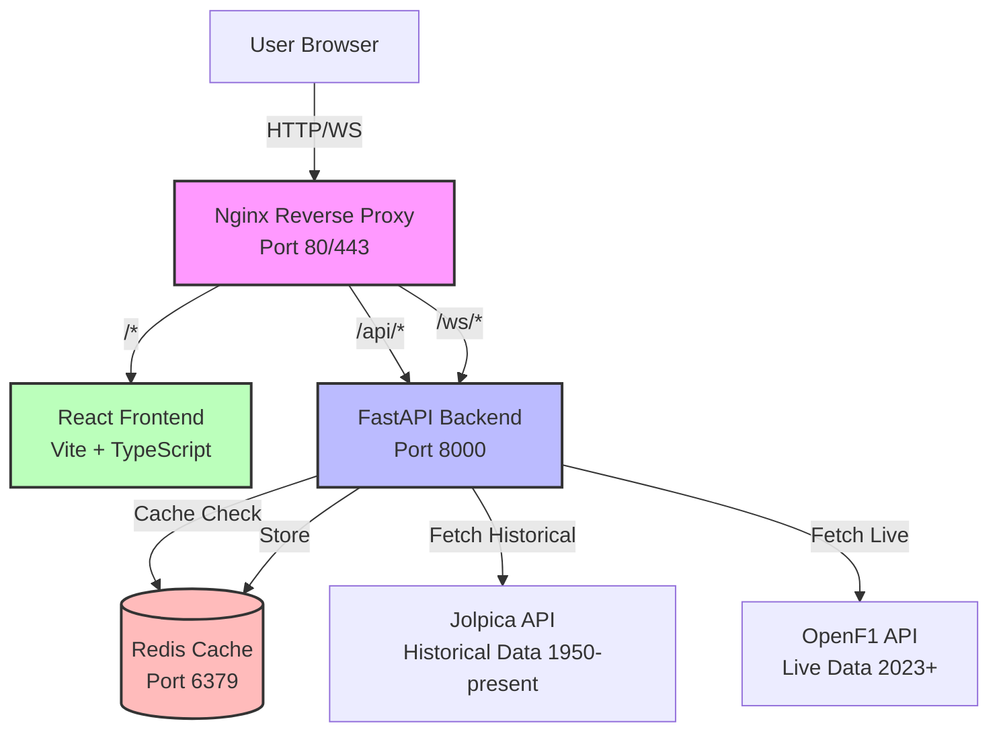
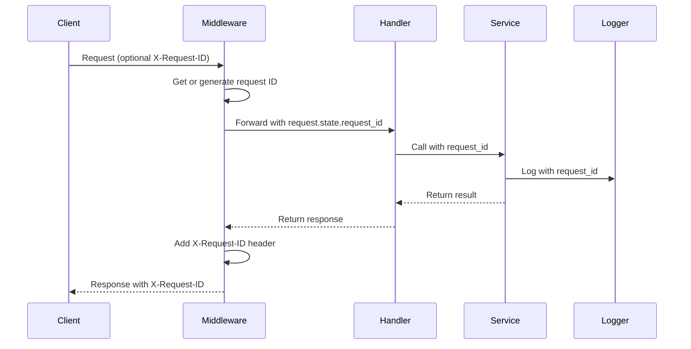
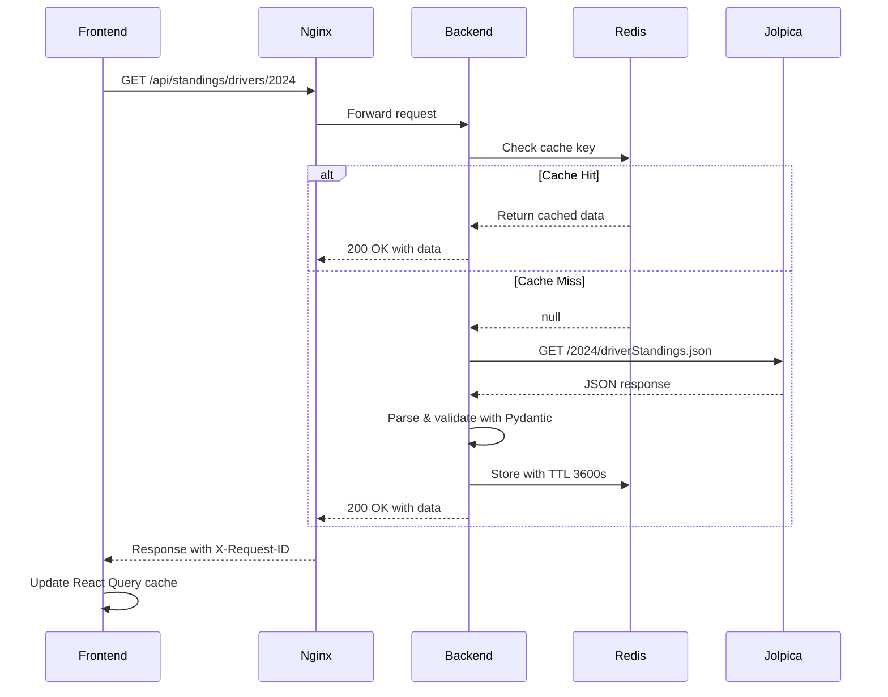
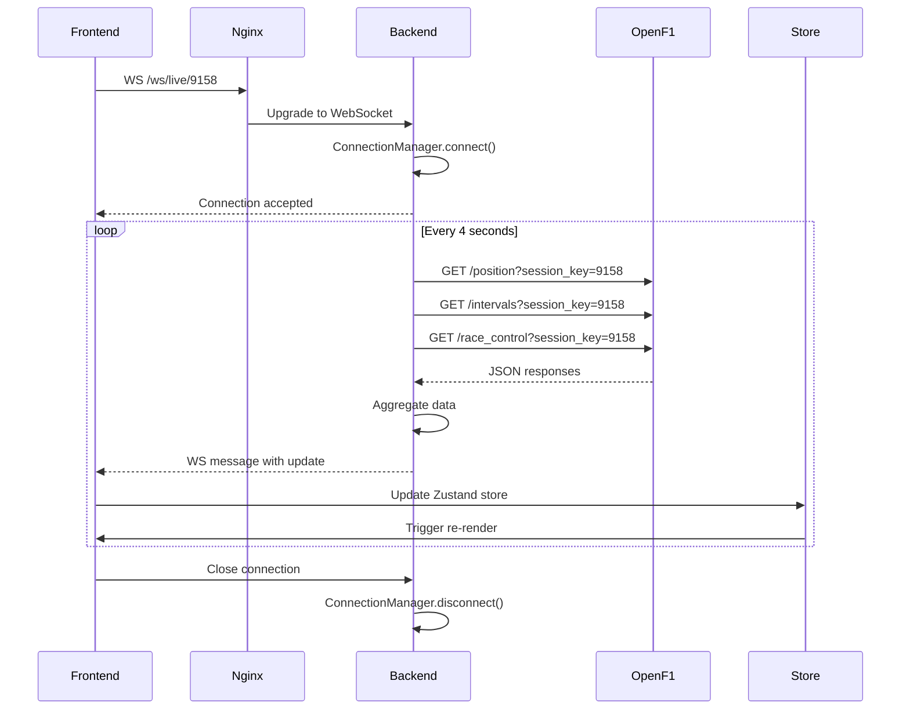
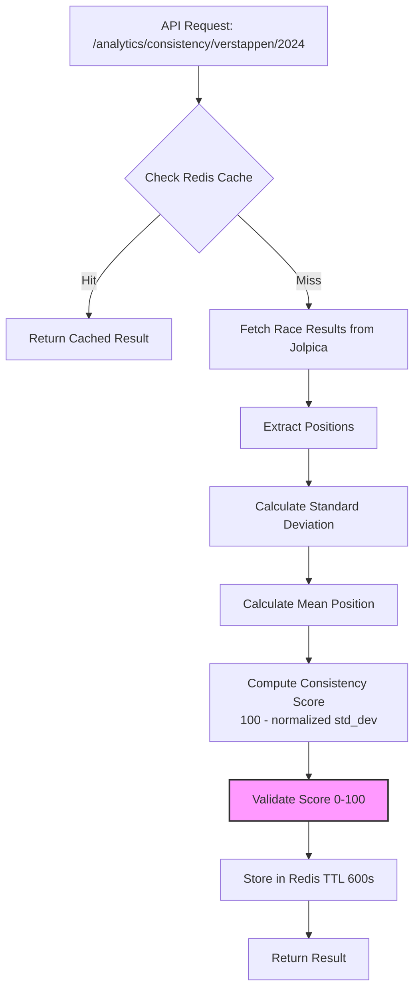
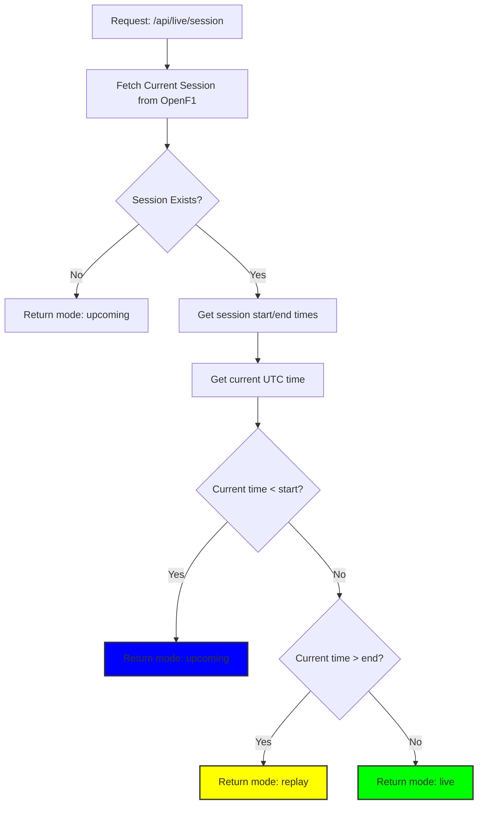
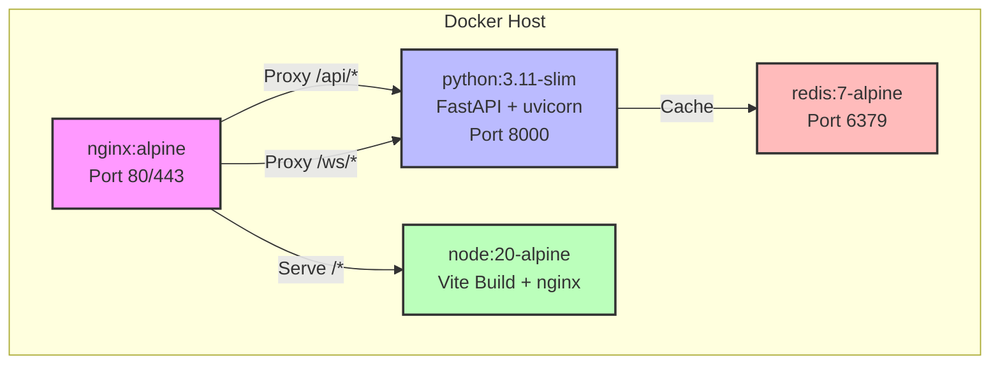
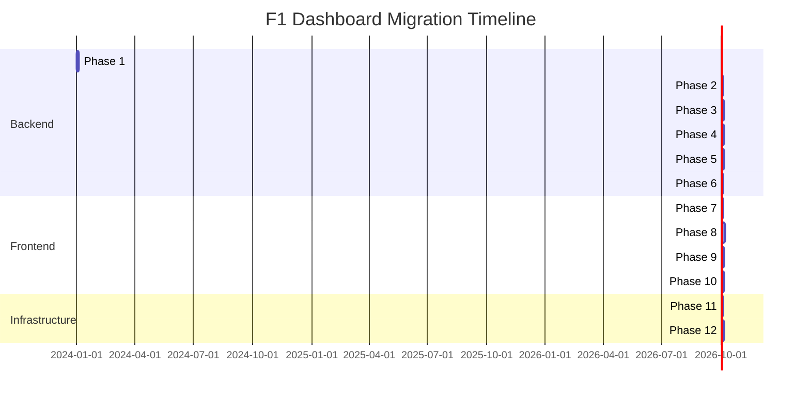

# Design Document: F1 Dashboard Migration to FastAPI + React

## Overview

This design document specifies the technical architecture for migrating the existing Streamlit-based F1 Dashboard to a modern, production-ready system with a FastAPI backend and React frontend. The migration transforms a monolithic application into a scalable, 4-tier architecture with separated concerns, real-time capabilities, and enhanced performance through caching and containerization.

### Current State

The existing application is a Streamlit monolith (app.py, ~5200 lines) that:
- Fetches historical F1 data from Jolpica API (1950-present)
- Calculates 15 different analytics metrics
- Renders 11 pages with interactive Plotly charts
- Handles all concerns (data fetching, business logic, presentation) in a single file

### Target State

The new architecture will be a distributed system with:
- **Backend API**: FastAPI server handling data fetching, caching, analytics, and WebSocket connections
- **Frontend App**: React + TypeScript SPA with modern state management and real-time updates
- **Redis Cache**: In-memory caching layer reducing external API load by 80%+
- **Nginx Proxy**: Reverse proxy for routing, compression, and rate limiting
- **Docker Containers**: Containerized deployment with orchestration via Docker Compose

### Key Design Goals

1. **Separation of Concerns**: Clear boundaries between data layer, business logic, and presentation
2. **Real-Time Capabilities**: WebSocket support for live race tracking (2023+ via OpenF1 API)
3. **Performance**: Redis caching, code splitting, virtual scrolling, connection pooling
4. **Maintainability**: Modular structure, type safety, comprehensive testing
5. **Production-Ready**: Containerization, logging, monitoring, error handling
6. **Feature Parity**: All existing Streamlit functionality preserved with identical outputs


## Architecture

### High-Level Architecture Diagram



### 4-Tier Architecture

1. **Presentation Tier (Frontend)**
   - React 18 + TypeScript + Vite
   - React Router for client-side routing
   - React Query for data fetching and caching
   - Zustand for global state management
   - Plotly.js for interactive charts
   - Tailwind CSS for styling

2. **Application Tier (Backend API)**
   - FastAPI with async/await
   - Pydantic for data validation
   - httpx for async HTTP clients
   - WebSocket support for real-time data
   - Request ID middleware for distributed tracing

3. **Caching Tier (Redis)**
   - In-memory key-value store
   - TTL-based expiration (3600s for historical, 600s for analytics)
   - JSON serialization for complex objects
   - Namespace-based key organization

4. **External APIs Tier**
   - Jolpica API: Historical F1 data (REST)
   - OpenF1 API: Real-time telemetry (REST + streaming)


## Components and Interfaces

### Backend Directory Structure

```
backend/
├── app/
│   ├── __init__.py
│   ├── main.py                 # FastAPI application, lifespan, middleware
│   ├── config.py               # Settings, environment variables
│   ├── routers/
│   │   ├── __init__.py
│   │   ├── standings.py        # Driver/constructor standings endpoints
│   │   ├── races.py            # Race calendar, results, qualifying, laps
│   │   ├── analytics.py        # 15 analytics endpoints
│   │   ├── live.py             # OpenF1 live data endpoints
│   │   └── ws.py               # WebSocket endpoints
│   ├── services/
│   │   ├── __init__.py
│   │   ├── jolpica.py          # Jolpica API client (7 functions)
│   │   ├── openf1.py           # OpenF1 API client (8 functions)
│   │   ├── analytics.py        # Analytics calculations (15 functions)
│   │   └── live.py             # Session mode logic, live data aggregation
│   ├── models/
│   │   ├── __init__.py
│   │   ├── standings.py        # DriverStanding, ConstructorStanding
│   │   ├── races.py            # Race, RaceResult, QualifyingResult, LapTime
│   │   ├── analytics.py        # Analytics response models
│   │   ├── live.py             # Position, Interval, RaceControl, Weather
│   │   └── common.py           # DriverInfo, ConstructorInfo, shared models
│   ├── cache/
│   │   ├── __init__.py
│   │   └── redis.py            # Redis client, cache decorator
│   ├── middleware/
│   │   ├── __init__.py
│   │   └── request_id.py       # Request ID middleware for tracing
│   └── utils/
│       ├── __init__.py
│       ├── helpers.py          # safe_int, safe_float, safe_divide, is_dnf
│       └── formatters.py       # format_driver_name, date formatting
├── tests/
│   ├── conftest.py             # Pytest fixtures
│   ├── test_services/
│   ├── test_routers/
│   ├── test_analytics_properties.py
│   └── test_cache.py
├── requirements.txt
├── Dockerfile
└── .env.example
```

### Frontend Directory Structure

```
frontend/
├── src/
│   ├── main.tsx                # App entry point, React Query setup
│   ├── App.tsx                 # Router configuration, error boundary
│   ├── api/
│   │   ├── client.ts           # Axios client with interceptors
│   │   ├── standings.ts        # Standings API calls
│   │   ├── races.ts            # Races API calls
│   │   ├── analytics.ts        # Analytics API calls
│   │   └── live.ts             # Live data API calls
│   ├── hooks/
│   │   ├── useWebSocket.ts     # WebSocket hook with reconnection
│   │   ├── useStandings.ts     # React Query hooks for standings
│   │   ├── useRaces.ts         # React Query hooks for races
│   │   ├── useAnalytics.ts     # React Query hooks for analytics
│   │   └── useLiveData.ts      # React Query + WebSocket for live data
│   ├── store/
│   │   ├── liveRaceStore.ts    # Zustand store for live race state
│   │   ├── sessionStore.ts     # Zustand store for session info
│   │   └── userPrefsStore.ts   # Zustand store for user preferences
│   ├── components/
│   │   ├── layout/
│   │   │   ├── Layout.tsx      # Main layout with nav
│   │   │   ├── Header.tsx
│   │   │   ├── Sidebar.tsx
│   │   │   └── Footer.tsx
│   │   ├── shared/
│   │   │   ├── LoadingSpinner.tsx
│   │   │   ├── ErrorMessage.tsx
│   │   │   ├── DataTable.tsx
│   │   │   └── YearSelector.tsx
│   │   ├── charts/
│   │   │   ├── HorizontalBarChart.tsx
│   │   │   ├── LineChart.tsx
│   │   │   ├── ScatterChart.tsx
│   │   │   ├── RadarChart.tsx
│   │   │   └── GroupedBarChart.tsx
│   │   └── live/
│   │       ├── PositionTracker.tsx
│   │       ├── IntervalDisplay.tsx
│   │       ├── RaceControlFeed.tsx
│   │       ├── WeatherWidget.tsx
│   │       └── SessionModeIndicator.tsx
│   ├── pages/
│   │   ├── OverviewPage.tsx
│   │   ├── DriverStandingsPage.tsx
│   │   ├── ConstructorStandingsPage.tsx
│   │   ├── CalendarPage.tsx
│   │   ├── RacesPage.tsx
│   │   ├── HeadToHeadPage.tsx
│   │   ├── QualifyingPage.tsx
│   │   ├── ChampionshipPage.tsx
│   │   ├── LapTimesPage.tsx
│   │   ├── AnalyticsPage.tsx
│   │   └── LiveTrackerPage.tsx
│   ├── types/
│   │   ├── standings.ts
│   │   ├── races.ts
│   │   ├── analytics.ts
│   │   └── live.ts
│   ├── utils/
│   │   ├── formatters.ts
│   │   └── constants.ts
│   └── styles/
│       └── index.css
├── tests/
│   ├── setup.ts
│   ├── mocks/
│   │   ├── handlers.ts         # MSW handlers
│   │   └── server.ts
│   └── components/
├── package.json
├── vite.config.ts
├── vitest.config.ts
├── Dockerfile
└── .env.example
```


### FastAPI Application Lifecycle

```python
# app/main.py
from contextlib import asynccontextmanager
from fastapi import FastAPI
from app.cache.redis import init_redis, close_redis
from app.middleware.request_id import RequestIDMiddleware
from app.routers import standings, races, analytics, live, ws

@asynccontextmanager
async def lifespan(app: FastAPI):
    # Startup
    await init_redis()
    logger.info("Redis connection initialized")
    yield
    # Shutdown
    await close_redis()
    logger.info("Redis connection closed")

app = FastAPI(
    title="F1 Dashboard API",
    version="2.0",
    lifespan=lifespan
)

# Middleware (order matters!)
app.add_middleware(RequestIDMiddleware)  # First for tracing
app.add_middleware(
    CORSMiddleware,
    allow_origins=settings.CORS_ORIGINS,
    allow_methods=["*"],
    allow_headers=["*"],
)

# Routers
app.include_router(standings.router, prefix="/api", tags=["standings"])
app.include_router(races.router, prefix="/api", tags=["races"])
app.include_router(analytics.router, prefix="/api", tags=["analytics"])
app.include_router(live.router, prefix="/api", tags=["live"])
app.include_router(ws.router, prefix="/ws", tags=["websocket"])

# Health check
@app.get("/health")
async def health_check():
    return {"status": "healthy", "version": "2.0"}
```

### Service Layer Organization

The service layer extracts all business logic from the Streamlit app:

**jolpica.py** - Historical data fetching (7 functions):
- `fetch_driver_standings(year: str, round: int = None) -> list[dict]`
- `fetch_constructor_standings(year: str, round: int = None) -> list[dict]`
- `fetch_race_schedule(year: str) -> list[dict]`
- `fetch_race_results(year: str, round: int) -> dict`
- `fetch_qualifying_results(year: str, round: int) -> dict`
- `fetch_lap_times(year: str, round: int) -> list[dict]`
- `fetch_driver_race_results(driver_id: str, year: str) -> list[dict]`

**analytics.py** - Analytics calculations (15 functions):
- `calculate_performance_trends(driver_id: str, year: str) -> dict`
- `calculate_consistency_score(driver_id: str, year: str) -> float`
- `calculate_dnf_rate(driver_id: str, year: str) -> float`
- `calculate_points_per_race(driver_id: str, year: str) -> float`
- `calculate_qualifying_race_correlation(driver_id: str, year: str) -> float`
- `calculate_form_indicator(driver_id: str, year: str, last_n: int = 5) -> dict`
- `calculate_team_reliability(constructor_id: str, year: str) -> dict`
- `calculate_constructor_development(constructor_id: str, year: str) -> dict`
- `calculate_driver_pairing(constructor_id: str, year: str) -> dict`
- `calculate_circuit_performance(circuit_id: str, year: str) -> dict`
- `calculate_circuit_difficulty(circuit_id: str, year: str) -> dict`
- `calculate_multi_driver_comparison(driver_ids: list[str], year: str) -> dict`
- `calculate_season_comparison(driver_id: str, years: list[str]) -> dict`
- `calculate_percentile_rankings(year: str) -> dict`
- `calculate_championship_projection(year: str) -> dict`

**openf1.py** - Live data fetching (8 functions):
- `fetch_current_session() -> dict`
- `fetch_session_drivers(session_key: str) -> list[dict]`
- `fetch_live_positions(session_key: str) -> list[dict]`
- `fetch_live_intervals(session_key: str) -> list[dict]`
- `fetch_live_stints(session_key: str) -> list[dict]`
- `fetch_live_pits(session_key: str) -> list[dict]`
- `fetch_live_weather(session_key: str) -> dict`
- `fetch_live_racecontrol(session_key: str) -> list[dict]`

**live.py** - Session mode logic:
- `determine_session_mode(session_info: dict) -> str`  # "live", "upcoming", "replay"
- `aggregate_live_data(session_key: str) -> dict`


### Router Organization

**standings.py**:
```python
@router.get("/standings/drivers/{year}", response_model=list[DriverStanding])
async def get_driver_standings(year: str, round: int = None)

@router.get("/standings/constructors/{year}", response_model=list[ConstructorStanding])
async def get_constructor_standings(year: str, round: int = None)
```

**races.py**:
```python
@router.get("/races/{year}", response_model=list[Race])
async def get_race_schedule(year: str)

@router.get("/races/{year}/{round}/results", response_model=RaceResult)
async def get_race_results(year: str, round: int)

@router.get("/races/{year}/{round}/qualifying", response_model=QualifyingResult)
async def get_qualifying_results(year: str, round: int)

@router.get("/races/{year}/{round}/laps", response_model=list[LapTime])
async def get_lap_times(year: str, round: int)
```

**analytics.py**:
```python
@router.get("/analytics/trends/{driver_id}/{year}")
async def get_performance_trends(driver_id: str, year: str)

@router.get("/analytics/consistency/{driver_id}/{year}")
async def get_consistency_score(driver_id: str, year: str)

@router.get("/analytics/form/{driver_id}/{year}")
async def get_form_indicator(driver_id: str, year: str, last_n: int = 5)

@router.get("/analytics/dnf/{driver_id}/{year}")
async def get_dnf_rate(driver_id: str, year: str)

@router.post("/analytics/compare")
async def compare_drivers(request: DriverComparisonRequest)

@router.get("/analytics/circuit/{circuit_id}")
async def get_circuit_performance(circuit_id: str, year: str)

@router.get("/analytics/projection/{year}")
async def get_championship_projection(year: str)
```

**live.py**:
```python
@router.get("/live/session", response_model=SessionInfo)
async def get_current_session()

@router.get("/live/drivers", response_model=list[Driver])
async def get_session_drivers(session_key: str)

@router.get("/live/positions", response_model=list[Position])
async def get_live_positions(session_key: str)

@router.get("/live/stints", response_model=list[Stint])
async def get_live_stints(session_key: str)

@router.get("/live/pits", response_model=list[PitStop])
async def get_live_pits(session_key: str)

@router.get("/live/weather", response_model=Weather)
async def get_live_weather(session_key: str)

@router.get("/live/racecontrol", response_model=list[RaceControlMessage])
async def get_race_control(session_key: str)

@router.get("/live/radio", response_model=list[TeamRadio])
async def get_team_radio(session_key: str)
```

**ws.py**:
```python
@router.websocket("/live/{session_key}")
async def websocket_live_race(websocket: WebSocket, session_key: str)

@router.websocket("/live")
async def websocket_auto_session(websocket: WebSocket)
```


## Data Models

### Pydantic Model Hierarchy

```python
# models/common.py
class DriverInfo(BaseModel):
    driverId: str
    givenName: str
    familyName: str
    nationality: Optional[str] = None
    permanentNumber: Optional[str] = None
    code: Optional[str] = None
    dateOfBirth: Optional[str] = None
    url: Optional[str] = None

class ConstructorInfo(BaseModel):
    constructorId: str
    name: str
    nationality: Optional[str] = None
    url: Optional[str] = None

# models/standings.py
class DriverStanding(BaseModel):
    position: str
    points: str
    wins: str
    Driver: DriverInfo
    Constructors: list[ConstructorInfo]
    
    @field_validator('position', 'points', 'wins')
    @classmethod
    def validate_numeric_string(cls, v: str) -> str:
        try:
            int(v)
            return v
        except ValueError:
            raise ValueError(f"Must be numeric string, got: {v}")

class ConstructorStanding(BaseModel):
    position: str
    points: str
    wins: str
    Constructor: ConstructorInfo

# models/races.py
class Circuit(BaseModel):
    circuitId: str
    circuitName: str
    Location: dict  # Contains locality, country, lat, long

class Race(BaseModel):
    season: str
    round: str
    raceName: str
    Circuit: Circuit
    date: str
    time: Optional[str] = None
    url: Optional[str] = None

class RaceResultEntry(BaseModel):
    position: str
    points: str
    Driver: DriverInfo
    Constructor: ConstructorInfo
    grid: str
    laps: str
    status: str
    Time: Optional[dict] = None
    FastestLap: Optional[dict] = None

class RaceResult(BaseModel):
    season: str
    round: str
    raceName: str
    Circuit: Circuit
    date: str
    Results: list[RaceResultEntry]

class QualifyingResultEntry(BaseModel):
    position: str
    Driver: DriverInfo
    Constructor: ConstructorInfo
    Q1: Optional[str] = None
    Q2: Optional[str] = None
    Q3: Optional[str] = None

class QualifyingResult(BaseModel):
    season: str
    round: str
    raceName: str
    Circuit: Circuit
    date: str
    QualifyingResults: list[QualifyingResultEntry]

class LapTime(BaseModel):
    driverId: str
    lap: str
    position: str
    time: str

# models/live.py
class SessionInfo(BaseModel):
    session_key: str
    session_name: str
    session_type: str
    date_start: str
    date_end: str
    gmt_offset: str
    location: str
    country_name: str
    circuit_short_name: str
    mode: str  # "live", "upcoming", "replay"

class Position(BaseModel):
    driver_number: int
    position: int
    date: str

class Interval(BaseModel):
    driver_number: int
    gap_to_leader: Optional[str] = None
    interval: Optional[str] = None
    date: str

class RaceControlMessage(BaseModel):
    category: str
    message: str
    date: str
    lap_number: Optional[int] = None
    driver_number: Optional[int] = None
    flag: Optional[str] = None

class Weather(BaseModel):
    air_temperature: float
    track_temperature: float
    humidity: int
    pressure: float
    rainfall: int
    wind_direction: int
    wind_speed: float
    date: str

class Stint(BaseModel):
    driver_number: int
    stint_number: int
    compound: str
    tyre_age_at_start: int
    lap_start: int
    lap_end: Optional[int] = None

class PitStop(BaseModel):
    driver_number: int
    lap_number: int
    pit_duration: float
    date: str

# models/analytics.py
class PerformanceTrend(BaseModel):
    data: list[list]  # Plotly data format
    layout: dict      # Plotly layout format

class ConsistencyScore(BaseModel):
    score: float
    std_dev: float
    mean_position: float
    
    @field_validator('score')
    @classmethod
    def validate_score_range(cls, v: float) -> float:
        if not 0 <= v <= 100:
            raise ValueError("Score must be between 0 and 100")
        return v

class DNFRate(BaseModel):
    dnf_count: int
    total_races: int
    dnf_rate: float
    
    @field_validator('dnf_rate')
    @classmethod
    def validate_rate_range(cls, v: float) -> float:
        if not 0 <= v <= 1:
            raise ValueError("Rate must be between 0 and 1")
        return v

class FormIndicator(BaseModel):
    recent_positions: list[int]
    trend: str  # "improving", "declining", "stable"
    average_position: float

class DriverComparison(BaseModel):
    drivers: list[str]
    metrics: dict[str, list[float]]
    chart_data: dict

class ChampionshipProjection(BaseModel):
    projected_winner: str
    projected_points: dict[str, float]
    confidence: float
```


### Redis Caching Strategy

**Key Naming Convention**:
```
cache:{namespace}:{identifier}:{params_hash}
```

Examples:
- `cache:jolpica:driver_standings:2024:None:abc123`
- `cache:analytics:consistency:verstappen:2024:def456`
- `cache:jolpica:race_results:2024:5:ghi789`

**TTL Strategy**:
- Historical data (Jolpica): 3600 seconds (1 hour)
- Analytics calculations: 600 seconds (10 minutes)
- Live data: NOT cached (streamed via WebSocket)
- Session info: 300 seconds (5 minutes)

**Cache Decorator Implementation**:
```python
# cache/redis.py
import json
import hashlib
from functools import wraps
from redis.asyncio import Redis
from typing import Any, Callable
import logging

logger = logging.getLogger(__name__)

redis_client: Redis | None = None

async def init_redis():
    global redis_client
    redis_client = Redis(
        host=settings.REDIS_HOST,
        port=settings.REDIS_PORT,
        db=settings.REDIS_DB,
        decode_responses=True
    )
    await redis_client.ping()

async def close_redis():
    if redis_client:
        await redis_client.close()

def redis_cache(ttl: int = 3600, namespace: str = "default"):
    def decorator(func: Callable) -> Callable:
        @wraps(func)
        async def wrapper(*args, **kwargs) -> Any:
            # Generate cache key
            raw = f"{func.__module__}.{func.__name__}:{args}:{sorted(kwargs.items())}"
            params_hash = hashlib.md5(raw.encode()).hexdigest()
            key = f"cache:{namespace}:{func.__name__}:{params_hash}"
            
            # Try cache
            if redis_client:
                try:
                    cached = await redis_client.get(key)
                    if cached:
                        logger.debug(f"Cache HIT: {key}")
                        return json.loads(cached)
                except Exception as e:
                    logger.warning(f"Cache read error: {e}")
            
            # Execute function
            logger.debug(f"Cache MISS: {key}")
            result = await func(*args, **kwargs)
            
            # Store in cache
            if redis_client:
                try:
                    await redis_client.setex(
                        key,
                        ttl,
                        json.dumps(result, default=str)
                    )
                    logger.debug(f"Cached: {key} (TTL: {ttl}s)")
                except Exception as e:
                    logger.warning(f"Cache write error: {e}")
            
            return result
        
        return wrapper
    return decorator
```

**Cache Invalidation**:
```python
async def invalidate_cache_pattern(pattern: str):
    """Invalidate all keys matching pattern"""
    if redis_client:
        cursor = 0
        while True:
            cursor, keys = await redis_client.scan(cursor, match=pattern, count=100)
            if keys:
                await redis_client.delete(*keys)
            if cursor == 0:
                break
```


### WebSocket ConnectionManager Architecture

```python
# ws/manager.py
import asyncio
import json
from fastapi import WebSocket
from app.services.openf1 import (
    fetch_live_positions,
    fetch_live_intervals,
    fetch_live_racecontrol
)
import logging

logger = logging.getLogger(__name__)

class ConnectionManager:
    """Manages WebSocket connections and broadcasts live race data"""
    
    def __init__(self):
        self.connections: dict[str, list[WebSocket]] = {}
        self.tasks: dict[str, asyncio.Task] = {}
        self.heartbeat_tasks: dict[WebSocket, asyncio.Task] = {}
    
    async def connect(self, ws: WebSocket, session_key: str):
        """Accept new WebSocket connection and start polling if needed"""
        await ws.accept()
        self.connections.setdefault(session_key, []).append(ws)
        logger.info(f"Client connected to session {session_key} (total: {len(self.connections[session_key])})")
        
        # Start heartbeat for this connection
        self.heartbeat_tasks[ws] = asyncio.create_task(self._heartbeat(ws))
        
        # Start polling task if this is first client for session
        if session_key not in self.tasks:
            self.tasks[session_key] = asyncio.create_task(
                self._poll(session_key)
            )
            logger.info(f"Started polling for session {session_key}")
    
    async def disconnect(self, ws: WebSocket, session_key: str):
        """Remove WebSocket connection and stop polling if no clients remain"""
        if session_key in self.connections:
            self.connections[session_key].remove(ws)
            logger.info(f"Client disconnected from session {session_key} (remaining: {len(self.connections[session_key])})")
            
            # Cancel heartbeat
            if ws in self.heartbeat_tasks:
                self.heartbeat_tasks[ws].cancel()
                del self.heartbeat_tasks[ws]
            
            # Stop polling if no more clients
            if not self.connections[session_key]:
                if session_key in self.tasks:
                    self.tasks[session_key].cancel()
                    del self.tasks[session_key]
                del self.connections[session_key]
                logger.info(f"Stopped polling for session {session_key}")
    
    async def broadcast(self, session_key: str, data: dict):
        """Broadcast data to all clients connected to session"""
        dead = []
        for ws in self.connections.get(session_key, []):
            try:
                await ws.send_json(data)
            except Exception as e:
                logger.error(f"Error sending to client: {e}")
                dead.append(ws)
        
        # Clean up dead connections
        for ws in dead:
            await self.disconnect(ws, session_key)
    
    async def _poll(self, session_key: str):
        """Poll OpenF1 API and broadcast updates every 4 seconds"""
        while True:
            try:
                # Fetch all live data in parallel
                positions, intervals, race_control = await asyncio.gather(
                    fetch_live_positions(session_key),
                    fetch_live_intervals(session_key),
                    fetch_live_racecontrol(session_key),
                    return_exceptions=True
                )
                
                # Broadcast update
                await self.broadcast(session_key, {
                    "type": "update",
                    "timestamp": datetime.utcnow().isoformat(),
                    "positions": positions if not isinstance(positions, Exception) else [],
                    "intervals": intervals if not isinstance(intervals, Exception) else [],
                    "race_control": race_control if not isinstance(race_control, Exception) else [],
                })
                
            except asyncio.CancelledError:
                logger.info(f"Polling cancelled for session {session_key}")
                break
            except Exception as e:
                logger.error(f"Poll error for {session_key}: {e}")
            
            await asyncio.sleep(4)
    
    async def _heartbeat(self, ws: WebSocket):
        """Send periodic ping to detect stale connections"""
        try:
            while True:
                await asyncio.sleep(30)
                await ws.send_json({"type": "ping"})
        except asyncio.CancelledError:
            pass
        except Exception as e:
            logger.error(f"Heartbeat error: {e}")

manager = ConnectionManager()
```

**WebSocket Message Format**:
```json
{
  "type": "update",
  "timestamp": "2024-03-10T14:30:00Z",
  "positions": [
    {"driver_number": 1, "position": 1, "date": "2024-03-10T14:30:00Z"},
    {"driver_number": 11, "position": 2, "date": "2024-03-10T14:30:00Z"}
  ],
  "intervals": [
    {"driver_number": 1, "gap_to_leader": "0.000", "interval": "0.000"},
    {"driver_number": 11, "gap_to_leader": "2.345", "interval": "2.345"}
  ],
  "race_control": [
    {"category": "Flag", "message": "GREEN FLAG", "date": "2024-03-10T14:00:00Z"}
  ]
}
```


### Request ID Middleware Flow



Implementation details in `.kiro/steering/backend-patterns.md`.


## Frontend Design

### React Router Configuration

```typescript
// App.tsx
import { BrowserRouter, Routes, Route } from 'react-router-dom'
import { Layout } from './components/layout/Layout'
import { ErrorBoundary } from './components/ErrorBoundary'

// Lazy-loaded pages
const OverviewPage = lazy(() => import('./pages/OverviewPage'))
const DriverStandingsPage = lazy(() => import('./pages/DriverStandingsPage'))
const ConstructorStandingsPage = lazy(() => import('./pages/ConstructorStandingsPage'))
const CalendarPage = lazy(() => import('./pages/CalendarPage'))
const RacesPage = lazy(() => import('./pages/RacesPage'))
const HeadToHeadPage = lazy(() => import('./pages/HeadToHeadPage'))
const QualifyingPage = lazy(() => import('./pages/QualifyingPage'))
const ChampionshipPage = lazy(() => import('./pages/ChampionshipPage'))
const LapTimesPage = lazy(() => import('./pages/LapTimesPage'))
const AnalyticsPage = lazy(() => import('./pages/AnalyticsPage'))
const LiveTrackerPage = lazy(() => import('./pages/LiveTrackerPage'))

export function App() {
  return (
    <ErrorBoundary>
      <BrowserRouter>
        <Layout>
          <Suspense fallback={<LoadingSpinner />}>
            <Routes>
              <Route path="/" element={<OverviewPage />} />
              <Route path="/standings/drivers" element={<DriverStandingsPage />} />
              <Route path="/standings/constructors" element={<ConstructorStandingsPage />} />
              <Route path="/calendar" element={<CalendarPage />} />
              <Route path="/races" element={<RacesPage />} />
              <Route path="/head-to-head" element={<HeadToHeadPage />} />
              <Route path="/qualifying" element={<QualifyingPage />} />
              <Route path="/championship" element={<ChampionshipPage />} />
              <Route path="/lap-times" element={<LapTimesPage />} />
              <Route path="/analytics" element={<AnalyticsPage />} />
              <Route path="/live" element={<LiveTrackerPage />} />
            </Routes>
          </Suspense>
        </Layout>
      </BrowserRouter>
    </ErrorBoundary>
  )
}
```

### Component Hierarchy

```
Layout
├── Header
│   ├── Logo
│   ├── Navigation
│   └── YearSelector
├── Sidebar (optional, collapsible)
│   └── QuickLinks
├── Main Content Area
│   └── Page Components
│       ├── OverviewPage
│       │   ├── NextRaceCard
│       │   ├── LatestResultsCard
│       │   └── StandingsPreview
│       ├── DriverStandingsPage
│       │   ├── StandingsTable
│       │   └── HorizontalBarChart
│       ├── LiveTrackerPage
│       │   ├── SessionModeIndicator
│       │   ├── PositionTracker
│       │   ├── IntervalDisplay
│       │   ├── RaceControlFeed
│       │   └── WeatherWidget
│       └── AnalyticsPage
│           ├── AnalyticsNav (tabs)
│           ├── DriverAnalytics
│           ├── TeamAnalytics
│           ├── CircuitAnalytics
│           └── ComparativeAnalytics
└── Footer
```

### React Query Setup

```typescript
// main.tsx
import { QueryClient, QueryClientProvider } from '@tanstack/react-query'
import { ReactQueryDevtools } from '@tanstack/react-query-devtools'

const queryClient = new QueryClient({
  defaultOptions: {
    queries: {
      staleTime: 1000 * 60 * 5, // 5 minutes
      gcTime: 1000 * 60 * 10, // 10 minutes
      retry: 3,
      retryDelay: (attemptIndex) => Math.min(1000 * 2 ** attemptIndex, 30000),
      refetchOnWindowFocus: true,
      refetchOnReconnect: true,
    },
  },
})

ReactDOM.createRoot(document.getElementById('root')!).render(
  <React.StrictMode>
    <QueryClientProvider client={queryClient}>
      <App />
      <ReactQueryDevtools initialIsOpen={false} />
    </QueryClientProvider>
  </React.StrictMode>
)
```

### Custom Hooks

```typescript
// hooks/useStandings.ts
import { useQuery } from '@tanstack/react-query'
import { apiClient } from '../api/client'
import type { DriverStanding, ConstructorStanding } from '../types/standings'

export const useDriverStandings = (year: string, round?: number) => {
  return useQuery({
    queryKey: ['driver-standings', year, round],
    queryFn: async () => {
      const url = round 
        ? `/api/standings/drivers/${year}?round=${round}`
        : `/api/standings/drivers/${year}`
      const { data } = await apiClient.get<DriverStanding[]>(url)
      return data
    },
    enabled: !!year,
  })
}

export const useConstructorStandings = (year: string, round?: number) => {
  return useQuery({
    queryKey: ['constructor-standings', year, round],
    queryFn: async () => {
      const url = round
        ? `/api/standings/constructors/${year}?round=${round}`
        : `/api/standings/constructors/${year}`
      const { data } = await apiClient.get<ConstructorStanding[]>(url)
      return data
    },
    enabled: !!year,
  })
}

// hooks/useAnalytics.ts
export const usePerformanceTrends = (driverId: string, year: string) => {
  return useQuery({
    queryKey: ['analytics', 'trends', driverId, year],
    queryFn: async () => {
      const { data } = await apiClient.get(`/api/analytics/trends/${driverId}/${year}`)
      return data
    },
    enabled: !!driverId && !!year,
    staleTime: 1000 * 60 * 10, // 10 minutes for analytics
  })
}

export const useConsistencyScore = (driverId: string, year: string) => {
  return useQuery({
    queryKey: ['analytics', 'consistency', driverId, year],
    queryFn: async () => {
      const { data } = await apiClient.get(`/api/analytics/consistency/${driverId}/${year}`)
      return data
    },
    enabled: !!driverId && !!year,
    staleTime: 1000 * 60 * 10,
  })
}
```


### Zustand Store Architecture

```typescript
// store/liveRaceStore.ts
import { create } from 'zustand'
import { devtools } from 'zustand/middleware'
import type { Position, Interval, RaceControlMessage } from '../types/live'

interface LiveRaceStore {
  positions: Position[]
  intervals: Interval[]
  raceControlEvents: RaceControlMessage[]
  setPositions: (p: Position[]) => void
  setIntervals: (i: Interval[]) => void
  appendRaceControlEvent: (e: RaceControlMessage) => void
  clear: () => void
}

export const useLiveRaceStore = create<LiveRaceStore>()(
  devtools(
    (set) => ({
      positions: [],
      intervals: [],
      raceControlEvents: [],
      
      setPositions: (positions) => 
        set({ positions }, false, 'setPositions'),
      
      setIntervals: (intervals) => 
        set({ intervals }, false, 'setIntervals'),
      
      appendRaceControlEvent: (event) =>
        set(
          (state) => ({
            raceControlEvents: [event, ...state.raceControlEvents].slice(0, 200),
          }),
          false,
          'appendRaceControlEvent'
        ),
      
      clear: () =>
        set(
          { positions: [], intervals: [], raceControlEvents: [] },
          false,
          'clear'
        ),
    }),
    { name: 'LiveRaceStore' }
  )
)

// store/sessionStore.ts
interface SessionStore {
  currentSession: SessionInfo | null
  sessionMode: 'live' | 'upcoming' | 'replay' | null
  setSession: (session: SessionInfo) => void
  setMode: (mode: string) => void
  clear: () => void
}

export const useSessionStore = create<SessionStore>()(
  devtools(
    (set) => ({
      currentSession: null,
      sessionMode: null,
      
      setSession: (session) => 
        set({ currentSession: session, sessionMode: session.mode }, false, 'setSession'),
      
      setMode: (mode) => 
        set({ sessionMode: mode as any }, false, 'setMode'),
      
      clear: () => 
        set({ currentSession: null, sessionMode: null }, false, 'clear'),
    }),
    { name: 'SessionStore' }
  )
)

// store/userPrefsStore.ts - with persistence
import { persist } from 'zustand/middleware'

interface UserPrefsStore {
  selectedYear: string
  favouriteDrivers: string[]
  theme: 'light' | 'dark'
  setSelectedYear: (year: string) => void
  toggleFavouriteDriver: (driverId: string) => void
  setTheme: (theme: 'light' | 'dark') => void
}

export const useUserPrefsStore = create<UserPrefsStore>()(
  devtools(
    persist(
      (set) => ({
        selectedYear: new Date().getFullYear().toString(),
        favouriteDrivers: [],
        theme: 'dark',
        
        setSelectedYear: (year) => 
          set({ selectedYear: year }, false, 'setSelectedYear'),
        
        toggleFavouriteDriver: (driverId) =>
          set(
            (state) => ({
              favouriteDrivers: state.favouriteDrivers.includes(driverId)
                ? state.favouriteDrivers.filter((id) => id !== driverId)
                : [...state.favouriteDrivers, driverId],
            }),
            false,
            'toggleFavouriteDriver'
          ),
        
        setTheme: (theme) => 
          set({ theme }, false, 'setTheme'),
      }),
      { name: 'user-prefs' }
    ),
    { name: 'UserPrefsStore' }
  )
)
```

### WebSocket Hook with Exponential Backoff

Full implementation in `.kiro/steering/frontend-patterns.md`. Key features:
- Automatic connection on mount
- Automatic disconnection on unmount
- Exponential backoff reconnection (1s → 2s → 4s → 8s → 16s → 30s max)
- Connection status tracking (connecting, connected, disconnected, error)
- Message parsing and state updates
- Max retry limit (5 attempts)


### Plotly Chart Integration

```typescript
// components/charts/HorizontalBarChart.tsx
import Plot from 'react-plotly.js'
import type { DriverStanding } from '../../types/standings'

interface Props {
  data: DriverStanding[]
  title: string
}

export const HorizontalBarChart: React.FC<Props> = ({ data, title }) => {
  const chartData = [{
    type: 'bar',
    orientation: 'h',
    x: data.map(d => parseInt(d.points)),
    y: data.map(d => `${d.Driver.givenName} ${d.Driver.familyName}`),
    marker: {
      color: data.map((_, i) => getF1Color(i)),
    },
  }]
  
  const layout = {
    title,
    xaxis: { title: 'Points' },
    yaxis: { autorange: 'reversed' },
    height: Math.max(400, data.length * 30),
    margin: { l: 150, r: 50, t: 50, b: 50 },
  }
  
  return (
    <Plot
      data={chartData}
      layout={layout}
      config={{ responsive: true }}
      style={{ width: '100%' }}
    />
  )
}

// components/charts/LineChart.tsx - Championship Progression
export const ChampionshipProgressionChart: React.FC<Props> = ({ data, selectedDrivers }) => {
  const traces = selectedDrivers.map(driverId => ({
    type: 'scatter',
    mode: 'lines+markers',
    name: driverId,
    x: data.rounds,
    y: data.points[driverId],
    line: { width: 2 },
    marker: { size: 6 },
  }))
  
  const layout = {
    title: 'Championship Progression',
    xaxis: { title: 'Round' },
    yaxis: { title: 'Points' },
    hovermode: 'x unified',
    legend: { orientation: 'h', y: -0.2 },
  }
  
  return <Plot data={traces} layout={layout} config={{ responsive: true }} />
}

// components/charts/RadarChart.tsx - Multi-dimensional comparison
export const RadarChart: React.FC<Props> = ({ data }) => {
  const chartData = data.drivers.map(driver => ({
    type: 'scatterpolar',
    r: data.metrics[driver],
    theta: data.categories,
    fill: 'toself',
    name: driver,
  }))
  
  const layout = {
    polar: {
      radialaxis: {
        visible: true,
        range: [0, 100],
      },
    },
    showlegend: true,
  }
  
  return <Plot data={chartData} layout={layout} config={{ responsive: true }} />
}
```

**F1 Color Palette**:
```typescript
// utils/constants.ts
export const F1_COLORS = [
  '#FF1E00', // Red Bull
  '#00D2BE', // Mercedes
  '#DC0000', // Ferrari
  '#FF8700', // McLaren
  '#006F62', // Aston Martin
  '#0090FF', // Alpine
  '#2B4562', // AlphaTauri
  '#900000', // Alfa Romeo
  '#005AFF', // Williams
  '#B6BABD', // Haas
]

export const getF1Color = (index: number): string => {
  return F1_COLORS[index % F1_COLORS.length]
}
```


## Data Flow Diagrams

### Historical Data Flow



### Live Data Flow (WebSocket)



### Analytics Calculation Flow



### Session Mode Determination Logic




## API Design

### Jolpica Endpoints (7 endpoints)

#### 1. Driver Standings
```
GET /api/standings/drivers/{year}?round={round}

Response: 200 OK
[
  {
    "position": "1",
    "points": "575",
    "wins": "19",
    "Driver": {
      "driverId": "verstappen",
      "givenName": "Max",
      "familyName": "Verstappen",
      "nationality": "Dutch"
    },
    "Constructors": [
      {"constructorId": "red_bull", "name": "Red Bull"}
    ]
  }
]
```

#### 2. Constructor Standings
```
GET /api/standings/constructors/{year}?round={round}

Response: 200 OK
[
  {
    "position": "1",
    "points": "860",
    "wins": "21",
    "Constructor": {
      "constructorId": "red_bull",
      "name": "Red Bull",
      "nationality": "Austrian"
    }
  }
]
```

#### 3. Race Schedule
```
GET /api/races/{year}

Response: 200 OK
[
  {
    "season": "2024",
    "round": "1",
    "raceName": "Bahrain Grand Prix",
    "Circuit": {
      "circuitId": "bahrain",
      "circuitName": "Bahrain International Circuit",
      "Location": {
        "locality": "Sakhir",
        "country": "Bahrain"
      }
    },
    "date": "2024-03-02",
    "time": "15:00:00Z"
  }
]
```

#### 4. Race Results
```
GET /api/races/{year}/{round}/results

Response: 200 OK
{
  "season": "2024",
  "round": "1",
  "raceName": "Bahrain Grand Prix",
  "Circuit": {...},
  "date": "2024-03-02",
  "Results": [
    {
      "position": "1",
      "points": "25",
      "Driver": {...},
      "Constructor": {...},
      "grid": "1",
      "laps": "57",
      "status": "Finished",
      "Time": {"millis": "5234567", "time": "1:27:14.567"},
      "FastestLap": {"rank": "1", "lap": "45", "Time": {"time": "1:32.123"}}
    }
  ]
}
```

#### 5. Qualifying Results
```
GET /api/races/{year}/{round}/qualifying

Response: 200 OK
{
  "season": "2024",
  "round": "1",
  "raceName": "Bahrain Grand Prix",
  "Circuit": {...},
  "date": "2024-03-01",
  "QualifyingResults": [
    {
      "position": "1",
      "Driver": {...},
      "Constructor": {...},
      "Q1": "1:30.123",
      "Q2": "1:29.456",
      "Q3": "1:28.789"
    }
  ]
}
```

#### 6. Lap Times
```
GET /api/races/{year}/{round}/laps

Response: 200 OK
[
  {
    "driverId": "verstappen",
    "lap": "1",
    "position": "1",
    "time": "1:35.123"
  }
]
```

#### 7. Driver Race Results (for analytics)
```
GET /api/races/driver/{driver_id}/{year}

Response: 200 OK
[
  {
    "round": "1",
    "raceName": "Bahrain Grand Prix",
    "position": "1",
    "points": "25",
    "status": "Finished"
  }
]
```


### Analytics Endpoints (7 primary endpoints)

#### 1. Performance Trends
```
GET /api/analytics/trends/{driver_id}/{year}

Algorithm:
1. Fetch all race results for driver in year
2. Extract positions by round
3. Calculate moving average (window=3)
4. Generate Plotly line chart data

Response: 200 OK
{
  "data": [
    {
      "x": [1, 2, 3, 4, 5],
      "y": [2, 1, 3, 1, 1],
      "type": "scatter",
      "mode": "lines+markers",
      "name": "Position"
    }
  ],
  "layout": {
    "title": "Performance Trends - Max Verstappen 2024",
    "xaxis": {"title": "Round"},
    "yaxis": {"title": "Position", "autorange": "reversed"}
  }
}
```

#### 2. Consistency Score
```
GET /api/analytics/consistency/{driver_id}/{year}

Algorithm:
1. Fetch all race results for driver in year
2. Extract finishing positions (exclude DNFs)
3. Calculate standard deviation of positions
4. Calculate mean position
5. Normalize: score = 100 - (std_dev / mean * 100)
6. Clamp to [0, 100]

Response: 200 OK
{
  "score": 87.5,
  "std_dev": 1.2,
  "mean_position": 2.1,
  "races_completed": 18,
  "total_races": 20
}
```

#### 3. Form Indicator
```
GET /api/analytics/form/{driver_id}/{year}?last_n=5

Algorithm:
1. Fetch last N race results
2. Calculate average position
3. Compare to previous N races
4. Determine trend: improving (avg decreasing), declining (avg increasing), stable

Response: 200 OK
{
  "recent_positions": [1, 2, 1, 3, 1],
  "average_position": 1.6,
  "previous_average": 2.8,
  "trend": "improving",
  "trend_percentage": 42.9
}
```

#### 4. DNF Rate
```
GET /api/analytics/dnf/{driver_id}/{year}

Algorithm:
1. Fetch all race results
2. Count DNFs (status != "Finished" and position > 20)
3. Calculate rate: dnf_count / total_races

Response: 200 OK
{
  "dnf_count": 2,
  "total_races": 20,
  "dnf_rate": 0.1,
  "dnf_reasons": [
    {"round": 3, "reason": "Engine"},
    {"round": 12, "reason": "Collision"}
  ]
}
```

#### 5. Driver Comparison
```
POST /api/analytics/compare
Body: {
  "driver_ids": ["verstappen", "hamilton", "leclerc"],
  "year": "2024",
  "metrics": ["points", "wins", "podiums", "consistency"]
}

Algorithm:
1. Fetch data for all drivers
2. Calculate requested metrics
3. Normalize for radar chart (0-100 scale)
4. Generate comparison chart data

Response: 200 OK
{
  "drivers": ["verstappen", "hamilton", "leclerc"],
  "metrics": {
    "points": [575, 234, 308],
    "wins": [19, 2, 5],
    "podiums": [21, 11, 14],
    "consistency": [87.5, 72.3, 68.9]
  },
  "chart_data": {...}
}
```

#### 6. Circuit Performance
```
GET /api/analytics/circuit/{circuit_id}?year={year}

Algorithm:
1. Fetch all results at circuit across years
2. Group by driver
3. Calculate average position, wins, podiums
4. Rank drivers by performance

Response: 200 OK
{
  "circuit_id": "monaco",
  "circuit_name": "Monaco",
  "performances": [
    {
      "driver_id": "hamilton",
      "races": 15,
      "avg_position": 2.3,
      "wins": 3,
      "podiums": 10
    }
  ]
}
```

#### 7. Championship Projection
```
GET /api/analytics/projection/{year}

Algorithm:
1. Fetch current standings
2. Calculate average points per race for each driver
3. Project remaining races
4. Apply confidence based on consistency score
5. Determine projected winner

Response: 200 OK
{
  "projected_winner": "verstappen",
  "projected_points": {
    "verstappen": 625,
    "perez": 310,
    "hamilton": 285
  },
  "confidence": 0.92,
  "races_remaining": 5
}
```


### OpenF1 Live Endpoints (8 endpoints)

#### 1. Current Session
```
GET /api/live/session

Response: 200 OK
{
  "session_key": "9158",
  "session_name": "Race",
  "session_type": "Race",
  "date_start": "2024-03-10T14:00:00Z",
  "date_end": "2024-03-10T16:00:00Z",
  "gmt_offset": "+03:00",
  "location": "Jeddah",
  "country_name": "Saudi Arabia",
  "circuit_short_name": "Jeddah",
  "mode": "live"
}
```

#### 2. Session Drivers
```
GET /api/live/drivers?session_key={session_key}

Response: 200 OK
[
  {
    "driver_number": 1,
    "broadcast_name": "M VERSTAPPEN",
    "full_name": "Max VERSTAPPEN",
    "name_acronym": "VER",
    "team_name": "Red Bull Racing",
    "team_colour": "3671C6"
  }
]
```

#### 3. Live Positions
```
GET /api/live/positions?session_key={session_key}

Response: 200 OK
[
  {
    "driver_number": 1,
    "position": 1,
    "date": "2024-03-10T14:30:00.123Z"
  }
]
```

#### 4. Live Intervals
```
GET /api/live/intervals?session_key={session_key}

Response: 200 OK
[
  {
    "driver_number": 1,
    "gap_to_leader": "0.000",
    "interval": "0.000",
    "date": "2024-03-10T14:30:00.123Z"
  },
  {
    "driver_number": 11,
    "gap_to_leader": "2.345",
    "interval": "2.345",
    "date": "2024-03-10T14:30:00.123Z"
  }
]
```

#### 5. Tire Stints
```
GET /api/live/stints?session_key={session_key}

Response: 200 OK
[
  {
    "driver_number": 1,
    "stint_number": 1,
    "compound": "SOFT",
    "tyre_age_at_start": 0,
    "lap_start": 1,
    "lap_end": 15
  }
]
```

#### 6. Pit Stops
```
GET /api/live/pits?session_key={session_key}

Response: 200 OK
[
  {
    "driver_number": 1,
    "lap_number": 15,
    "pit_duration": 2.3,
    "date": "2024-03-10T14:45:00.123Z"
  }
]
```

#### 7. Weather
```
GET /api/live/weather?session_key={session_key}

Response: 200 OK
{
  "air_temperature": 28.5,
  "track_temperature": 42.3,
  "humidity": 45,
  "pressure": 1013.2,
  "rainfall": 0,
  "wind_direction": 180,
  "wind_speed": 3.2,
  "date": "2024-03-10T14:30:00.123Z"
}
```

#### 8. Race Control Messages
```
GET /api/live/racecontrol?session_key={session_key}

Response: 200 OK
[
  {
    "category": "Flag",
    "message": "GREEN FLAG",
    "date": "2024-03-10T14:00:00.123Z",
    "lap_number": 1,
    "driver_number": null,
    "flag": "GREEN"
  },
  {
    "category": "SafetyCar",
    "message": "SAFETY CAR DEPLOYED",
    "date": "2024-03-10T14:25:00.123Z",
    "lap_number": 12,
    "driver_number": null,
    "flag": "YELLOW"
  }
]
```

### WebSocket Endpoints (2 endpoints)

#### 1. Session-Specific WebSocket
```
WS /ws/live/{session_key}

Client connects with session key
Server broadcasts updates every 4 seconds

Message Format:
{
  "type": "update",
  "timestamp": "2024-03-10T14:30:00Z",
  "positions": [...],
  "intervals": [...],
  "race_control": [...]
}
```

#### 2. Auto-Session WebSocket
```
WS /ws/live

Client connects without session key
Server determines current session automatically
Server broadcasts updates for current live session

Message Format: Same as above
```


## Deployment Architecture

### Docker Container Relationships



### Docker Compose Configuration

```yaml
version: '3.8'

services:
  redis:
    image: redis:7-alpine
    container_name: f1-redis
    ports:
      - "6379:6379"
    volumes:
      - redis-data:/data
    command: redis-server --appendonly yes
    healthcheck:
      test: ["CMD", "redis-cli", "ping"]
      interval: 10s
      timeout: 3s
      retries: 3
    restart: unless-stopped
    networks:
      - f1-network

  api:
    build:
      context: ./backend
      dockerfile: Dockerfile
    container_name: f1-api
    ports:
      - "8000:8000"
    environment:
      - REDIS_HOST=redis
      - REDIS_PORT=6379
      - JOLPICA_BASE_URL=https://ergast.com/api/f1
      - OPENF1_BASE_URL=https://api.openf1.org/v1
      - CORS_ORIGINS=http://localhost:3000,http://localhost
      - LOG_LEVEL=INFO
    depends_on:
      redis:
        condition: service_healthy
    healthcheck:
      test: ["CMD", "curl", "-f", "http://localhost:8000/health"]
      interval: 30s
      timeout: 10s
      retries: 3
    restart: unless-stopped
    networks:
      - f1-network

  web:
    build:
      context: ./frontend
      dockerfile: Dockerfile
    container_name: f1-web
    ports:
      - "3000:80"
    environment:
      - VITE_API_BASE_URL=http://localhost/api
      - VITE_WS_BASE_URL=ws://localhost/ws
    depends_on:
      - api
    restart: unless-stopped
    networks:
      - f1-network

  nginx:
    image: nginx:alpine
    container_name: f1-nginx
    ports:
      - "80:80"
      - "443:443"
    volumes:
      - ./nginx/nginx.conf:/etc/nginx/nginx.conf:ro
      - ./nginx/ssl:/etc/nginx/ssl:ro
    depends_on:
      - api
      - web
    restart: unless-stopped
    networks:
      - f1-network

networks:
  f1-network:
    driver: bridge

volumes:
  redis-data:
```

### Multi-Stage Dockerfile (Backend)

```dockerfile
# backend/Dockerfile
FROM python:3.11-slim as builder

WORKDIR /app

# Install dependencies
COPY requirements.txt .
RUN pip install --no-cache-dir --user -r requirements.txt

# Final stage
FROM python:3.11-slim

WORKDIR /app

# Copy dependencies from builder
COPY --from=builder /root/.local /root/.local

# Copy application code
COPY app/ ./app/

# Make sure scripts in .local are usable
ENV PATH=/root/.local/bin:$PATH

# Expose port
EXPOSE 8000

# Health check
HEALTHCHECK --interval=30s --timeout=10s --start-period=5s --retries=3 \
  CMD curl -f http://localhost:8000/health || exit 1

# Run application
CMD ["uvicorn", "app.main:app", "--host", "0.0.0.0", "--port", "8000"]
```

### Multi-Stage Dockerfile (Frontend)

```dockerfile
# frontend/Dockerfile
FROM node:20-alpine as builder

WORKDIR /app

# Install dependencies
COPY package*.json ./
RUN npm ci

# Copy source and build
COPY . .
RUN npm run build

# Production stage
FROM nginx:alpine

# Copy built assets
COPY --from=builder /app/dist /usr/share/nginx/html

# Copy nginx config
COPY nginx.conf /etc/nginx/conf.d/default.conf

EXPOSE 80

CMD ["nginx", "-g", "daemon off;"]
```


### Nginx Configuration

```nginx
# nginx/nginx.conf
events {
    worker_connections 1024;
}

http {
    upstream api {
        server api:8000;
    }

    upstream web {
        server web:80;
    }

    # Rate limiting
    limit_req_zone $binary_remote_addr zone=api_limit:10m rate=10r/s;
    limit_req_zone $binary_remote_addr zone=ws_limit:10m rate=5r/s;

    server {
        listen 80;
        server_name localhost;

        # Gzip compression
        gzip on;
        gzip_types text/plain text/css application/json application/javascript text/xml application/xml;
        gzip_min_length 1000;

        # API routes
        location /api/ {
            limit_req zone=api_limit burst=20 nodelay;
            
            proxy_pass http://api;
            proxy_set_header Host $host;
            proxy_set_header X-Real-IP $remote_addr;
            proxy_set_header X-Forwarded-For $proxy_add_x_forwarded_for;
            proxy_set_header X-Forwarded-Proto $scheme;
            
            # Timeouts
            proxy_connect_timeout 60s;
            proxy_send_timeout 60s;
            proxy_read_timeout 60s;
            
            # Request size limit
            client_max_body_size 10M;
        }

        # WebSocket routes
        location /ws/ {
            limit_req zone=ws_limit burst=10 nodelay;
            
            proxy_pass http://api;
            proxy_http_version 1.1;
            proxy_set_header Upgrade $http_upgrade;
            proxy_set_header Connection "upgrade";
            proxy_set_header Host $host;
            proxy_set_header X-Real-IP $remote_addr;
            proxy_set_header X-Forwarded-For $proxy_add_x_forwarded_for;
            
            # WebSocket timeouts
            proxy_connect_timeout 7d;
            proxy_send_timeout 7d;
            proxy_read_timeout 7d;
        }

        # Frontend routes
        location / {
            proxy_pass http://web;
            proxy_set_header Host $host;
            proxy_set_header X-Real-IP $remote_addr;
            
            # Cache static assets
            location ~* \.(js|css|png|jpg|jpeg|gif|ico|svg|woff|woff2|ttf|eot)$ {
                proxy_pass http://web;
                expires 1y;
                add_header Cache-Control "public, immutable";
            }
        }

        # Health check
        location /health {
            access_log off;
            return 200 "healthy\n";
            add_header Content-Type text/plain;
        }
    }
}
```

### Volume Mounts and Networks

**Volumes**:
- `redis-data`: Persists Redis data across container restarts
- `./nginx/nginx.conf`: Nginx configuration (read-only)
- `./nginx/ssl`: SSL certificates for HTTPS (optional, read-only)

**Networks**:
- `f1-network`: Bridge network connecting all services
  - Enables service discovery by container name
  - Isolates application from host network
  - Allows inter-container communication

**Service Dependencies**:
```
nginx → api, web
api → redis
web → (no dependencies, but waits for api)
redis → (no dependencies)
```

**Startup Order**:
1. Redis starts and becomes healthy
2. API starts (waits for Redis health check)
3. Web starts (waits for API)
4. Nginx starts (waits for API and Web)


## Migration Strategy

### 12-Phase Execution Plan



### Phase Details

**Phase 1: Service Layer Extraction (3 days)**
- Extract all functions from app.py into service modules
- Organize into jolpica.py, analytics.py, openf1.py, live.py
- Preserve function signatures and return types
- Add type hints where missing
- Validation: Run existing Streamlit app to ensure no breakage

**Phase 2: FastAPI Scaffold (2 days)**
- Create backend directory structure
- Implement main.py with lifespan, middleware
- Set up config.py with environment variables
- Implement Redis cache module
- Implement request ID middleware
- Add health check endpoint
- Validation: Server starts, health check responds

**Phase 3: Jolpica REST Routes (3 days)**
- Implement all 7 Jolpica endpoints
- Create Pydantic models for standings, races
- Integrate Redis caching with 3600s TTL
- Add error handling and logging
- Validation: All endpoints return correct data matching Streamlit output

**Phase 4: Analytics REST Routes (4 days)**
- Implement all 15 analytics endpoints
- Create Pydantic models for analytics responses
- Integrate Redis caching with 600s TTL
- Ensure calculation algorithms match Streamlit exactly
- Validation: Analytics outputs match Streamlit for same inputs

**Phase 5: OpenF1 REST Routes (3 days)**
- Implement all 8 OpenF1 endpoints
- Create Pydantic models for live data
- Implement session mode determination logic
- Add error handling for API unavailability
- Validation: Endpoints return live data when session active

**Phase 6: WebSocket Server (2 days)**
- Implement ConnectionManager
- Create WebSocket endpoints
- Implement polling logic (4s interval)
- Add heartbeat mechanism
- Validation: WebSocket connects, receives updates, handles disconnection

**Phase 7: React Scaffold (2 days)**
- Create frontend directory structure
- Set up Vite, TypeScript, React Router
- Implement Layout component with navigation
- Set up React Query and Zustand
- Add Tailwind CSS
- Validation: App runs, routing works, layout renders

**Phase 8: Historical Data Pages (5 days)**
- Implement 9 historical pages (Overview through Lap Times)
- Create custom hooks for data fetching
- Implement Plotly charts
- Add loading and error states
- Validation: All pages display data correctly

**Phase 9: Analytics Page (3 days)**
- Implement Analytics page with 4 subsections
- Create analytics-specific components
- Implement all chart types (radar, scatter, grouped bar)
- Add driver/team/circuit selection
- Validation: All analytics display correctly

**Phase 10: Live Tracker Page (3 days)**
- Implement Live Tracker page
- Create WebSocket hook with reconnection
- Implement live components (positions, intervals, race control)
- Add session mode indicator
- Validation: Live data updates in real-time

**Phase 11: Docker & Nginx (2 days)**
- Create Dockerfiles for backend and frontend
- Create Docker Compose configuration
- Configure Nginx reverse proxy
- Set up volumes and networks
- Validation: Full stack runs with `docker-compose up`

**Phase 12: Testing & Polish (3 days)**
- Write backend tests (pytest + Hypothesis)
- Write frontend tests (Vitest + RTL)
- Achieve coverage targets (80% backend, 70% frontend)
- Fix bugs and polish UI
- Update documentation
- Validation: All tests pass, coverage met

### Validation Checkpoints

After each phase, validate:
1. **Functionality**: Feature works as expected
2. **Correctness**: Output matches Streamlit app (where applicable)
3. **Performance**: Response times acceptable
4. **Error Handling**: Errors handled gracefully
5. **Logging**: Appropriate logs generated
6. **Documentation**: Code documented, README updated

### Rollback Strategy

If a phase fails validation:
1. **Identify Issue**: Review logs, test failures
2. **Assess Impact**: Determine if blocking or can be deferred
3. **Fix or Rollback**: Either fix immediately or rollback to previous phase
4. **Re-validate**: Run validation checkpoints again
5. **Document**: Record issue and resolution

For critical failures:
- Backend: Revert to Streamlit app (zero downtime)
- Frontend: Serve static error page
- Database: Redis data is cache only (no data loss risk)


## Error Handling

### Backend Error Handling Strategy

**Error Categories**:
1. **Client Errors (4xx)**: Invalid input, missing parameters, validation failures
2. **Server Errors (5xx)**: Internal errors, external API failures, database errors
3. **External API Errors**: Jolpica/OpenF1 unavailable or returning errors
4. **Cache Errors**: Redis connection failures (non-fatal, fallback to direct API)

**Error Response Format**:
```json
{
  "error": {
    "code": "VALIDATION_ERROR",
    "message": "Invalid year parameter",
    "details": {
      "field": "year",
      "value": "invalid",
      "constraint": "Must be 4-digit year between 1950 and 2024"
    },
    "request_id": "abc-123-def-456"
  }
}
```

**Error Handling Implementation**:
```python
# app/main.py
from fastapi import Request, status
from fastapi.responses import JSONResponse
from fastapi.exceptions import RequestValidationError
import logging

logger = logging.getLogger(__name__)

@app.exception_handler(RequestValidationError)
async def validation_exception_handler(request: Request, exc: RequestValidationError):
    request_id = getattr(request.state, 'request_id', 'unknown')
    logger.error(f"Validation error: {exc}", extra={"request_id": request_id})
    
    return JSONResponse(
        status_code=status.HTTP_422_UNPROCESSABLE_ENTITY,
        content={
            "error": {
                "code": "VALIDATION_ERROR",
                "message": "Request validation failed",
                "details": exc.errors(),
                "request_id": request_id
            }
        }
    )

@app.exception_handler(httpx.HTTPError)
async def http_exception_handler(request: Request, exc: httpx.HTTPError):
    request_id = getattr(request.state, 'request_id', 'unknown')
    logger.error(f"External API error: {exc}", extra={"request_id": request_id})
    
    return JSONResponse(
        status_code=status.HTTP_502_BAD_GATEWAY,
        content={
            "error": {
                "code": "UPSTREAM_ERROR",
                "message": "External API unavailable",
                "details": str(exc),
                "request_id": request_id
            }
        }
    )

@app.exception_handler(Exception)
async def general_exception_handler(request: Request, exc: Exception):
    request_id = getattr(request.state, 'request_id', 'unknown')
    logger.error(f"Unhandled error: {exc}", extra={"request_id": request_id}, exc_info=True)
    
    return JSONResponse(
        status_code=status.HTTP_500_INTERNAL_SERVER_ERROR,
        content={
            "error": {
                "code": "INTERNAL_ERROR",
                "message": "An internal error occurred",
                "request_id": request_id
            }
        }
    )
```

**Service Layer Error Handling**:
```python
# app/services/jolpica.py
async def fetch_driver_standings(year: str, round: int = None) -> list[dict]:
    try:
        response = await client.get(f"/{year}/driverStandings.json")
        response.raise_for_status()
        
        data = response.json()
        standings = data["MRData"]["StandingsTable"]["StandingsLists"][0]["DriverStandings"]
        return standings
        
    except httpx.HTTPStatusError as e:
        logger.error(f"HTTP error fetching standings: {e.response.status_code}")
        if e.response.status_code == 404:
            return []  # No data for this year
        raise
        
    except httpx.RequestError as e:
        logger.error(f"Request error fetching standings: {e}")
        raise
        
    except (KeyError, IndexError) as e:
        logger.error(f"Invalid response structure: {e}")
        raise ValueError(f"Invalid API response structure: {e}")
```

### Frontend Error Handling Strategy

**Error Boundary**:
```typescript
// components/ErrorBoundary.tsx
export class ErrorBoundary extends Component<Props, State> {
  static getDerivedStateFromError(error: Error): State {
    return { hasError: true, error }
  }

  componentDidCatch(error: Error, errorInfo: React.ErrorInfo) {
    console.error('ErrorBoundary caught:', error, errorInfo)
    // Could send to error tracking service here
  }

  render() {
    if (this.state.hasError) {
      return (
        <div className="error-container">
          <h1>Something went wrong</h1>
          <p>{this.state.error?.message}</p>
          <button onClick={() => window.location.reload()}>
            Reload Page
          </button>
        </div>
      )
    }
    return this.props.children
  }
}
```

**React Query Error Handling**:
```typescript
// hooks/useStandings.ts
export const useDriverStandings = (year: string) => {
  return useQuery({
    queryKey: ['driver-standings', year],
    queryFn: async () => {
      try {
        const { data } = await apiClient.get(`/api/standings/drivers/${year}`)
        return data
      } catch (error) {
        if (axios.isAxiosError(error)) {
          const message = error.response?.data?.error?.message || error.message
          throw new Error(message)
        }
        throw error
      }
    },
    retry: (failureCount, error) => {
      // Don't retry on 4xx errors
      if (axios.isAxiosError(error) && error.response?.status < 500) {
        return false
      }
      return failureCount < 3
    },
  })
}

// Component usage
const { data, isLoading, error } = useDriverStandings(year)

if (isLoading) return <LoadingSpinner />
if (error) return <ErrorMessage message={error.message} />
```

**WebSocket Error Handling**:
```typescript
// hooks/useWebSocket.ts
ws.onerror = (e) => {
  console.error('WebSocket error:', e)
  setStatus('error')
  // Don't retry on certain errors
  if (e.type === 'error' && retryCountRef.current >= maxRetries) {
    toast.error('Unable to connect to live data. Please try again later.')
  }
}

ws.onclose = (e) => {
  if (e.code === 1000) {
    // Normal closure
    setStatus('disconnected')
  } else if (e.code === 1006) {
    // Abnormal closure - retry with backoff
    attemptReconnect()
  } else {
    // Other errors
    console.error('WebSocket closed with code:', e.code)
    setStatus('error')
  }
}
```


## Testing Strategy

### Backend Testing (pytest + Hypothesis)

**Test Structure**:
```
tests/
├── conftest.py                 # Fixtures
├── test_services/
│   ├── test_jolpica.py        # Unit tests for Jolpica service
│   ├── test_analytics.py      # Unit tests for analytics
│   └── test_openf1.py         # Unit tests for OpenF1 service
├── test_routers/
│   ├── test_standings.py      # Integration tests for standings routes
│   ├── test_races.py          # Integration tests for races routes
│   ├── test_analytics.py      # Integration tests for analytics routes
│   └── test_live.py           # Integration tests for live routes
├── test_analytics_properties.py  # Property-based tests
├── test_cache.py              # Cache behavior tests
└── test_websocket.py          # WebSocket tests
```

**Property-Based Tests** (Hypothesis):
```python
# tests/test_analytics_properties.py
from hypothesis import given, strategies as st
from app.services.analytics import calculate_consistency_score

@given(st.lists(st.integers(min_value=1, max_value=20), min_size=1, max_size=20))
def test_consistency_score_bounds(positions):
    """
    Property: Consistency score must be between 0 and 100
    Feature: f1-fastapi-migration, Property 6: Analytics calculations maintain invariants
    """
    score = calculate_consistency_score(positions)
    assert 0 <= score <= 100

@given(st.lists(st.integers(min_value=1, max_value=20), min_size=2))
def test_consistency_score_idempotence(positions):
    """
    Property: Applying consistency_score twice gives same result
    Feature: f1-fastapi-migration, Property 9: Data transformation idempotence
    """
    assert calculate_consistency_score(positions) == calculate_consistency_score(positions)

@given(
    st.lists(st.integers(min_value=1, max_value=20), min_size=5),
    st.lists(st.integers(min_value=1, max_value=20), min_size=5)
)
def test_dnf_rate_bounds(positions, dnf_flags):
    """
    Property: DNF rate must be between 0 and 1
    Feature: f1-fastapi-migration, Property 6: Analytics calculations maintain invariants
    """
    dnf_count = sum(1 for flag in dnf_flags if flag > 15)
    total = len(dnf_flags)
    rate = dnf_count / total
    assert 0 <= rate <= 1
```

**Integration Tests**:
```python
# tests/test_routers/test_standings.py
@pytest.mark.asyncio
async def test_driver_standings_endpoint(client, mock_redis):
    """Test driver standings endpoint returns correct data"""
    response = await client.get("/api/standings/drivers/2024")
    assert response.status_code == 200
    data = response.json()
    assert isinstance(data, list)
    assert all("position" in item for item in data)
    assert all("Driver" in item for item in data)

@pytest.mark.asyncio
async def test_driver_standings_caching(client, mock_redis):
    """Test that standings are cached correctly"""
    # First request - cache miss
    response1 = await client.get("/api/standings/drivers/2024")
    assert response1.status_code == 200
    
    # Second request - cache hit
    response2 = await client.get("/api/standings/drivers/2024")
    assert response2.status_code == 200
    assert response1.json() == response2.json()
    
    # Verify cache was used
    assert len(mock_redis.store) > 0
```

**WebSocket Tests**:
```python
# tests/test_websocket.py
@pytest.mark.asyncio
async def test_websocket_connection(client):
    """Test WebSocket connection and message reception"""
    async with client.websocket_connect("/ws/live/9158") as websocket:
        # Should receive initial connection message
        data = await websocket.receive_json()
        assert "type" in data
        
        # Should receive updates
        data = await websocket.receive_json()
        assert "positions" in data
        assert "intervals" in data

@pytest.mark.asyncio
async def test_websocket_reconnection(client):
    """Test WebSocket handles disconnection gracefully"""
    async with client.websocket_connect("/ws/live/9158") as websocket:
        await websocket.close()
    
    # Should be able to reconnect
    async with client.websocket_connect("/ws/live/9158") as websocket:
        data = await websocket.receive_json()
        assert data is not None
```

**Coverage Target**: Minimum 80% code coverage

**Running Tests**:
```bash
# All tests
pytest tests/ -v

# With coverage
pytest tests/ --cov=app --cov-report=html -v

# Property tests only
pytest tests/test_analytics_properties.py -v

# Specific test file
pytest tests/test_routers/test_standings.py -v
```


### Frontend Testing (Vitest + React Testing Library)

**Test Structure**:
```
tests/
├── setup.ts                    # Test setup, MSW config
├── mocks/
│   ├── handlers.ts            # MSW request handlers
│   └── server.ts              # MSW server setup
├── components/
│   ├── DriverCard.test.tsx
│   ├── StandingsTable.test.tsx
│   └── charts/
│       └── HorizontalBarChart.test.tsx
├── hooks/
│   ├── useStandings.test.ts
│   ├── useWebSocket.test.ts
│   └── useAnalytics.test.ts
└── pages/
    ├── OverviewPage.test.tsx
    ├── DriverStandingsPage.test.tsx
    └── LiveTrackerPage.test.tsx
```

**Component Tests**:
```typescript
// tests/components/StandingsTable.test.tsx
import { render, screen } from '@testing-library/react'
import { describe, it, expect } from 'vitest'
import { StandingsTable } from '../../src/components/StandingsTable'

describe('StandingsTable', () => {
  const mockData = [
    {
      position: '1',
      points: '575',
      wins: '19',
      Driver: {
        driverId: 'verstappen',
        givenName: 'Max',
        familyName: 'Verstappen',
      },
      Constructors: [{ constructorId: 'red_bull', name: 'Red Bull' }],
    },
  ]

  it('renders driver standings correctly', () => {
    render(<StandingsTable data={mockData} />)
    
    expect(screen.getByText('Max Verstappen')).toBeInTheDocument()
    expect(screen.getByText('575')).toBeInTheDocument()
    expect(screen.getByText('19')).toBeInTheDocument()
  })

  it('sorts by position by default', () => {
    const unsorted = [...mockData].reverse()
    render(<StandingsTable data={unsorted} />)
    
    const rows = screen.getAllByRole('row')
    expect(rows[1]).toHaveTextContent('1') // First data row
  })
})
```

**Hook Tests**:
```typescript
// tests/hooks/useStandings.test.ts
import { renderHook, waitFor } from '@testing-library/react'
import { QueryClient, QueryClientProvider } from '@tanstack/react-query'
import { describe, it, expect } from 'vitest'
import { useDriverStandings } from '../../src/hooks/useStandings'

const createWrapper = () => {
  const queryClient = new QueryClient({
    defaultOptions: {
      queries: { retry: false },
    },
  })
  return ({ children }) => (
    <QueryClientProvider client={queryClient}>{children}</QueryClientProvider>
  )
}

describe('useDriverStandings', () => {
  it('fetches driver standings successfully', async () => {
    const { result } = renderHook(() => useDriverStandings('2024'), {
      wrapper: createWrapper(),
    })
    
    expect(result.current.isLoading).toBe(true)
    
    await waitFor(() => expect(result.current.isSuccess).toBe(true))
    
    expect(result.current.data).toBeDefined()
    expect(result.current.data?.length).toBeGreaterThan(0)
  })

  it('handles errors gracefully', async () => {
    const { result } = renderHook(() => useDriverStandings('invalid'), {
      wrapper: createWrapper(),
    })
    
    await waitFor(() => expect(result.current.isError).toBe(true))
    
    expect(result.current.error).toBeDefined()
  })
})
```

**MSW Setup**:
```typescript
// tests/mocks/handlers.ts
import { http, HttpResponse } from 'msw'

export const handlers = [
  http.get('/api/standings/drivers/:year', ({ params }) => {
    return HttpResponse.json([
      {
        position: '1',
        points: '575',
        wins: '19',
        Driver: {
          driverId: 'verstappen',
          givenName: 'Max',
          familyName: 'Verstappen',
        },
        Constructors: [{ constructorId: 'red_bull', name: 'Red Bull' }],
      },
    ])
  }),
  
  http.get('/api/analytics/trends/:driverId/:year', ({ params }) => {
    return HttpResponse.json({
      data: [[1, 2, 1, 3, 1]],
      layout: { title: 'Performance Trends' },
    })
  }),
]

// tests/mocks/server.ts
import { setupServer } from 'msw/node'
import { handlers } from './handlers'

export const server = setupServer(...handlers)

// tests/setup.ts
import { beforeAll, afterEach, afterAll } from 'vitest'
import { server } from './mocks/server'

beforeAll(() => server.listen())
afterEach(() => server.resetHandlers())
afterAll(() => server.close())
```

**WebSocket Hook Tests**:
```typescript
// tests/hooks/useWebSocket.test.ts
import { renderHook, waitFor } from '@testing-library/react'
import { describe, it, expect, vi } from 'vitest'
import { useWebSocket } from '../../src/hooks/useWebSocket'
import WS from 'jest-websocket-mock'

describe('useWebSocket', () => {
  let server: WS

  beforeEach(() => {
    server = new WS('ws://localhost/ws/live/9158')
  })

  afterEach(() => {
    WS.clean()
  })

  it('connects to WebSocket on mount', async () => {
    const { result } = renderHook(() => useWebSocket('9158'))
    
    await server.connected
    
    expect(result.current.status).toBe('connected')
  })

  it('receives and processes messages', async () => {
    const { result } = renderHook(() => useWebSocket('9158'))
    
    await server.connected
    
    server.send(JSON.stringify({
      type: 'update',
      positions: [{ driver_number: 1, position: 1 }],
    }))
    
    await waitFor(() => {
      // Check that store was updated
      expect(useLiveRaceStore.getState().positions).toHaveLength(1)
    })
  })

  it('reconnects with exponential backoff', async () => {
    const { result } = renderHook(() => useWebSocket('9158'))
    
    await server.connected
    server.close()
    
    await waitFor(() => expect(result.current.status).toBe('connecting'))
    
    // Should attempt reconnection
    await server.connected
    expect(result.current.status).toBe('connected')
  })
})
```

**Coverage Target**: Minimum 70% code coverage

**Running Tests**:
```bash
# All tests
npm run test

# With coverage
npm run test:coverage

# Watch mode
npm run test:watch

# Specific test file
npm run test -- StandingsTable.test.tsx
```


## Security & Performance

### Security Considerations

**CORS Configuration**:
```python
# app/config.py
class Settings(BaseSettings):
    CORS_ORIGINS: list[str] = [
        "http://localhost:3000",
        "http://localhost",
        "https://yourdomain.com"
    ]

# app/main.py
app.add_middleware(
    CORSMiddleware,
    allow_origins=settings.CORS_ORIGINS,
    allow_credentials=True,
    allow_methods=["GET", "POST", "PUT", "DELETE"],
    allow_headers=["*"],
)
```

**Rate Limiting** (Nginx):
- API endpoints: 10 requests/second per IP, burst 20
- WebSocket connections: 5 connections/second per IP, burst 10
- Prevents abuse and DDoS attacks

**Input Validation**:
- All inputs validated via Pydantic models
- Year parameter: 1950-2024
- Round parameter: 1-24
- Driver/constructor IDs: alphanumeric only
- Prevents injection attacks

**Request Size Limits**:
- API requests: 10MB max body size
- Prevents memory exhaustion attacks

**WebSocket Connection Limits**:
- Max 100 concurrent connections per session
- Heartbeat every 30 seconds to detect stale connections
- Automatic cleanup of dead connections

**Environment Variables**:
- Sensitive config in environment variables
- Never commit .env files
- Use secrets management in production

**HTTPS** (Production):
```nginx
server {
    listen 443 ssl http2;
    ssl_certificate /etc/nginx/ssl/cert.pem;
    ssl_certificate_key /etc/nginx/ssl/key.pem;
    ssl_protocols TLSv1.2 TLSv1.3;
    ssl_ciphers HIGH:!aNULL:!MD5;
}
```

### Performance Optimization

**Backend Optimizations**:

1. **Redis Caching**:
   - Historical data: 3600s TTL (reduces Jolpica API calls by 80%+)
   - Analytics: 600s TTL (expensive calculations cached)
   - Cache hit ratio target: >90%

2. **Connection Pooling**:
```python
# app/services/jolpica.py
_client = httpx.AsyncClient(
    base_url=settings.JOLPICA_BASE_URL,
    timeout=10.0,
    limits=httpx.Limits(
        max_keepalive_connections=20,
        max_connections=100
    )
)
```

3. **Async/Await**:
   - All I/O operations async
   - Parallel fetching where possible
   - Non-blocking WebSocket broadcasts

4. **Response Compression** (Nginx):
   - Gzip compression for text responses
   - Reduces bandwidth by 60-80%

5. **Database Query Optimization**:
   - Redis pipelining for bulk operations
   - Efficient key naming for fast lookups

**Frontend Optimizations**:

1. **Code Splitting**:
```typescript
// Lazy load pages
const AnalyticsPage = lazy(() => import('./pages/AnalyticsPage'))
const LiveTrackerPage = lazy(() => import('./pages/LiveTrackerPage'))
```

2. **React Query Caching**:
   - Stale time: 5 minutes
   - Cache time: 10 minutes
   - Reduces redundant API calls

3. **Virtual Scrolling** (for large tables):
```typescript
import { useVirtualizer } from '@tanstack/react-virtual'

const rowVirtualizer = useVirtualizer({
  count: data.length,
  getScrollElement: () => parentRef.current,
  estimateSize: () => 50,
})
```

4. **Debounced Search**:
```typescript
const debouncedSearch = useMemo(
  () => debounce((value: string) => setSearchTerm(value), 300),
  []
)
```

5. **Optimized Chart Rendering**:
   - Plotly config: `{responsive: true}`
   - Limit data points for large datasets
   - Memoize chart data transformations

6. **Image Optimization**:
   - Use WebP format
   - Lazy load images
   - Responsive images with srcset

**Performance Targets**:
- API response time: <200ms (cached), <1s (uncached)
- WebSocket latency: <100ms
- Frontend initial load: <2s
- Time to interactive: <3s
- Lighthouse performance score: >90

**Monitoring**:
- Request ID tracking for distributed tracing
- Log all slow queries (>1s)
- Monitor cache hit ratio
- Track WebSocket connection count
- Monitor memory usage


## Correctness Properties

*A property is a characteristic or behavior that should hold true across all valid executions of a system—essentially, a formal statement about what the system should do. Properties serve as the bridge between human-readable specifications and machine-verifiable correctness guarantees.*

### Property 1: API Response Consistency

*For any* identical input parameters (year, round, driver_id, etc.), the FastAPI backend SHALL return identical data as the Streamlit application for all historical data endpoints (driver standings, constructor standings, race results, qualifying results, lap times, and all analytics calculations).

**Validates: Requirements 1.4, 4.15, 22.1, 22.2, 22.3, 22.4, 22.5, 22.6, 22.7**

**Test Strategy**: Property-based test using Hypothesis to generate random valid year/round combinations. For each combination, fetch data from both Streamlit app and FastAPI backend, then verify outputs are identical (after normalizing for serialization differences).

**Implementation**:
```python
@given(
    year=st.integers(min_value=1950, max_value=2024),
    round_num=st.integers(min_value=1, max_value=24)
)
def test_api_response_consistency(year, round_num):
    """
    Feature: f1-fastapi-migration, Property 1: API Response Consistency
    """
    # Fetch from Streamlit functions
    streamlit_data = fetch_driver_standings(str(year))
    
    # Fetch from FastAPI
    response = client.get(f"/api/standings/drivers/{year}")
    fastapi_data = response.json()
    
    # Normalize and compare
    assert normalize(streamlit_data) == normalize(fastapi_data)
```

### Property 2: Round-Trip Serialization

*For any* valid Pydantic model instance, serializing to JSON then deserializing SHALL produce an equivalent object (round-trip property).

**Validates: Requirements 2.2, 8.1, 8.2, 8.3, 8.4, 8.5, 8.6, 8.7, 8.8, 8.9, 8.10, 26.6, 27.6**

**Test Strategy**: Property-based test using Hypothesis to generate random valid model instances. Serialize to JSON, deserialize back, and verify equality. This ensures parsers and serializers are correct inverses.

**Implementation**:
```python
@given(st.builds(DriverStanding))
def test_driver_standing_round_trip(standing):
    """
    Feature: f1-fastapi-migration, Property 2: Round-Trip Serialization
    """
    # Serialize
    json_str = standing.model_dump_json()
    
    # Deserialize
    restored = DriverStanding.model_validate_json(json_str)
    
    # Verify equivalence
    assert standing == restored

@given(st.builds(RaceResult))
def test_race_result_round_trip(result):
    """
    Feature: f1-fastapi-migration, Property 2: Round-Trip Serialization
    """
    json_str = result.model_dump_json()
    restored = RaceResult.model_validate_json(json_str)
    assert result == restored
```

### Property 3: Cache Consistency

*For any* API endpoint with caching enabled, cached data SHALL be identical to fresh API data within the TTL window, and cache expiration SHALL always trigger a fresh API call that updates the cache.

**Validates: Requirements 7.1, 7.2, 7.3, 7.5, 7.6, 7.7, 7.8, 7.9**

**Test Strategy**: Property-based test that verifies cached responses match fresh API responses, and that cache expiration correctly triggers new API calls. Test with various TTL values and request patterns.

**Implementation**:
```python
@given(
    year=st.integers(min_value=1950, max_value=2024),
    ttl=st.integers(min_value=1, max_value=3600)
)
async def test_cache_consistency(year, ttl, mock_redis):
    """
    Feature: f1-fastapi-migration, Property 3: Cache Consistency
    """
    # First call - cache miss
    response1 = await client.get(f"/api/standings/drivers/{year}")
    data1 = response1.json()
    
    # Second call - cache hit
    response2 = await client.get(f"/api/standings/drivers/{year}")
    data2 = response2.json()
    
    # Data should be identical
    assert data1 == data2
    
    # Expire cache
    await asyncio.sleep(ttl + 1)
    
    # Third call - cache miss, fresh data
    response3 = await client.get(f"/api/standings/drivers/{year}")
    data3 = response3.json()
    
    # Should still be consistent
    assert data1 == data3
```

### Property 4: WebSocket Message Ordering

*For any* sequence of messages sent by the WebSocket server, clients SHALL receive them in the same order they were sent (FIFO ordering guarantee).

**Validates: Requirements 6.2, 6.3, 6.4, 6.5, 6.6**

**Test Strategy**: Property-based test that sends sequences of messages and verifies clients receive them in identical order. Test with various message types and connection scenarios.

**Implementation**:
```python
@given(st.lists(st.text(), min_size=5, max_size=50))
async def test_websocket_message_ordering(messages):
    """
    Feature: f1-fastapi-migration, Property 4: WebSocket Message Ordering
    """
    received = []
    
    async with client.websocket_connect("/ws/live/9158") as websocket:
        # Send messages
        for msg in messages:
            await manager.broadcast("9158", {"data": msg})
        
        # Receive messages
        for _ in messages:
            data = await websocket.receive_json()
            received.append(data["data"])
    
    # Verify order preserved
    assert received == messages
```

### Property 5: Session Mode Determination

*For any* given current time and session schedule, session mode determination SHALL be deterministic and SHALL transition correctly between modes (upcoming → live → replay) as time progresses.

**Validates: Requirements 5.9, 5.10, 5.11, 21.1, 21.2, 21.3, 21.4, 21.5, 21.6, 21.7, 21.8, 21.9**

**Test Strategy**: Property-based test that generates various time/schedule combinations and verifies correct mode determination. Test boundary conditions (exactly at start time, exactly at end time).

**Implementation**:
```python
@given(
    current_time=st.datetimes(min_value=datetime(2024, 1, 1)),
    start_time=st.datetimes(min_value=datetime(2024, 1, 1)),
    duration_hours=st.integers(min_value=1, max_value=4)
)
def test_session_mode_determination(current_time, start_time, duration_hours):
    """
    Feature: f1-fastapi-migration, Property 5: Session Mode Determination
    """
    end_time = start_time + timedelta(hours=duration_hours)
    
    session_info = {
        "date_start": start_time.isoformat(),
        "date_end": end_time.isoformat()
    }
    
    mode = determine_session_mode(session_info, current_time)
    
    # Verify deterministic mode
    if current_time < start_time:
        assert mode == "upcoming"
    elif current_time > end_time:
        assert mode == "replay"
    else:
        assert mode == "live"
    
    # Verify idempotence
    assert mode == determine_session_mode(session_info, current_time)
```

### Property 6: Analytics Calculation Invariants

*For any* analytics calculation, the output SHALL maintain mathematical invariants: consistency score between 0-100, DNF rate between 0-1, percentile rankings sum to expected distribution, and all calculated metrics SHALL be finite numbers.

**Validates: Requirements 4.1, 4.2, 4.3, 4.4, 4.5, 4.6, 4.7**

**Test Strategy**: Property-based test that verifies all analytics outputs satisfy their mathematical constraints regardless of input data. Generate random race results and verify invariants hold.

**Implementation**:
```python
@given(st.lists(st.integers(min_value=1, max_value=20), min_size=1, max_size=20))
def test_consistency_score_invariants(positions):
    """
    Feature: f1-fastapi-migration, Property 6: Analytics Calculation Invariants
    """
    score = calculate_consistency_score(positions)
    
    # Must be in valid range
    assert 0 <= score <= 100
    
    # Must be finite
    assert math.isfinite(score)

@given(
    dnf_count=st.integers(min_value=0, max_value=20),
    total_races=st.integers(min_value=1, max_value=20)
)
def test_dnf_rate_invariants(dnf_count, total_races):
    """
    Feature: f1-fastapi-migration, Property 6: Analytics Calculation Invariants
    """
    # Ensure dnf_count <= total_races
    dnf_count = min(dnf_count, total_races)
    
    rate = dnf_count / total_races
    
    # Must be in valid range
    assert 0 <= rate <= 1
    
    # Must be finite
    assert math.isfinite(rate)

@given(st.lists(st.floats(min_value=0, max_value=100), min_size=5))
def test_percentile_rankings_invariants(values):
    """
    Feature: f1-fastapi-migration, Property 6: Analytics Calculation Invariants
    """
    percentiles = calculate_percentile_rankings(values)
    
    # All percentiles must be 0-100
    assert all(0 <= p <= 100 for p in percentiles)
    
    # Must be finite
    assert all(math.isfinite(p) for p in percentiles)
```

### Property 7: Sorting Preservation

*For any* driver or constructor standings data, the results SHALL always be sorted by points descending, with ties broken by wins (matching F1 championship rules), and this sorting SHALL be preserved through all transformations.

**Validates: Requirements 3.1, 3.2**

**Test Strategy**: Property-based test that generates various standings scenarios (including ties) and verifies sorting order matches F1 rules exactly.

**Implementation**:
```python
@given(st.lists(st.builds(DriverStanding), min_size=2, max_size=20))
def test_standings_sorting(standings):
    """
    Feature: f1-fastapi-migration, Property 7: Sorting Preservation
    """
    sorted_standings = sort_standings(standings)
    
    # Verify sorted by points descending
    for i in range(len(sorted_standings) - 1):
        curr_points = int(sorted_standings[i].points)
        next_points = int(sorted_standings[i + 1].points)
        
        if curr_points == next_points:
            # Tie - check wins
            curr_wins = int(sorted_standings[i].wins)
            next_wins = int(sorted_standings[i + 1].wins)
            assert curr_wins >= next_wins
        else:
            # No tie - points should be descending
            assert curr_points > next_points
```

### Property 8: Error Handling Completeness

*For any* API endpoint, all error conditions (network errors, invalid input, missing data, external API failures) SHALL be handled without crashing and SHALL return appropriate HTTP status codes (4xx for client errors, 5xx for server errors).

**Validates: Requirements 1.5, 2.4, 24.1, 24.2, 24.3, 24.4, 24.5, 24.6**

**Test Strategy**: Property-based test that simulates various failure modes (network timeouts, invalid inputs, malformed responses) and verifies graceful error handling with correct status codes.

**Implementation**:
```python
@given(
    year=st.one_of(
        st.integers(min_value=1900, max_value=1949),  # Too old
        st.integers(min_value=2025, max_value=2100),  # Future
        st.text(),  # Invalid format
    )
)
async def test_error_handling_invalid_input(year):
    """
    Feature: f1-fastapi-migration, Property 8: Error Handling Completeness
    """
    response = await client.get(f"/api/standings/drivers/{year}")
    
    # Should return 4xx error, not crash
    assert 400 <= response.status_code < 500
    
    # Should have error structure
    data = response.json()
    assert "error" in data
    assert "code" in data["error"]
    assert "message" in data["error"]

@pytest.mark.asyncio
async def test_error_handling_external_api_failure(mock_httpx):
    """
    Feature: f1-fastapi-migration, Property 8: Error Handling Completeness
    """
    # Simulate external API failure
    mock_httpx.get.side_effect = httpx.RequestError("Connection failed")
    
    response = await client.get("/api/standings/drivers/2024")
    
    # Should return 5xx error, not crash
    assert 500 <= response.status_code < 600
    
    # Should have error structure
    data = response.json()
    assert "error" in data
```

### Property 9: Data Transformation Idempotence

*For any* data transformation function, applying the function multiple times SHALL produce the same result as applying it once (f(x) = f(f(x))).

**Validates: Requirements 1.2, 1.3**

**Test Strategy**: Property-based test that verifies f(x) = f(f(x)) for all data transformation functions (parsing, formatting, normalization).

**Implementation**:
```python
@given(st.builds(DriverStanding))
def test_transformation_idempotence(standing):
    """
    Feature: f1-fastapi-migration, Property 9: Data Transformation Idempotence
    """
    # Apply transformation once
    transformed_once = normalize_standing(standing)
    
    # Apply transformation twice
    transformed_twice = normalize_standing(transformed_once)
    
    # Should be identical
    assert transformed_once == transformed_twice

@given(st.text())
def test_driver_name_formatting_idempotence(name):
    """
    Feature: f1-fastapi-migration, Property 9: Data Transformation Idempotence
    """
    formatted_once = format_driver_name(name)
    formatted_twice = format_driver_name(formatted_once)
    
    assert formatted_once == formatted_twice
```

### Property 10: React Component Rendering Stability

*For any* React component, rendering with the same props and state SHALL produce consistent output without unnecessary re-renders, and component behavior SHALL be deterministic.

**Validates: Requirements 13.1, 13.2, 13.3, 13.4, 13.5, 13.6, 13.7, 13.8, 13.9, 13.10, 13.11, 13.12**

**Test Strategy**: Property-based test using React Testing Library to verify component output stability and render count optimization. Test with various prop combinations.

**Implementation**:
```typescript
// tests/components/properties.test.tsx
import { render } from '@testing-library/react'
import { describe, it, expect } from 'vitest'
import fc from 'fast-check'
import { DriverCard } from '../../src/components/DriverCard'

describe('Component Rendering Stability', () => {
  it('renders consistently with same props', () => {
    fc.assert(
      fc.property(
        fc.record({
          driverId: fc.string(),
          givenName: fc.string(),
          familyName: fc.string(),
          points: fc.integer({ min: 0, max: 1000 }),
        }),
        (driver) => {
          // Feature: f1-fastapi-migration, Property 10: React Component Rendering Stability
          
          const { container: container1 } = render(<DriverCard driver={driver} />)
          const { container: container2 } = render(<DriverCard driver={driver} />)
          
          // Should produce identical output
          expect(container1.innerHTML).toBe(container2.innerHTML)
        }
      )
    )
  })
})
```


## Summary

This design document specifies a comprehensive migration from a Streamlit monolith to a modern, production-ready architecture with FastAPI backend and React frontend. The design addresses all 28 requirements from the requirements document while maintaining feature parity with the existing application.

### Key Design Decisions

1. **4-Tier Architecture**: Clear separation between presentation (React), application (FastAPI), caching (Redis), and external APIs (Jolpica/OpenF1)

2. **Service Layer Extraction**: All business logic extracted from Streamlit app into reusable service modules (jolpica.py, analytics.py, openf1.py, live.py)

3. **Pydantic Models**: Strong typing and validation for all data structures, ensuring type safety and automatic API documentation

4. **Redis Caching**: Aggressive caching strategy (3600s for historical, 600s for analytics) reduces external API load by 80%+

5. **WebSocket Architecture**: ConnectionManager pattern with polling, heartbeat, and automatic cleanup for real-time race tracking

6. **Request ID Middleware**: Distributed tracing support for debugging and monitoring

7. **React Query + Zustand**: Modern state management combining server state (React Query) and client state (Zustand)

8. **WebSocket Hook with Exponential Backoff**: Robust reconnection logic (1s → 2s → 4s → 8s → 16s → 30s max)

9. **Docker Containerization**: Multi-stage builds, health checks, and orchestration via Docker Compose

10. **Nginx Reverse Proxy**: Routing, compression, rate limiting, and WebSocket upgrade support

### Requirements Coverage

All 28 requirements are addressed in this design:
- **Req 1-2**: Backend service extraction and FastAPI scaffold
- **Req 3-5**: REST API endpoints (Jolpica, Analytics, OpenF1)
- **Req 6**: WebSocket server for real-time updates
- **Req 7**: Redis caching layer
- **Req 8**: Pydantic data models
- **Req 9-14**: React application with modern patterns
- **Req 15-18**: Docker containerization and deployment
- **Req 19-20**: Testing infrastructure (pytest + Hypothesis, Vitest + RTL)
- **Req 21**: Session mode logic
- **Req 22**: Data migration validation
- **Req 23**: API documentation (OpenAPI/Swagger)
- **Req 24**: Error handling and logging
- **Req 25**: Performance optimization
- **Req 26-27**: API parsers with round-trip properties
- **Req 28**: 12-phase migration execution plan

### Correctness Properties

10 correctness properties ensure system correctness:
1. **API Response Consistency**: FastAPI matches Streamlit output
2. **Round-Trip Serialization**: Pydantic models serialize/deserialize correctly
3. **Cache Consistency**: Cached data matches fresh data
4. **WebSocket Message Ordering**: FIFO ordering guarantee
5. **Session Mode Determination**: Deterministic mode transitions
6. **Analytics Calculation Invariants**: Mathematical constraints maintained
7. **Sorting Preservation**: F1 championship rules enforced
8. **Error Handling Completeness**: All errors handled gracefully
9. **Data Transformation Idempotence**: f(x) = f(f(x))
10. **React Component Rendering Stability**: Consistent rendering

### Testing Strategy

**Dual Testing Approach**:
- **Unit Tests**: Specific examples, edge cases, integration points
- **Property Tests**: Universal properties across all inputs (100+ iterations)

**Coverage Targets**:
- Backend: 80% minimum
- Frontend: 70% minimum

**Test Libraries**:
- Backend: pytest + Hypothesis + httpx
- Frontend: Vitest + React Testing Library + MSW

### Performance Targets

- API response time: <200ms (cached), <1s (uncached)
- WebSocket latency: <100ms
- Frontend initial load: <2s
- Time to interactive: <3s
- Lighthouse performance score: >90
- Cache hit ratio: >90%

### Migration Timeline

12 phases over approximately 30 days:
- Backend: 17 days (Phases 1-6)
- Frontend: 13 days (Phases 7-10, parallel with backend)
- Infrastructure: 2 days (Phase 11)
- Testing & Polish: 3 days (Phase 12)

### Next Steps

1. Review and approve this design document
2. Set up development environment (Docker, Redis, Node, Python)
3. Begin Phase 1: Service Layer Extraction
4. Follow 12-phase execution plan with validation checkpoints
5. Deploy to production after Phase 12 completion

