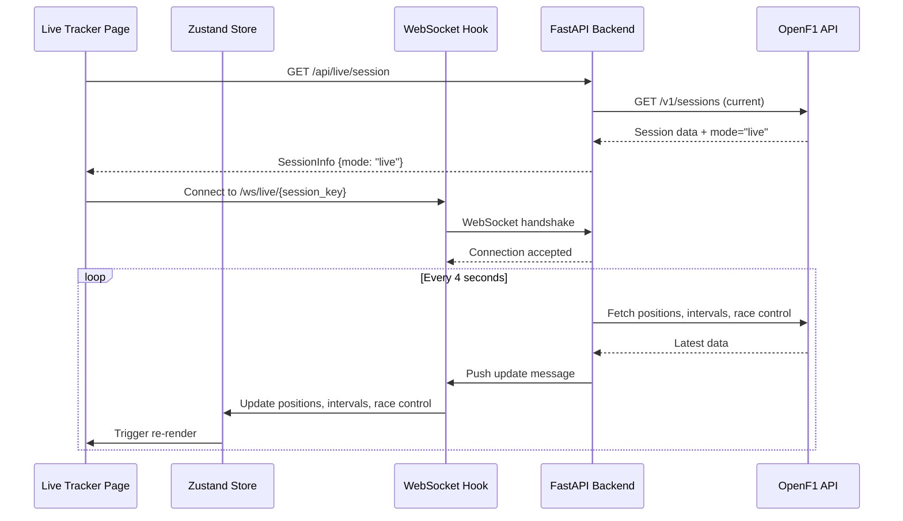
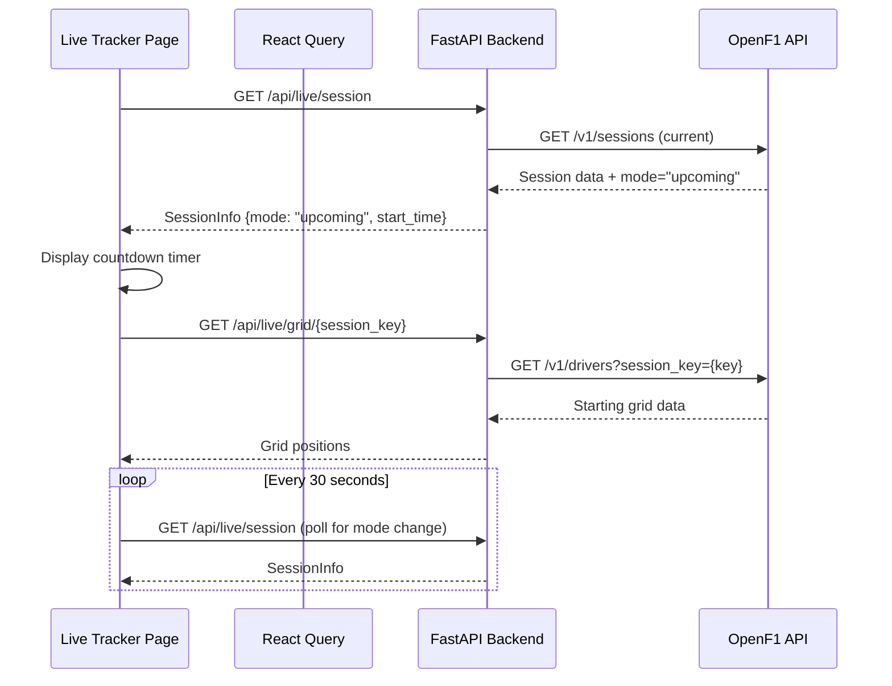
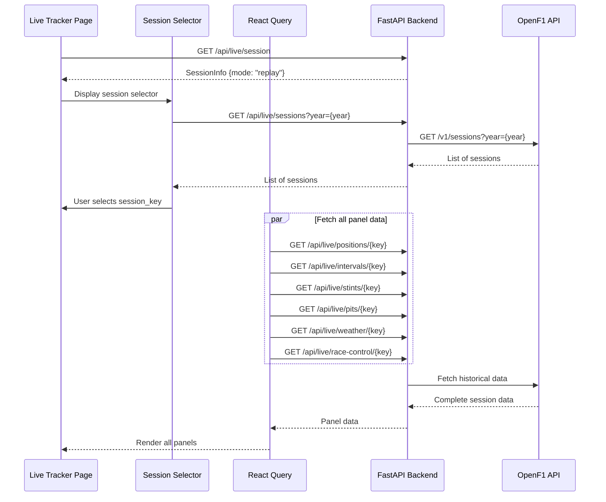

# Design Document: Live Race Timing Feature

## Overview

This design document specifies the technical architecture for the Live Race Timing feature, the flagship page of the F1 FastAPI dashboard. The Live Race Tracker provides real-time race monitoring with automatic mode detection, WebSocket-based live updates, and comprehensive telemetry visualization across seven interactive panels.

### Feature Summary

The Live Race Timing feature transforms the F1 dashboard into a real-time race monitoring platform by integrating with the OpenF1 API. It automatically detects whether a race is live, upcoming, or historical (replay mode) and adapts the UI accordingly. The feature supports three distinct operating modes with seamless transitions between them.

### Key Capabilities

1. **Automatic Mode Detection**: Determines session state (live/upcoming/replay) without user configuration
2. **Real-Time Updates**: WebSocket-based streaming for sub-second latency during live races
3. **Seven Interactive Panels**: Race Tower, Gap Tracker Chart, Tyre Strategy, Pit Stops, Weather, Race Control, Team Radio
4. **Intelligent Reconnection**: Exponential backoff strategy for WebSocket resilience
5. **Responsive Design**: Adaptive grid layout for desktop, tablet, and mobile devices
6. **Historical Replay**: Full session selector for analyzing past races

### Design Goals

1. **Real-Time Performance**: <100ms latency from WebSocket message to DOM update, 60fps during live updates
2. **Resilience**: Automatic reconnection with exponential backoff, graceful degradation on errors
3. **Scalability**: Efficient state management with Zustand, optimized rendering with React.memo
4. **Maintainability**: Clear separation between data fetching, state management, and presentation
5. **User Experience**: Seamless mode transitions, clear visual indicators, responsive across devices


## Architecture

### High-Level Architecture Diagram

```mermaid
graph TB
    User[User Browser]
    LivePage[Live Tracker Page<br/>React Component]
    ZustandStore[Zustand Store<br/>liveRaceStore]
    ReactQuery[React Query<br/>Data Fetching]
    WSHook[useWebSocket Hook<br/>Connection Manager]
    Backend[FastAPI Backend<br/>Port 8000]
    OpenF1[OpenF1 API<br/>api.openf1.org]
    
    User -->|Navigate to /live| LivePage
    LivePage -->|Read State| ZustandStore
    LivePage -->|Update State| ZustandStore
    LivePage -->|REST Calls| ReactQuery
    LivePage -->|WebSocket| WSHook
    ReactQuery -->|GET /api/live/session| Backend
    ReactQuery -->|GET /api/live/*| Backend
    WSHook -->|WS /ws/live/{key}| Backend
    Backend -->|Fetch Data| OpenF1
    Backend -->|Stream Updates| WSHook
    
    style LivePage fill:#bfb,stroke:#333,stroke-width:2px
    style ZustandStore fill:#fbb,stroke:#333,stroke-width:2px
    style Backend fill:#bbf,stroke:#333,stroke-width:2px
    style OpenF1 fill:#ff9,stroke:#333,stroke-width:2px
```

### Three-Mode Architecture

The Live Race Timing feature operates in three distinct modes, each with different data flow patterns:


**1. Live Mode** (Active Race in Progress)


**2. Upcoming Mode** (Race Scheduled but Not Started)


**3. Replay Mode** (Historical Session Review)



### Technology Stack

**Frontend**:
- React 18 with TypeScript
- Vite for build tooling
- Zustand for state management (liveRaceStore)
- React Query for REST API calls and caching
- Custom useWebSocket hook for real-time updates
- Plotly.js for Gap Tracker Chart visualization
- Tailwind CSS for responsive styling

**Backend**:
- FastAPI with async/await
- WebSocket support via Starlette
- httpx for async HTTP client to OpenF1 API
- Pydantic for data validation
- No database required (proxy to OpenF1)

**External APIs**:
- OpenF1 API (https://api.openf1.org/v1)
  - Sessions endpoint for session metadata
  - Position, interval, stint, pit, weather, race control endpoints
  - Real-time data availability for 2023+ seasons

### Component Hierarchy

```
LiveTrackerPage
├── ModeBadge (session mode indicator)
├── SessionModeSwitch
│   ├── LiveMode
│   │   ├── RaceTower (positions P1-P20)
│   │   ├── GapTrackerChart (Plotly line chart)
│   │   ├── TyreStrategyPanel (stint visualization)
│   │   ├── PitStopList (pit stop log)
│   │   ├── WeatherPanel (track conditions)
│   │   ├── RaceControlFeed (flags and messages)
│   │   └── TeamRadioPlayer (audio clips)
│   ├── UpcomingMode
│   │   ├── CountdownTimer (time to session start)
│   │   ├── CircuitInfo (track details)
│   │   └── StartingGrid (P1-P20 grid positions)
│   └── ReplayMode
│       ├── SessionSelector (historical session picker)
│       └── [All 7 panels from LiveMode with historical data]
```


## Components and Interfaces

### Frontend Directory Structure

```
frontend/src/
├── pages/
│   └── LiveTrackerPage.tsx          # Main page component, mode detection
├── components/
│   └── live/
│       ├── ModeBadge.tsx            # Visual mode indicator
│       ├── RaceTower.tsx            # P1-P20 positions with gaps
│       ├── GapTrackerChart.tsx      # Plotly gap-to-leader chart
│       ├── TyreStrategyPanel.tsx    # Stint bars visualization
│       ├── PitStopList.tsx          # Pit stop log with rankings
│       ├── WeatherPanel.tsx         # Track conditions display
│       ├── RaceControlFeed.tsx      # Flags and race control messages
│       ├── TeamRadioPlayer.tsx      # Audio player for radio clips
│       ├── CountdownTimer.tsx       # Time to session start
│       ├── CircuitInfo.tsx          # Circuit details display
│       ├── StartingGrid.tsx         # Grid positions P1-P20
│       └── SessionSelector.tsx      # Historical session picker
├── hooks/
│   ├── useWebSocket.ts              # WebSocket connection manager
│   ├── useLiveData.ts               # React Query hooks for live endpoints
│   └── useSessionMode.ts            # Session mode detection logic
├── store/
│   └── liveRaceStore.ts             # Zustand store for live race state
├── types/
│   └── live.ts                      # TypeScript interfaces
└── api/
    └── live.ts                      # API client functions
```

### Backend Directory Structure

```
backend/app/
├── routers/
│   ├── live.py                      # REST endpoints for live data
│   └── ws.py                        # WebSocket endpoint
├── services/
│   ├── openf1.py                    # OpenF1 API client
│   └── live.py                      # Session mode logic
├── models/
│   └── live.py                      # Pydantic models
└── ws/
    └── manager.py                   # WebSocket connection manager
```


### Backend API Endpoints

**Session Mode Detection**:
```
GET /api/live/session
Response: {
  "session_key": "9158",
  "session_name": "Race",
  "session_type": "Race",
  "date_start": "2024-03-10T14:00:00Z",
  "date_end": "2024-03-10T16:00:00Z",
  "gmt_offset": "+01:00",
  "location": "Bahrain",
  "country_name": "Bahrain",
  "circuit_short_name": "Bahrain",
  "mode": "live" | "upcoming" | "replay"
}
```

**Live Data Endpoints** (Path parameter style):
```
GET /api/live/sessions?year={year}
GET /api/live/positions/{session_key}
GET /api/live/intervals/{session_key}
GET /api/live/stints/{session_key}
GET /api/live/pits/{session_key}
GET /api/live/weather/{session_key}
GET /api/live/race-control/{session_key}
GET /api/live/radio/{session_key}
GET /api/live/grid/{session_key}
```

**WebSocket Endpoint**:
```
WS /ws/live/{session_key}

Message Format (Server → Client):
{
  "type": "update",
  "timestamp": "2024-03-10T14:30:00Z",
  "positions": [...],
  "intervals": [...],
  "race_control": [...]
}

{
  "type": "ping",
  "timestamp": "2024-03-10T14:30:00Z"
}

{
  "type": "error",
  "message": "Connection lost",
  "code": 1006
}

Message Format (Client → Server):
{
  "type": "pong"
}
```


### OpenF1 API Integration

The backend acts as a proxy to the OpenF1 API, transforming and aggregating data for frontend consumption.

**OpenF1 Endpoints Used**:
```
GET https://api.openf1.org/v1/sessions
  ?year={year}&session_type=Race&date_start>={now}
  → Current/upcoming session detection

GET https://api.openf1.org/v1/sessions
  ?session_key={key}
  → Session metadata

GET https://api.openf1.org/v1/position
  ?session_key={key}
  → Driver positions over time

GET https://api.openf1.org/v1/intervals
  ?session_key={key}
  → Gaps and intervals

GET https://api.openf1.org/v1/stints
  ?session_key={key}
  → Tire stint data

GET https://api.openf1.org/v1/pit
  ?session_key={key}
  → Pit stop data

GET https://api.openf1.org/v1/weather
  ?session_key={key}
  → Weather conditions

GET https://api.openf1.org/v1/race_control
  ?session_key={key}
  → Race control messages

GET https://api.openf1.org/v1/team_radio
  ?session_key={key}
  → Team radio audio clips

GET https://api.openf1.org/v1/drivers
  ?session_key={key}
  → Driver list for session
```

**Data Transformation Examples**:

OpenF1 Position Response:
```json
{
  "date": "2024-03-10T14:30:00.123Z",
  "driver_number": 1,
  "meeting_key": 1234,
  "position": 1,
  "session_key": 9158
}
```

Backend Position Response (aggregated latest):
```json
{
  "driver_number": 1,
  "position": 1,
  "date": "2024-03-10T14:30:00Z"
}
```


## Data Models

### TypeScript Interfaces (Frontend)

```typescript
// types/live.ts

export type SessionMode = 'live' | 'upcoming' | 'replay'

export interface SessionInfo {
  session_key: string
  session_name: string
  session_type: string
  date_start: string
  date_end: string
  gmt_offset: string
  location: string
  country_name: string
  circuit_short_name: string
  mode: SessionMode
}

export interface Position {
  driver_number: number
  position: number
  date: string
}

export interface Interval {
  driver_number: number
  gap_to_leader: number | string | null
  interval: number | string | null
  date: string
}

export interface Stint {
  driver_number: number
  stint_number: number
  compound: 'SOFT' | 'MEDIUM' | 'HARD' | 'INTERMEDIATE' | 'WET'
  tyre_age_at_start: number
  lap_start: number
  lap_end: number | null
}

export interface PitStop {
  driver_number: number
  lap_number: number
  stop_duration: number | null
  lane_duration: number
  date: string
}

export interface Weather {
  air_temperature: number
  track_temperature: number
  humidity: number
  pressure: number
  rainfall: number
  wind_direction: number
  wind_speed: number
  date: string
}

export interface RaceControlMessage {
  category: string
  message: string
  date: string
  lap_number: number | null
  driver_number: number | null
  flag: 'YELLOW' | 'RED' | 'GREEN' | 'BLUE' | 'CHEQUERED' | null
}

export interface TeamRadio {
  driver_number: number
  date: string
  recording_url: string
  duration: number
}

export interface Driver {
  driver_number: number
  broadcast_name: string
  full_name: string
  name_acronym: string
  team_name: string
  team_colour: string
  headshot_url: string | null
}

export interface WebSocketMessage {
  type: 'update' | 'ping' | 'error'
  timestamp: string
  positions?: Position[]
  intervals?: Interval[]
  race_control?: RaceControlMessage[]
  message?: string
  code?: number
}
```


### Pydantic Models (Backend)

```python
# models/live.py
from pydantic import BaseModel, Field
from typing import Optional, Literal, Union
from datetime import datetime

class SessionInfo(BaseModel):
    session_key: str
    session_name: str
    session_type: str
    date_start: str
    date_end: str
    gmt_offset: str
    location: str
    country_name: str
    circuit_short_name: str
    mode: Literal["live", "upcoming", "replay"]

class Position(BaseModel):
    driver_number: int
    position: int
    date: str

class Interval(BaseModel):
    driver_number: int
    gap_to_leader: Optional[Union[float, str]] = None
    interval: Optional[Union[float, str]] = None
    date: str

class Stint(BaseModel):
    driver_number: int
    stint_number: int
    compound: Literal["SOFT", "MEDIUM", "HARD", "INTERMEDIATE", "WET"]
    tyre_age_at_start: int
    lap_start: int
    lap_end: Optional[int] = None

class PitStop(BaseModel):
    driver_number: int
    lap_number: int
    stop_duration: Optional[float] = None
    lane_duration: float
    date: str

class Weather(BaseModel):
    air_temperature: float
    track_temperature: float
    humidity: int
    pressure: float
    rainfall: int
    wind_direction: int
    wind_speed: float
    date: str

class RaceControlMessage(BaseModel):
    category: str
    message: str
    date: str
    lap_number: Optional[int] = None
    driver_number: Optional[int] = None
    flag: Optional[Literal["YELLOW", "RED", "GREEN", "BLUE", "CHEQUERED"]] = None

class TeamRadio(BaseModel):
    driver_number: int
    date: str
    recording_url: str
    duration: float

class Driver(BaseModel):
    driver_number: int
    broadcast_name: str
    full_name: str
    name_acronym: str
    team_name: str
    team_colour: str
    headshot_url: Optional[str] = None
```


### Zustand Store Structure

```typescript
// store/liveRaceStore.ts
import { create } from 'zustand'
import type { Position, Interval, Stint, PitStop, Weather, RaceControlMessage, Driver, SessionInfo } from '../types/live'

interface LiveRaceState {
  // Session metadata
  sessionInfo: SessionInfo | null
  drivers: Driver[]
  
  // Live data
  positions: Position[]
  intervals: Interval[]
  intervalHistory: { lap: number; driver_number: number; gap: number | null }[]
  stints: Stint[]
  pitStops: PitStop[]
  weather: Weather | null
  raceControl: RaceControlMessage[]
  
  // WebSocket connection state
  isConnected: boolean
  lastUpdate: string | null
  
  // Actions
  setSessionInfo: (info: SessionInfo) => void
  setDrivers: (drivers: Driver[]) => void
  updatePositions: (positions: Position[]) => void
  updateIntervals: (intervals: Interval[]) => void
  appendIntervalHistory: (lap: number, driver_number: number, gap: number | null) => void
  updateStints: (stints: Stint[]) => void
  addPitStop: (pitStop: PitStop) => void
  updateWeather: (weather: Weather) => void
  addRaceControlMessage: (message: RaceControlMessage) => void
  setConnectionStatus: (connected: boolean) => void
  clearLiveData: () => void
}

export const useLiveRaceStore = create<LiveRaceState>((set) => ({
  sessionInfo: null,
  drivers: [],
  positions: [],
  intervals: [],
  intervalHistory: [],
  stints: [],
  pitStops: [],
  weather: null,
  raceControl: [],
  isConnected: false,
  lastUpdate: null,
  
  setSessionInfo: (info) => set({ sessionInfo: info }),
  setDrivers: (drivers) => set({ drivers }),
  
  updatePositions: (positions) => set({ 
    positions,
    lastUpdate: new Date().toISOString()
  }),
  
  updateIntervals: (intervals) => set({ 
    intervals,
    lastUpdate: new Date().toISOString()
  }),
  
  appendIntervalHistory: (lap, driver_number, gap) => set((state) => ({
    intervalHistory: [...state.intervalHistory, { lap, driver_number, gap }]
  })),
  
  updateStints: (stints) => set({ stints }),
  
  addPitStop: (pitStop) => set((state) => ({
    pitStops: [pitStop, ...state.pitStops]
  })),
  
  updateWeather: (weather) => set({ weather }),
  
  addRaceControlMessage: (message) => set((state) => ({
    raceControl: [message, ...state.raceControl]
  })),
  
  setConnectionStatus: (connected) => set({ isConnected: connected }),
  
  clearLiveData: () => set({
    positions: [],
    intervals: [],
    intervalHistory: [],
    stints: [],
    pitStops: [],
    weather: null,
    raceControl: [],
    isConnected: false,
    lastUpdate: null
  })
}))
```


## WebSocket Implementation

### Frontend: useWebSocket Hook

```typescript
// hooks/useWebSocket.ts
import { useEffect, useRef, useCallback } from 'react'
import { useLiveRaceStore } from '../store/liveRaceStore'
import type { WebSocketMessage } from '../types/live'

interface UseWebSocketOptions {
  sessionKey: string
  enabled: boolean
  onError?: (error: Event) => void
}

export function useWebSocket({ sessionKey, enabled, onError }: UseWebSocketOptions) {
  const wsRef = useRef<WebSocket | null>(null)
  const reconnectTimeoutRef = useRef<NodeJS.Timeout>()
  const reconnectDelayRef = useRef(1000) // Start with 1 second
  const reconnectAttemptsRef = useRef(0)
  
  const {
    updatePositions,
    updateIntervals,
    addRaceControlMessage,
    setConnectionStatus
  } = useLiveRaceStore()
  
  const connect = useCallback(() => {
    if (!enabled || !sessionKey) return
    
    const wsUrl = `${import.meta.env.VITE_WS_URL}/ws/live/${sessionKey}`
    const ws = new WebSocket(wsUrl)
    
    ws.onopen = () => {
      console.log('[WebSocket] Connected')
      setConnectionStatus(true)
      reconnectAttemptsRef.current = 0
      reconnectDelayRef.current = 1000 // Reset delay on successful connection
    }
    
    ws.onmessage = (event) => {
      try {
        const message: WebSocketMessage = JSON.parse(event.data)
        
        switch (message.type) {
          case 'update':
            if (message.positions) updatePositions(message.positions)
            if (message.intervals) updateIntervals(message.intervals)
            if (message.race_control) {
              message.race_control.forEach(addRaceControlMessage)
            }
            break
            
          case 'ping':
            ws.send(JSON.stringify({ type: 'pong' }))
            break
            
          case 'error':
            console.error('[WebSocket] Server error:', message.message)
            break
        }
      } catch (error) {
        console.error('[WebSocket] Failed to parse message:', error)
      }
    }
    
    ws.onerror = (error) => {
      console.error('[WebSocket] Error:', error)
      onError?.(error)
    }
    
    ws.onclose = (event) => {
      console.log('[WebSocket] Closed:', event.code, event.reason)
      setConnectionStatus(false)
      
      // Attempt reconnection with exponential backoff
      if (enabled && reconnectAttemptsRef.current < 10) {
        reconnectAttemptsRef.current += 1
        
        reconnectTimeoutRef.current = setTimeout(() => {
          console.log(`[WebSocket] Reconnecting... (attempt ${reconnectAttemptsRef.current})`)
          connect()
        }, reconnectDelayRef.current)
        
        // Double the delay, max 30 seconds
        reconnectDelayRef.current = Math.min(reconnectDelayRef.current * 2, 30000)
      }
    }
    
    wsRef.current = ws
  }, [sessionKey, enabled])
  
  const disconnect = useCallback(() => {
    if (reconnectTimeoutRef.current) {
      clearTimeout(reconnectTimeoutRef.current)
    }
    if (wsRef.current) {
      wsRef.current.close()
      wsRef.current = null
    }
    setConnectionStatus(false)
  }, [])
  
  useEffect(() => {
    if (enabled) {
      connect()
    }
    
    return () => {
      disconnect()
    }
  }, [enabled, sessionKey])
  
  return {
    disconnect,
    reconnect: connect
  }
}
```


### Backend: WebSocket Manager

```python
# app/ws/manager.py
import asyncio
import json
from fastapi import WebSocket
from app.services.openf1 import (
    fetch_live_positions,
    fetch_live_intervals,
    fetch_live_racecontrol
)
from datetime import datetime
import logging

logger = logging.getLogger(__name__)

class ConnectionManager:
    """Manages WebSocket connections and broadcasts live race data"""
    
    def __init__(self):
        self.connections: dict[str, list[WebSocket]] = {}
        self.tasks: dict[str, asyncio.Task] = {}
        self.heartbeat_tasks: dict[WebSocket, asyncio.Task] = {}
    
    async def connect(self, ws: WebSocket, session_key: str):
        """Accept new WebSocket connection and start polling if needed"""
        await ws.accept()
        self.connections.setdefault(session_key, []).append(ws)
        logger.info(f"Client connected to session {session_key} (total: {len(self.connections[session_key])})")
        
        # Start heartbeat for this connection
        self.heartbeat_tasks[ws] = asyncio.create_task(self._heartbeat(ws))
        
        # Start polling task if this is first client for session
        if session_key not in self.tasks:
            self.tasks[session_key] = asyncio.create_task(
                self._poll(session_key)
            )
            logger.info(f"Started polling for session {session_key}")
    
    async def disconnect(self, ws: WebSocket, session_key: str):
        """Remove WebSocket connection and stop polling if no clients remain"""
        if session_key in self.connections:
            self.connections[session_key].remove(ws)
            logger.info(f"Client disconnected from session {session_key} (remaining: {len(self.connections[session_key])})")
            
            # Cancel heartbeat
            if ws in self.heartbeat_tasks:
                self.heartbeat_tasks[ws].cancel()
                del self.heartbeat_tasks[ws]
            
            # Stop polling if no more clients
            if not self.connections[session_key]:
                if session_key in self.tasks:
                    self.tasks[session_key].cancel()
                    del self.tasks[session_key]
                del self.connections[session_key]
                logger.info(f"Stopped polling for session {session_key}")
    
    async def broadcast(self, session_key: str, data: dict):
        """Broadcast data to all clients connected to session"""
        dead = []
        for ws in self.connections.get(session_key, []):
            try:
                await ws.send_json(data)
            except Exception as e:
                logger.error(f"Error sending to client: {e}")
                dead.append(ws)
        
        # Clean up dead connections
        for ws in dead:
            await self.disconnect(ws, session_key)
    
    async def _poll(self, session_key: str):
        """Poll OpenF1 API and broadcast updates every 4 seconds"""
        while True:
            try:
                # Fetch all live data in parallel
                positions, intervals, race_control = await asyncio.gather(
                    fetch_live_positions(session_key),
                    fetch_live_intervals(session_key),
                    fetch_live_racecontrol(session_key),
                    return_exceptions=True
                )
                
                # Broadcast update
                await self.broadcast(session_key, {
                    "type": "update",
                    "timestamp": datetime.utcnow().isoformat(),
                    "positions": positions if not isinstance(positions, Exception) else [],
                    "intervals": intervals if not isinstance(intervals, Exception) else [],
                    "race_control": race_control if not isinstance(race_control, Exception) else [],
                })
                
            except asyncio.CancelledError:
                logger.info(f"Polling cancelled for session {session_key}")
                break
            except Exception as e:
                logger.error(f"Poll error for {session_key}: {e}")
            
            await asyncio.sleep(4)
    
    async def _heartbeat(self, ws: WebSocket):
        """Send periodic ping to detect stale connections"""
        try:
            while True:
                await asyncio.sleep(30)
                await ws.send_json({"type": "ping"})
        except asyncio.CancelledError:
            pass
        except Exception as e:
            logger.error(f"Heartbeat error: {e}")

manager = ConnectionManager()
```


### Backend: WebSocket Router

```python
# app/routers/ws.py
from fastapi import APIRouter, WebSocket, WebSocketDisconnect
from app.ws.manager import manager
import logging

logger = logging.getLogger(__name__)
router = APIRouter()

@router.websocket("/live/{session_key}")
async def websocket_live_race(websocket: WebSocket, session_key: str):
    """
    WebSocket endpoint for live race updates.
    
    Connects client to live race data stream for specified session.
    Broadcasts position, interval, and race control updates every 4 seconds.
    """
    await manager.connect(websocket, session_key)
    
    try:
        while True:
            # Keep connection alive, listen for pong responses
            data = await websocket.receive_text()
            message = json.loads(data)
            
            if message.get("type") == "pong":
                logger.debug(f"Received pong from client for session {session_key}")
                
    except WebSocketDisconnect:
        logger.info(f"Client disconnected from session {session_key}")
        await manager.disconnect(websocket, session_key)
    except Exception as e:
        logger.error(f"WebSocket error for session {session_key}: {e}")
        await manager.disconnect(websocket, session_key)
```


## Session Mode Detection Logic

### Backend: Session Mode Determination

```python
# app/services/live.py
from datetime import datetime, timezone
from typing import Literal

def determine_session_mode(session_info: dict) -> Literal["live", "upcoming", "replay"]:
    """
    Determine session mode based on session timing.
    
    Logic:
    - live: Current time is between date_start and date_end
    - upcoming: Current time is before date_start
    - replay: Current time is after date_end
    """
    now = datetime.now(timezone.utc)
    
    date_start = datetime.fromisoformat(session_info["date_start"].replace("Z", "+00:00"))
    date_end = datetime.fromisoformat(session_info["date_end"].replace("Z", "+00:00"))
    
    if date_start <= now <= date_end:
        return "live"
    elif now < date_start:
        return "upcoming"
    else:
        return "replay"
```

### Backend: Session API Endpoint

```python
# app/routers/live.py
from fastapi import APIRouter, HTTPException, Request
from app.services.openf1 import fetch_current_session
from app.services.live import determine_session_mode
from app.models.live import SessionInfo
import logging

logger = logging.getLogger(__name__)
router = APIRouter()

@router.get(
    "/live/session",
    response_model=SessionInfo,
    summary="Get current session info",
    description="Returns current F1 session with mode detection (live/upcoming/replay)"
)
async def get_current_session(request: Request):
    """
    Get current F1 session information with automatic mode detection.
    
    Returns session metadata including:
    - Session key, name, type
    - Start and end times
    - Circuit information
    - Mode: "live" (in progress), "upcoming" (not started), "replay" (finished)
    """
    request_id = getattr(request.state, 'request_id', None)
    
    try:
        logger.info(f"[{request_id}] Fetching current session")
        
        # Fetch current session from OpenF1
        session_data = await fetch_current_session()
        
        if not session_data:
            raise HTTPException(
                status_code=404,
                detail="No active or upcoming session found"
            )
        
        # Determine mode
        mode = determine_session_mode(session_data)
        session_data["mode"] = mode
        
        logger.info(f"[{request_id}] Session mode: {mode}, key: {session_data.get('session_key')}")
        
        return SessionInfo.model_validate(session_data)
        
    except HTTPException:
        raise
    except Exception as e:
        logger.error(f"[{request_id}] Error fetching session: {e}", exc_info=True)
        raise HTTPException(
            status_code=500,
            detail="Internal server error while fetching session"
        )
```


## Frontend Component Specifications

### LiveTrackerPage Component

```typescript
// pages/LiveTrackerPage.tsx
import { useEffect } from 'react'
import { useQuery } from '@tanstack/react-query'
import { useLiveRaceStore } from '../store/liveRaceStore'
import { useWebSocket } from '../hooks/useWebSocket'
import { fetchSessionInfo } from '../api/live'
import { ModeBadge } from '../components/live/ModeBadge'
import { RaceTower } from '../components/live/RaceTower'
import { GapTrackerChart } from '../components/live/GapTrackerChart'
import { TyreStrategyPanel } from '../components/live/TyreStrategyPanel'
import { PitStopList } from '../components/live/PitStopList'
import { WeatherPanel } from '../components/live/WeatherPanel'
import { RaceControlFeed } from '../components/live/RaceControlFeed'
import { TeamRadioPlayer } from '../components/live/TeamRadioPlayer'
import { CountdownTimer } from '../components/live/CountdownTimer'
import { CircuitInfo } from '../components/live/CircuitInfo'
import { StartingGrid } from '../components/live/StartingGrid'
import { SessionSelector } from '../components/live/SessionSelector'
import { LoadingSpinner } from '../components/shared/LoadingSpinner'
import { ErrorMessage } from '../components/shared/ErrorMessage'

export default function LiveTrackerPage() {
  const { sessionInfo, setSessionInfo, clearLiveData } = useLiveRaceStore()
  
  // Fetch session info to determine mode
  const { data, isLoading, error, refetch } = useQuery({
    queryKey: ['session-info'],
    queryFn: fetchSessionInfo,
    refetchInterval: sessionInfo?.mode === 'upcoming' ? 30000 : false,
    retry: 3
  })
  
  // Update store when session info changes
  useEffect(() => {
    if (data) {
      setSessionInfo(data)
    }
  }, [data, setSessionInfo])
  
  // Connect WebSocket in live mode
  const { reconnect } = useWebSocket({
    sessionKey: sessionInfo?.session_key || '',
    enabled: sessionInfo?.mode === 'live',
    onError: (error) => {
      console.error('WebSocket error:', error)
    }
  })
  
  // Clear data when leaving page
  useEffect(() => {
    return () => {
      clearLiveData()
    }
  }, [clearLiveData])
  
  if (isLoading) return <LoadingSpinner />
  if (error) return <ErrorMessage message="Failed to load session" onRetry={refetch} />
  if (!sessionInfo) return <ErrorMessage message="No session data available" />
  
  return (
    <div className="min-h-screen bg-gray-50 p-4">
      <div className="max-w-7xl mx-auto">
        {/* Header with mode badge */}
        <div className="flex justify-between items-center mb-6">
          <h1 className="text-3xl font-bold">Live Race Tracker</h1>
          <ModeBadge mode={sessionInfo.mode} sessionInfo={sessionInfo} />
        </div>
        
        {/* Mode-specific content */}
        {sessionInfo.mode === 'live' && (
          <LiveModeContent />
        )}
        
        {sessionInfo.mode === 'upcoming' && (
          <UpcomingModeContent sessionInfo={sessionInfo} />
        )}
        
        {sessionInfo.mode === 'replay' && (
          <ReplayModeContent />
        )}
      </div>
    </div>
  )
}

function LiveModeContent() {
  return (
    <div className="grid grid-cols-1 lg:grid-cols-3 gap-4">
      {/* Full width race tower */}
      <div className="lg:col-span-3">
        <RaceTower />
      </div>
      
      {/* Gap tracker chart - 2 columns */}
      <div className="lg:col-span-2">
        <GapTrackerChart />
      </div>
      
      {/* Weather panel - 1 column */}
      <div className="lg:col-span-1">
        <WeatherPanel />
      </div>
      
      {/* Tyre strategy - 2 columns */}
      <div className="lg:col-span-2">
        <TyreStrategyPanel />
      </div>
      
      {/* Pit stops - 1 column */}
      <div className="lg:col-span-1">
        <PitStopList />
      </div>
      
      {/* Race control - 2 columns */}
      <div className="lg:col-span-2">
        <RaceControlFeed />
      </div>
      
      {/* Team radio - 1 column */}
      <div className="lg:col-span-1">
        <TeamRadioPlayer />
      </div>
    </div>
  )
}

function UpcomingModeContent({ sessionInfo }: { sessionInfo: SessionInfo }) {
  return (
    <div className="grid grid-cols-1 md:grid-cols-2 gap-6">
      <div className="bg-white rounded-lg shadow p-6">
        <CountdownTimer startTime={sessionInfo.date_start} />
      </div>
      
      <div className="bg-white rounded-lg shadow p-6">
        <CircuitInfo sessionInfo={sessionInfo} />
      </div>
      
      <div className="md:col-span-2">
        <StartingGrid sessionKey={sessionInfo.session_key} />
      </div>
    </div>
  )
}

function ReplayModeContent() {
  return (
    <div>
      <div className="mb-6">
        <SessionSelector />
      </div>
      
      <LiveModeContent />
    </div>
  )
}
```


### Panel Component Specifications

**ModeBadge Component**:
```typescript
// components/live/ModeBadge.tsx
interface ModeBadgeProps {
  mode: SessionMode
  sessionInfo: SessionInfo
}

export function ModeBadge({ mode, sessionInfo }: ModeBadgeProps) {
  const badges = {
    live: {
      bg: 'bg-red-600',
      text: 'text-white',
      label: 'LIVE',
      pulse: true
    },
    upcoming: {
      bg: 'bg-amber-500',
      text: 'text-gray-900',
      label: 'UPCOMING',
      pulse: false
    },
    replay: {
      bg: 'bg-blue-600',
      text: 'text-white',
      label: `REPLAY — ${sessionInfo.circuit_short_name} ${new Date(sessionInfo.date_start).getFullYear()}`,
      pulse: false
    }
  }
  
  const badge = badges[mode]
  
  return (
    <div className={`${badge.bg} ${badge.text} px-4 py-2 rounded-full flex items-center gap-2 sticky top-4 z-50`}>
      {badge.pulse && (
        <span className="relative flex h-3 w-3">
          <span className="animate-ping absolute inline-flex h-full w-full rounded-full bg-white opacity-75"></span>
          <span className="relative inline-flex rounded-full h-3 w-3 bg-white"></span>
        </span>
      )}
      <span className="font-semibold text-sm">{badge.label}</span>
    </div>
  )
}
```

**RaceTower Component**:
```typescript
// components/live/RaceTower.tsx
import { useLiveRaceStore } from '../../store/liveRaceStore'

export function RaceTower() {
  const positions = useLiveRaceStore((state) => state.positions)
  const intervals = useLiveRaceStore((state) => state.intervals)
  const drivers = useLiveRaceStore((state) => state.drivers)
  const stints = useLiveRaceStore((state) => state.stints)
  
  // Merge position, interval, and driver data
  const raceOrder = positions
    .sort((a, b) => a.position - b.position)
    .map((pos) => {
      const interval = intervals.find((i) => i.driver_number === pos.driver_number)
      const driver = drivers.find((d) => d.driver_number === pos.driver_number)
      const currentStint = stints.find((s) => s.driver_number === pos.driver_number && s.lap_end === null)
      return { 
        ...pos, 
        ...interval, 
        ...driver,
        current_compound: currentStint?.compound,
        tire_age: currentStint?.tyre_age_at_start
      }
    })
  
  return (
    <div className="bg-white rounded-lg shadow overflow-hidden">
      <div className="bg-gray-800 text-white px-4 py-3 font-semibold">
        Race Tower
      </div>
      
      <div className="divide-y">
        {raceOrder.map((entry) => (
          <div
            key={entry.driver_number}
            className="flex items-center gap-4 px-4 py-3 hover:bg-gray-50 transition-colors"
          >
            {/* Position */}
            <div className="w-8 text-center font-bold text-lg">
              {entry.position}
            </div>
            
            {/* Driver info with team color */}
            <div
              className="flex-1 px-3 py-2 rounded"
              style={{ backgroundColor: `#${entry.team_colour}20` }}
            >
              <div className="font-semibold">{entry.broadcast_name}</div>
              <div className="text-sm text-gray-600">{entry.team_name}</div>
            </div>
            
            {/* Gap to leader */}
            <div className="w-20 text-right text-sm">
              {entry.position === 1 ? '—' : entry.gap_to_leader || '—'}
            </div>
            
            {/* Interval */}
            <div className="w-20 text-right text-sm text-gray-600">
              {entry.position === 1 ? '—' : entry.interval || '—'}
            </div>
            
            {/* Tire info */}
            <div className="flex items-center gap-2">
              <TireIndicator compound={entry.current_compound} />
              <span className="text-sm">{entry.tire_age} laps</span>
            </div>
          </div>
        ))}
      </div>
    </div>
  )
}

function TireIndicator({ compound }: { compound: string }) {
  const colors = {
    SOFT: 'bg-red-500',
    MEDIUM: 'bg-yellow-400',
    HARD: 'bg-gray-400',
    INTERMEDIATE: 'bg-green-500',
    WET: 'bg-blue-500'
  }
  
  return (
    <div className={`w-6 h-6 rounded-full ${colors[compound] || 'bg-gray-300'}`} />
  )
}
```


**GapTrackerChart Component**:
```typescript
// components/live/GapTrackerChart.tsx
import { useMemo } from 'react'
import Plot from 'react-plotly.js'
import { useLiveRaceStore } from '../../store/liveRaceStore'

export function GapTrackerChart() {
  const positions = useLiveRaceStore((state) => state.positions)
  const drivers = useLiveRaceStore((state) => state.drivers)
  
  const chartData = useMemo(() => {
    // Group positions by driver and calculate gaps
    const driverData = new Map()
    
    positions.forEach((pos) => {
      if (!driverData.has(pos.driver_number)) {
        driverData.set(pos.driver_number, [])
      }
      driverData.get(pos.driver_number).push(pos)
    })
    
    // Create traces for each driver
    return Array.from(driverData.entries()).map(([driverNum, positions]) => {
      const driver = drivers.find((d) => d.driver_number === driverNum)
      
      return {
        x: positions.map((_, idx) => idx + 1), // Lap numbers
        y: positions.map((p) => parseFloat(p.gap_to_leader || '0')),
        type: 'scatter',
        mode: 'lines',
        name: driver?.broadcast_name || `#${driverNum}`,
        line: {
          color: driver ? `#${driver.team_colour}` : '#999',
          width: 2
        }
      }
    })
  }, [positions, drivers])
  
  return (
    <div className="bg-white rounded-lg shadow p-4">
      <h3 className="text-lg font-semibold mb-4">Gap to Leader</h3>
      
      <Plot
        data={chartData}
        layout={{
          xaxis: { title: 'Lap' },
          yaxis: { title: 'Gap (seconds)' },
          hovermode: 'closest',
          showlegend: true,
          legend: { orientation: 'h', y: -0.2 },
          margin: { l: 50, r: 20, t: 20, b: 80 }
        }}
        config={{
          responsive: true,
          displayModeBar: false
        }}
        style={{ width: '100%', height: '400px' }}
      />
    </div>
  )
}
```

**TyreStrategyPanel Component**:
```typescript
// components/live/TyreStrategyPanel.tsx
import { useLiveRaceStore } from '../../store/liveRaceStore'

export function TyreStrategyPanel() {
  const stints = useLiveRaceStore((state) => state.stints)
  const drivers = useLiveRaceStore((state) => state.drivers)
  
  const compoundColors = {
    SOFT: '#E8002D',
    MEDIUM: '#FFF200',
    HARD: '#CCCCCC',
    INTERMEDIATE: '#43B02A',
    WET: '#0067AD'
  }
  
  return (
    <div className="bg-white rounded-lg shadow p-4">
      <h3 className="text-lg font-semibold mb-4">Tyre Strategy</h3>
      
      <div className="space-y-2">
        {drivers.map((driver) => {
          const driverStints = stints.filter((s) => s.driver_number === driver.driver_number)
          
          return (
            <div key={driver.driver_number} className="flex items-center gap-4">
              {/* Driver name */}
              <div className="w-32 text-sm font-medium truncate">
                {driver.name_acronym}
              </div>
              
              {/* Stint bars */}
              <div className="flex-1 flex gap-1">
                {driverStints.map((stint) => {
                  const stintLength = stint.lap_end 
                    ? stint.lap_end - stint.lap_start + 1
                    : 1
                  
                  return (
                    <div
                      key={stint.stint_number}
                      className="relative group"
                      style={{
                        width: `${stintLength * 10}px`,
                        height: '30px',
                        backgroundColor: compoundColors[stint.compound],
                        border: '1px solid #333'
                      }}
                    >
                      {/* Tooltip */}
                      <div className="absolute hidden group-hover:block bg-gray-900 text-white text-xs rounded px-2 py-1 -top-8 left-1/2 transform -translate-x-1/2 whitespace-nowrap z-10">
                        {stint.compound} - {stintLength} laps
                      </div>
                    </div>
                  )
                })}
              </div>
            </div>
          )
        })}
      </div>
    </div>
  )
}
```


**PitStopList Component**:
```typescript
// components/live/PitStopList.tsx
import { useMemo } from 'react'
import { useLiveRaceStore } from '../../store/liveRaceStore'

export function PitStopList() {
  const pitStops = useLiveRaceStore((state) => state.pitStops)
  const drivers = useLiveRaceStore((state) => state.drivers)
  
  const rankedPitStops = useMemo(() => {
    const sorted = [...pitStops].sort((a, b) => a.pit_duration - b.pit_duration)
    
    return pitStops.map((stop) => {
      const rank = sorted.findIndex((s) => s === stop) + 1
      const driver = drivers.find((d) => d.driver_number === stop.driver_number)
      const isFastest = rank === 1
      const isSlowest = rank === pitStops.length
      
      return { ...stop, driver, rank, isFastest, isSlowest }
    })
  }, [pitStops, drivers])
  
  return (
    <div className="bg-white rounded-lg shadow overflow-hidden">
      <div className="bg-gray-800 text-white px-4 py-3 font-semibold flex justify-between">
        <span>Pit Stops</span>
        <span className="text-sm">{pitStops.length} stops</span>
      </div>
      
      <div className="max-h-96 overflow-y-auto">
        <div className="divide-y">
          {rankedPitStops.map((stop, idx) => (
            <div
              key={idx}
              className={`px-4 py-3 ${
                stop.isFastest ? 'bg-green-50' : stop.isSlowest ? 'bg-red-50' : ''
              }`}
            >
              <div className="flex justify-between items-center">
                <div>
                  <div className="font-semibold">{stop.driver?.broadcast_name}</div>
                  <div className="text-sm text-gray-600">Lap {stop.lap_number}</div>
                </div>
                
                <div className="text-right">
                  <div className="font-mono font-semibold">
                    {stop.pit_duration.toFixed(1)}s
                  </div>
                  <div className="text-xs text-gray-500">
                    #{stop.rank}
                  </div>
                </div>
              </div>
            </div>
          ))}
        </div>
      </div>
    </div>
  )
}
```

**WeatherPanel Component**:
```typescript
// components/live/WeatherPanel.tsx
import { useLiveRaceStore } from '../../store/liveRaceStore'

export function WeatherPanel() {
  const weather = useLiveRaceStore((state) => state.weather)
  
  if (!weather) {
    return (
      <div className="bg-white rounded-lg shadow p-4">
        <h3 className="text-lg font-semibold mb-4">Weather</h3>
        <p className="text-gray-500">No weather data available</p>
      </div>
    )
  }
  
  return (
    <div className="bg-white rounded-lg shadow p-4">
      <h3 className="text-lg font-semibold mb-4">Weather</h3>
      
      <div className="space-y-3">
        <WeatherItem
          icon="🌡️"
          label="Track Temp"
          value={`${weather.track_temperature}°C`}
        />
        
        <WeatherItem
          icon="🌡️"
          label="Air Temp"
          value={`${weather.air_temperature}°C`}
        />
        
        <WeatherItem
          icon="💧"
          label="Humidity"
          value={`${weather.humidity}%`}
        />
        
        <WeatherItem
          icon="🌧️"
          label="Rainfall"
          value={weather.rainfall ? 'Yes' : 'No'}
          highlight={weather.rainfall === 1}
        />
        
        <WeatherItem
          icon="💨"
          label="Wind"
          value={`${weather.wind_speed} km/h (${weather.wind_direction}°)`}
        />
        
        <WeatherItem
          icon="🔽"
          label="Pressure"
          value={`${weather.pressure} mbar`}
        />
      </div>
    </div>
  )
}

function WeatherItem({ icon, label, value, highlight = false }: {
  icon: string
  label: string
  value: string
  highlight?: boolean
}) {
  return (
    <div className={`flex items-center justify-between p-2 rounded ${highlight ? 'bg-blue-100' : ''}`}>
      <div className="flex items-center gap-2">
        <span className="text-2xl">{icon}</span>
        <span className="text-sm font-medium">{label}</span>
      </div>
      <span className="font-semibold">{value}</span>
    </div>
  )
}
```


**RaceControlFeed Component**:
```typescript
// components/live/RaceControlFeed.tsx
import { useLiveRaceStore } from '../../store/liveRaceStore'

export function RaceControlFeed() {
  const raceControl = useLiveRaceStore((state) => state.raceControl)
  
  const flagIcons = {
    YELLOW: '🟨',
    RED: '🟥',
    GREEN: '🟩',
    BLUE: '🟦',
    CHEQUERED: '🏁'
  }
  
  const categoryColors = {
    'SafetyCar': 'bg-yellow-100 border-yellow-400',
    'Flag': 'bg-blue-100 border-blue-400',
    'Drs': 'bg-green-100 border-green-400',
    'Other': 'bg-gray-100 border-gray-400'
  }
  
  return (
    <div className="bg-white rounded-lg shadow overflow-hidden">
      <div className="bg-gray-800 text-white px-4 py-3 font-semibold">
        Race Control
      </div>
      
      <div className="max-h-96 overflow-y-auto">
        <div className="divide-y">
          {raceControl.map((message, idx) => {
            const colorClass = categoryColors[message.category] || categoryColors.Other
            
            return (
              <div
                key={idx}
                className={`px-4 py-3 border-l-4 ${colorClass}`}
              >
                <div className="flex items-start gap-3">
                  {message.flag && (
                    <span className="text-2xl">{flagIcons[message.flag]}</span>
                  )}
                  
                  <div className="flex-1">
                    <div className="flex items-center gap-2 mb-1">
                      <span className="text-xs font-semibold text-gray-500">
                        {message.category}
                      </span>
                      {message.lap_number && (
                        <span className="text-xs text-gray-500">
                          Lap {message.lap_number}
                        </span>
                      )}
                    </div>
                    
                    <p className="text-sm">{message.message}</p>
                    
                    <div className="text-xs text-gray-500 mt-1">
                      {new Date(message.date).toLocaleTimeString()}
                    </div>
                  </div>
                </div>
              </div>
            )
          })}
        </div>
      </div>
    </div>
  )
}
```

**CountdownTimer Component**:
```typescript
// components/live/CountdownTimer.tsx
import { useState, useEffect } from 'react'

interface CountdownTimerProps {
  startTime: string
}

export function CountdownTimer({ startTime }: CountdownTimerProps) {
  const [timeRemaining, setTimeRemaining] = useState<{
    days: number
    hours: number
    minutes: number
    seconds: number
  } | null>(null)
  
  useEffect(() => {
    const calculateTimeRemaining = () => {
      const now = new Date()
      const start = new Date(startTime)
      const diff = start.getTime() - now.getTime()
      
      if (diff <= 0) {
        setTimeRemaining({ days: 0, hours: 0, minutes: 0, seconds: 0 })
        return
      }
      
      const days = Math.floor(diff / (1000 * 60 * 60 * 24))
      const hours = Math.floor((diff % (1000 * 60 * 60 * 24)) / (1000 * 60 * 60))
      const minutes = Math.floor((diff % (1000 * 60 * 60)) / (1000 * 60))
      const seconds = Math.floor((diff % (1000 * 60)) / 1000)
      
      setTimeRemaining({ days, hours, minutes, seconds })
    }
    
    calculateTimeRemaining()
    const interval = setInterval(calculateTimeRemaining, 1000)
    
    return () => clearInterval(interval)
  }, [startTime])
  
  if (!timeRemaining) return null
  
  const isUrgent = timeRemaining.days === 0 && timeRemaining.hours === 0
  const isCritical = isUrgent && timeRemaining.minutes < 5
  
  return (
    <div>
      <h3 className="text-lg font-semibold mb-4">Session Starts In</h3>
      
      <div className={`grid grid-cols-4 gap-4 ${isCritical ? 'animate-pulse' : ''}`}>
        <TimeUnit value={timeRemaining.days} label="Days" urgent={false} />
        <TimeUnit value={timeRemaining.hours} label="Hours" urgent={isUrgent} />
        <TimeUnit value={timeRemaining.minutes} label="Minutes" urgent={isUrgent} />
        <TimeUnit value={timeRemaining.seconds} label="Seconds" urgent={isUrgent} />
      </div>
      
      {timeRemaining.days === 0 && timeRemaining.hours === 0 && timeRemaining.minutes === 0 && timeRemaining.seconds === 0 && (
        <div className="mt-4 text-center text-lg font-semibold text-red-600">
          Session starting...
        </div>
      )}
    </div>
  )
}

function TimeUnit({ value, label, urgent }: { value: number; label: string; urgent: boolean }) {
  return (
    <div className={`text-center p-4 rounded-lg ${urgent ? 'bg-red-100' : 'bg-gray-100'}`}>
      <div className={`text-3xl font-bold ${urgent ? 'text-red-600' : 'text-gray-900'}`}>
        {value.toString().padStart(2, '0')}
      </div>
      <div className="text-sm text-gray-600 mt-1">{label}</div>
    </div>
  )
}
```


## Error Handling

### Error Scenarios and Recovery Strategies

**1. Session API Failure**:
```typescript
// Scenario: GET /api/live/session returns 404 or 500
// Recovery: Display error message with retry button, retry after 10 seconds

if (error?.response?.status === 404) {
  return <ErrorMessage message="No active session found" onRetry={refetch} />
}

if (error?.response?.status === 500) {
  return <ErrorMessage message="Server error. Retrying..." onRetry={refetch} />
}
```

**2. WebSocket Connection Failure**:
```typescript
// Scenario: WebSocket fails to establish or closes unexpectedly
// Recovery: Exponential backoff reconnection (1s → 2s → 4s → 8s → 16s → 30s max)

ws.onclose = (event) => {
  if (reconnectAttempts < 10) {
    const delay = Math.min(1000 * Math.pow(2, reconnectAttempts), 30000)
    setTimeout(() => connect(), delay)
  } else {
    // Show manual reconnect button after 10 failed attempts
    showReconnectButton()
  }
}
```

**3. OpenF1 API Unavailable**:
```python
# Scenario: OpenF1 API returns error or times out
# Recovery: Return empty data, log error, frontend displays "Data unavailable"

try:
    async with httpx.AsyncClient(timeout=10.0) as client:
        response = await client.get(url)
        response.raise_for_status()
        return response.json()
except httpx.TimeoutException:
    logger.error(f"OpenF1 API timeout: {url}")
    return []
except httpx.HTTPError as e:
    logger.error(f"OpenF1 API error: {e}")
    return []
```

**4. Invalid WebSocket Message**:
```typescript
// Scenario: WebSocket message contains invalid JSON or missing fields
// Recovery: Log error, skip update, continue listening

ws.onmessage = (event) => {
  try {
    const message = JSON.parse(event.data)
    
    // Validate message structure
    if (!message.type) {
      console.warn('Invalid message: missing type field')
      return
    }
    
    // Process message...
  } catch (error) {
    console.error('Failed to parse WebSocket message:', error)
    // Continue listening for next message
  }
}
```

**5. React Rendering Error**:
```typescript
// Scenario: Component throws error during render
// Recovery: Error boundary catches error, displays fallback UI

class ErrorBoundary extends React.Component {
  state = { hasError: false }
  
  static getDerivedStateFromError(error) {
    return { hasError: true }
  }
  
  componentDidCatch(error, errorInfo) {
    console.error('React error:', error, errorInfo)
  }
  
  render() {
    if (this.state.hasError) {
      return (
        <div className="p-8 text-center">
          <h2 className="text-xl font-semibold mb-4">Something went wrong</h2>
          <button onClick={() => window.location.reload()}>
            Reload Page
          </button>
        </div>
      )
    }
    
    return this.props.children
  }
}
```

### Error Logging Strategy

**Frontend**:
- Console logging in development mode
- Structured error objects with context (component, action, timestamp)
- Error boundary for React rendering errors

**Backend**:
- Python logging module with structured format
- Request ID propagation for distributed tracing
- Error severity levels (DEBUG, INFO, WARNING, ERROR, CRITICAL)
- Log aggregation ready (JSON format)

```python
# Backend logging format
logger.error(
    f"[{request_id}] OpenF1 API error",
    extra={
        "request_id": request_id,
        "endpoint": url,
        "status_code": response.status_code,
        "error": str(error)
    }
)
```


## Testing Strategy

### Testing Approach

The Live Race Timing feature requires a dual testing approach combining unit tests for specific scenarios and property-based tests for universal correctness properties.

**Unit Testing Focus**:
- Specific examples of mode detection logic
- Edge cases (empty data, missing fields, malformed messages)
- Error conditions (network failures, API errors)
- Integration points (WebSocket connection, API calls)
- Component rendering with specific props

**Property-Based Testing Focus**:
- Universal properties that hold for all inputs
- WebSocket message ordering and consistency
- State synchronization across components
- Mode transition correctness
- Data transformation invariants

### Unit Testing

**Frontend Unit Tests** (Vitest + React Testing Library):

```typescript
// tests/components/ModeBadge.test.tsx
describe('ModeBadge', () => {
  it('displays live badge with pulse animation', () => {
    const sessionInfo = createMockSession({ mode: 'live' })
    render(<ModeBadge mode="live" sessionInfo={sessionInfo} />)
    
    expect(screen.getByText('LIVE')).toBeInTheDocument()
    expect(screen.getByText('LIVE').parentElement).toHaveClass('bg-red-600')
    expect(document.querySelector('.animate-ping')).toBeInTheDocument()
  })
  
  it('displays upcoming badge without animation', () => {
    const sessionInfo = createMockSession({ mode: 'upcoming' })
    render(<ModeBadge mode="upcoming" sessionInfo={sessionInfo} />)
    
    expect(screen.getByText('UPCOMING')).toBeInTheDocument()
    expect(screen.getByText('UPCOMING').parentElement).toHaveClass('bg-amber-500')
    expect(document.querySelector('.animate-ping')).not.toBeInTheDocument()
  })
  
  it('displays replay badge with circuit and year', () => {
    const sessionInfo = createMockSession({
      mode: 'replay',
      circuit_short_name: 'Monaco',
      date_start: '2023-05-28T13:00:00Z'
    })
    render(<ModeBadge mode="replay" sessionInfo={sessionInfo} />)
    
    expect(screen.getByText(/REPLAY — Monaco 2023/)).toBeInTheDocument()
  })
})

// tests/hooks/useWebSocket.test.ts
describe('useWebSocket', () => {
  it('connects when enabled is true', () => {
    const { result } = renderHook(() => 
      useWebSocket({ sessionKey: '9158', enabled: true })
    )
    
    expect(mockWebSocket).toHaveBeenCalledWith(
      expect.stringContaining('/ws/live/9158')
    )
  })
  
  it('does not connect when enabled is false', () => {
    renderHook(() => 
      useWebSocket({ sessionKey: '9158', enabled: false })
    )
    
    expect(mockWebSocket).not.toHaveBeenCalled()
  })
  
  it('reconnects with exponential backoff on close', async () => {
    const { result } = renderHook(() => 
      useWebSocket({ sessionKey: '9158', enabled: true })
    )
    
    // Simulate connection close
    act(() => {
      mockWebSocket.onclose({ code: 1006 })
    })
    
    // First reconnect after 1 second
    await waitFor(() => {
      expect(mockWebSocket).toHaveBeenCalledTimes(2)
    }, { timeout: 1500 })
    
    // Simulate second close
    act(() => {
      mockWebSocket.onclose({ code: 1006 })
    })
    
    // Second reconnect after 2 seconds
    await waitFor(() => {
      expect(mockWebSocket).toHaveBeenCalledTimes(3)
    }, { timeout: 2500 })
  })
  
  it('stops reconnecting after 10 attempts', async () => {
    const { result } = renderHook(() => 
      useWebSocket({ sessionKey: '9158', enabled: true })
    )
    
    // Simulate 10 failed connections
    for (let i = 0; i < 10; i++) {
      act(() => {
        mockWebSocket.onclose({ code: 1006 })
      })
      await waitFor(() => {}, { timeout: 100 })
    }
    
    // Should not attempt 11th connection
    expect(mockWebSocket).toHaveBeenCalledTimes(10)
  })
})
```

**Backend Unit Tests** (pytest):

```python
# tests/test_live_endpoints.py
def test_get_current_session_live_mode(client, mock_openf1):
    """Test session endpoint returns live mode during active race"""
    mock_openf1.return_value = {
        "session_key": "9158",
        "date_start": (datetime.now(timezone.utc) - timedelta(minutes=30)).isoformat(),
        "date_end": (datetime.now(timezone.utc) + timedelta(hours=1)).isoformat(),
        # ... other fields
    }
    
    response = client.get("/api/live/session")
    
    assert response.status_code == 200
    data = response.json()
    assert data["mode"] == "live"
    assert data["session_key"] == "9158"

def test_get_current_session_upcoming_mode(client, mock_openf1):
    """Test session endpoint returns upcoming mode before race start"""
    mock_openf1.return_value = {
        "session_key": "9159",
        "date_start": (datetime.now(timezone.utc) + timedelta(hours=2)).isoformat(),
        "date_end": (datetime.now(timezone.utc) + timedelta(hours=4)).isoformat(),
    }
    
    response = client.get("/api/live/session")
    
    assert response.status_code == 200
    assert response.json()["mode"] == "upcoming"

def test_get_current_session_replay_mode(client, mock_openf1):
    """Test session endpoint returns replay mode after race end"""
    mock_openf1.return_value = {
        "session_key": "9157",
        "date_start": (datetime.now(timezone.utc) - timedelta(hours=3)).isoformat(),
        "date_end": (datetime.now(timezone.utc) - timedelta(hours=1)).isoformat(),
    }
    
    response = client.get("/api/live/session")
    
    assert response.status_code == 200
    assert response.json()["mode"] == "replay"

def test_get_current_session_not_found(client, mock_openf1):
    """Test session endpoint returns 404 when no session available"""
    mock_openf1.return_value = None
    
    response = client.get("/api/live/session")
    
    assert response.status_code == 404
    assert "No active or upcoming session" in response.json()["detail"]

# tests/test_websocket.py
@pytest.mark.asyncio
async def test_websocket_connection(client):
    """Test WebSocket connection establishment"""
    async with client.websocket_connect("/ws/live/9158") as websocket:
        # Should receive initial data
        data = await websocket.receive_json()
        assert data["type"] == "update"
        assert "positions" in data

@pytest.mark.asyncio
async def test_websocket_ping_pong(client):
    """Test WebSocket heartbeat mechanism"""
    async with client.websocket_connect("/ws/live/9158") as websocket:
        # Wait for ping
        await asyncio.sleep(31)
        data = await websocket.receive_json()
        assert data["type"] == "ping"
        
        # Send pong
        await websocket.send_json({"type": "pong"})

@pytest.mark.asyncio
async def test_websocket_broadcasts_to_multiple_clients(client):
    """Test WebSocket broadcasts to all connected clients"""
    async with client.websocket_connect("/ws/live/9158") as ws1:
        async with client.websocket_connect("/ws/live/9158") as ws2:
            # Both should receive updates
            data1 = await ws1.receive_json()
            data2 = await ws2.receive_json()
            
            assert data1["type"] == "update"
            assert data2["type"] == "update"
            assert data1["timestamp"] == data2["timestamp"]
```


### Property-Based Testing

**Property-Based Testing Library**: fast-check (JavaScript/TypeScript)

**Configuration**:
- Minimum 100 iterations per property test
- Each test tagged with feature name and property number
- Tag format: `Feature: live-race-timing, Property {N}: {description}`

**Example Property Test Structure**:

```typescript
// tests/properties/session-mode.test.ts
import fc from 'fast-check'
import { determine_session_mode } from '../services/live'

describe('Feature: live-race-timing, Property 1: Session mode determination', () => {
  it('should always return one of three valid modes', () => {
    fc.assert(
      fc.property(
        fc.record({
          date_start: fc.date(),
          date_end: fc.date()
        }),
        (sessionInfo) => {
          const mode = determine_session_mode(sessionInfo)
          return ['live', 'upcoming', 'replay'].includes(mode)
        }
      ),
      { numRuns: 100 }
    )
  })
})

// tests/properties/websocket-reconnection.test.ts
describe('Feature: live-race-timing, Property 2: Exponential backoff', () => {
  it('should double delay on each attempt up to 30s max', () => {
    fc.assert(
      fc.property(
        fc.integer({ min: 0, max: 20 }),
        (attemptNumber) => {
          const delay = calculateReconnectDelay(attemptNumber)
          const expectedDelay = Math.min(1000 * Math.pow(2, attemptNumber), 30000)
          return delay === expectedDelay
        }
      ),
      { numRuns: 100 }
    )
  })
})
```


## Correctness Properties

*A property is a characteristic or behavior that should hold true across all valid executions of a system—essentially, a formal statement about what the system should do. Properties serve as the bridge between human-readable specifications and machine-verifiable correctness guarantees.*

### Property Reflection

After analyzing all acceptance criteria, I identified the following redundancies:

- Requirements 6.2-6.6 (Race Tower display fields) can be combined into a single property about complete driver information display
- Requirements 2.3-2.4 (WebSocket update frequency) are testing the same timing behavior and can be combined
- Requirements 3.5 and 4.4 (no WebSocket in upcoming/replay) can be combined into one property about WebSocket connection modes
- Requirements 4.5-4.10 (fetching from different endpoints) are all examples of the same pattern and don't need separate properties

The following properties represent the unique, testable correctness guarantees for the Live Race Timing feature:

### Property 1: Session Mode Determinism

*For any* session with start and end times, the session mode determination SHALL be deterministic and consistent—calling the mode detection function multiple times with the same session data SHALL always return the same mode value.

**Validates: Requirements 1.2**

### Property 2: Mode-Appropriate UI Rendering

*For any* session mode value ("live", "upcoming", "replay"), the Live Tracker Page SHALL render only the UI components appropriate for that mode—live mode SHALL render all 7 panels, upcoming mode SHALL render countdown/circuit/grid components, and replay mode SHALL render session selector plus all 7 panels.

**Validates: Requirements 1.3, 1.4, 1.5**

### Property 3: State Synchronization

*For any* session information received from the API, the Zustand store SHALL be updated with that information, and all child components subscribing to that state SHALL receive the updated data.

**Validates: Requirements 1.6, 15.1, 15.2, 15.3, 15.4**

### Property 4: WebSocket Connection Mode Exclusivity

*For any* session mode, a WebSocket connection SHALL be established if and only if the mode is "live"—upcoming and replay modes SHALL NOT establish WebSocket connections.

**Validates: Requirements 2.1, 3.5, 4.4**

### Property 5: WebSocket Initial State Delivery

*For any* WebSocket connection that successfully opens, the server SHALL send an initial update message containing current session state before any subsequent updates.

**Validates: Requirements 2.2**

### Property 6: WebSocket Update Frequency

*For any* open WebSocket connection in live mode, position and interval updates SHALL be pushed at intervals not exceeding 4 seconds—measuring the time between consecutive update messages SHALL show intervals ≤ 4 seconds.

**Validates: Requirements 2.3, 2.4, 17.1**

### Property 7: Exponential Backoff Correctness

*For any* sequence of reconnection attempts, the delay before attempt N SHALL equal min(1000 × 2^(N-1), 30000) milliseconds—the first attempt SHALL wait 1 second, the second 2 seconds, doubling until reaching the 30-second maximum.

**Validates: Requirements 2.7, 23.1, 23.2, 23.3, 23.4**

### Property 8: WebSocket Cleanup on Mode Change

*For any* mode transition from "live" to another mode, any existing WebSocket connection SHALL be closed and no new connection SHALL be established until mode returns to "live".

**Validates: Requirements 2.8**

### Property 9: Session Grouping Correctness

*For any* list of sessions, the Session Selector SHALL group them first by year (descending) and then by circuit within each year—sessions from the same year and circuit SHALL appear together, and years SHALL be ordered newest first.

**Validates: Requirements 4.2, 22.2, 22.3**

### Property 10: Complete Driver Information Display

*For any* driver in any position, the Race Tower SHALL display all required fields: driver number, driver name, team name, gap to leader (except P1), interval (except P1), tire compound, and tire age—no required field SHALL be missing from the rendered output.

**Validates: Requirements 6.2, 6.3, 6.4, 6.5, 6.6**

### Property 11: Position Ordering Invariant

*For any* set of position data, the Race Tower SHALL display drivers in ascending order by position number (P1, P2, ..., P20)—the visual order SHALL always match the position field values.

**Validates: Requirements 6.1**

### Property 12: Pit Stop Ranking Consistency

*For any* set of pit stops, the ranking by duration SHALL be consistent—the pit stop with the shortest duration SHALL always be ranked #1, and for any two pit stops A and B, if duration(A) < duration(B), then rank(A) < rank(B).

**Validates: Requirements 9.4, 9.5, 9.6**

### Property 13: Weather Data Completeness

*For any* weather update received, the Weather Panel SHALL display all seven required fields: track temperature, air temperature, humidity, pressure, rainfall, wind direction, and wind speed—no field SHALL be omitted from the display.

**Validates: Requirements 10.1, 10.2, 10.3, 10.4, 10.5, 10.6, 10.7**

### Property 14: Race Control Message Ordering

*For any* set of race control messages, they SHALL be displayed in reverse chronological order—messages with more recent timestamps SHALL appear before messages with earlier timestamps.

**Validates: Requirements 11.1**

### Property 15: WebSocket Message Parsing Robustness

*For any* WebSocket message received, if the message contains valid JSON with a recognized type field, it SHALL be processed without throwing an exception—invalid messages SHALL be logged and skipped without crashing the application.

**Validates: Requirements 14.1, 14.2, 14.5, 14.6, 14.7**

### Property 16: WebSocket Message Timestamp Ordering

*For any* sequence of WebSocket messages with timestamps, the application SHALL display data from the message with the most recent timestamp for each data type—out-of-order messages SHALL NOT cause older data to overwrite newer data.

**Validates: Requirements 14.8**

### Property 17: Zustand Store Update Propagation

*For any* update to the Zustand store (positions, intervals, stints, pits, weather, race control), all React components subscribed to that slice of state SHALL re-render with the new data within one render cycle.

**Validates: Requirements 15.5, 15.6, 15.7, 15.8, 15.9, 15.10**

### Property 18: Countdown Timer Accuracy

*For any* session start time in the future, the countdown timer SHALL display the correct time remaining (days, hours, minutes, seconds) with accuracy within ±1 second—the displayed time SHALL match the calculated difference between current time and start time.

**Validates: Requirements 19.1, 19.2, 19.3**

### Property 19: API Retry Behavior

*For any* failed API request that returns a retryable error (5xx status codes, network errors), React Query SHALL attempt up to 3 retries with exponential backoff before marking the request as failed.

**Validates: Requirements 18.7**

### Property 20: Performance Latency Bound

*For any* WebSocket update message received during live mode, the time from message receipt to DOM update completion SHALL be less than 100 milliseconds in 95% of cases—measuring end-to-end latency SHALL show p95 < 100ms.

**Validates: Requirements 17.9**


## Performance Optimization

### Frontend Performance Strategies

**1. React Rendering Optimization**:
```typescript
// Memoize expensive components
export const RaceTower = React.memo(function RaceTower() {
  // Component implementation
})

// Use selective Zustand subscriptions
const positions = useLiveRaceStore((state) => state.positions)
// Only re-renders when positions change, not on other state updates
```

**2. WebSocket Update Throttling**:
```typescript
// Debounce rapid updates to max 4 per second (250ms minimum interval)
const debouncedUpdate = useMemo(
  () => debounce((data) => {
    updatePositions(data.positions)
    updateIntervals(data.intervals)
  }, 250),
  []
)
```

**3. Virtual Scrolling for Long Lists**:
```typescript
// Use react-window for pit stop list when > 50 entries
import { FixedSizeList } from 'react-window'

{pitStops.length > 50 ? (
  <FixedSizeList
    height={400}
    itemCount={pitStops.length}
    itemSize={60}
  >
    {PitStopRow}
  </FixedSizeList>
) : (
  <div>{pitStops.map(PitStopRow)}</div>
)}
```

**4. Code Splitting**:
```typescript
// Lazy load panel components
const GapTrackerChart = lazy(() => import('./components/live/GapTrackerChart'))
const TyreStrategyPanel = lazy(() => import('./components/live/TyreStrategyPanel'))

// Lazy load Plotly.js (large library)
const Plot = lazy(() => import('react-plotly.js'))
```

**5. Plotly Streaming Mode**:
```typescript
// Use Plotly's streaming mode for efficient updates
<Plot
  data={chartData}
  layout={layout}
  config={{
    responsive: true,
    displayModeBar: false
  }}
  useResizeHandler={true}
  style={{ width: '100%', height: '400px' }}
  // Enable streaming updates
  revision={revision}
/>
```

### Backend Performance Strategies

**1. Connection Pooling**:
```python
# Reuse HTTP client for OpenF1 API calls
class OpenF1Client:
    def __init__(self):
        self.client = httpx.AsyncClient(
            timeout=10.0,
            limits=httpx.Limits(max_keepalive_connections=20, max_connections=100)
        )
    
    async def close(self):
        await self.client.aclose()
```

**2. Parallel Data Fetching**:
```python
# Fetch multiple endpoints in parallel
positions, intervals, race_control = await asyncio.gather(
    fetch_live_positions(session_key),
    fetch_live_intervals(session_key),
    fetch_live_racecontrol(session_key),
    return_exceptions=True
)
```

**3. WebSocket Broadcasting Optimization**:
```python
# Batch broadcasts to all clients
async def broadcast(self, session_key: str, data: dict):
    """Broadcast to all clients in parallel"""
    tasks = [
        ws.send_json(data)
        for ws in self.connections.get(session_key, [])
    ]
    await asyncio.gather(*tasks, return_exceptions=True)
```

**4. Efficient Polling**:
```python
# Poll OpenF1 API every 4 seconds (not more frequently)
# Use asyncio.sleep for non-blocking wait
await asyncio.sleep(4)
```

### Performance Targets

- **WebSocket Latency**: <100ms from message receipt to DOM update (p95)
- **Frame Rate**: 60fps during live updates on desktop browsers
- **Update Frequency**: Maximum 4 updates per second (250ms minimum interval)
- **Initial Page Load**: <2 seconds to first meaningful paint
- **WebSocket Connection**: <500ms to establish connection
- **API Response Time**: <200ms for session endpoint (p95)


## Responsive Design

### Breakpoint Strategy

The Live Race Timing feature uses a mobile-first responsive design with three breakpoints:

- **Mobile**: < 768px (single column layout)
- **Tablet**: 768px - 1023px (2-column grid)
- **Desktop**: ≥ 1024px (3-column grid)

### Layout Grid Specifications

```typescript
// Tailwind CSS grid classes for responsive layout

// Mobile (< 768px): Stack all panels vertically
<div className="grid grid-cols-1 gap-4">
  {/* All panels full width */}
</div>

// Tablet (768px - 1023px): 2-column grid
<div className="grid grid-cols-1 md:grid-cols-2 gap-4">
  <div className="md:col-span-2">{/* Race Tower - full width */}</div>
  <div className="md:col-span-1">{/* Gap Tracker */}</div>
  <div className="md:col-span-1">{/* Weather */}</div>
</div>

// Desktop (≥ 1024px): 3-column grid
<div className="grid grid-cols-1 lg:grid-cols-3 gap-4">
  <div className="lg:col-span-3">{/* Race Tower - full width */}</div>
  <div className="lg:col-span-2">{/* Gap Tracker - 2 cols */}</div>
  <div className="lg:col-span-1">{/* Weather - 1 col */}</div>
</div>
```

### Component-Specific Responsive Behavior

**Race Tower**:
- Mobile: Compact view with abbreviated team names
- Tablet/Desktop: Full view with all information

**Gap Tracker Chart**:
- Mobile: Height 300px, legend below chart
- Tablet: Height 350px, legend below chart
- Desktop: Height 400px, legend to the right

**Tyre Strategy Panel**:
- Mobile: Horizontal scroll for stint bars
- Tablet/Desktop: Full width display

**Mode Badge**:
- Mobile: Smaller text, abbreviated labels
- Tablet/Desktop: Full labels with icons

### Touch Optimization

**Touch Targets**:
- Minimum 44x44px for all interactive elements
- Increased padding on mobile for easier tapping

**Gesture Support**:
- Disable hover interactions on touch devices
- Use touch events for chart interactions (pinch to zoom)

**Mobile-Specific Optimizations**:
- Reduce chart complexity on mobile (fewer data points)
- Lazy load images and heavy components
- Optimize font sizes for readability

### Responsive Testing Strategy

**Visual Regression Tests**:
- Capture screenshots at 320px, 768px, 1024px, 1920px
- Verify no layout breaks or content overflow
- Test both portrait and landscape orientations

**Device Testing**:
- iPhone SE (375px)
- iPad (768px)
- Desktop (1920px)


## Security Considerations

### WebSocket Security

**1. Connection Authentication**:
- WebSocket connections use same origin policy
- CORS headers configured to allow only trusted origins
- No authentication required for read-only live data (public information)

**2. Rate Limiting**:
```python
# Limit WebSocket connections per IP
MAX_CONNECTIONS_PER_IP = 5

# Limit message rate from clients
MAX_MESSAGES_PER_MINUTE = 60
```

**3. Input Validation**:
```python
# Validate session_key parameter
@router.websocket("/live/{session_key}")
async def websocket_live_race(websocket: WebSocket, session_key: str):
    # Validate session_key format (numeric string)
    if not session_key.isdigit():
        await websocket.close(code=1008, reason="Invalid session key")
        return
```

### API Security

**1. CORS Configuration**:
```python
app.add_middleware(
    CORSMiddleware,
    allow_origins=[
        "http://localhost:5173",  # Development
        "https://f1dashboard.example.com"  # Production
    ],
    allow_methods=["GET", "POST"],
    allow_headers=["*"],
)
```

**2. Request Validation**:
- All path parameters validated by Pydantic
- Query parameters have type constraints
- Request body validated against Pydantic models

**3. Error Message Sanitization**:
```python
# Don't expose internal errors to clients
except Exception as e:
    logger.error(f"Internal error: {e}", exc_info=True)
    raise HTTPException(
        status_code=500,
        detail="Internal server error"  # Generic message
    )
```

### Frontend Security

**1. XSS Prevention**:
- React automatically escapes all rendered content
- No use of `dangerouslySetInnerHTML`
- All user input sanitized before display

**2. Content Security Policy**:
```html
<meta http-equiv="Content-Security-Policy" 
      content="default-src 'self'; 
               connect-src 'self' https://api.openf1.org wss://api.example.com;
               img-src 'self' https:;
               style-src 'self' 'unsafe-inline';">
```

**3. Dependency Security**:
- Regular dependency updates via Dependabot
- Audit dependencies with `npm audit`
- Pin dependency versions in package.json


## Deployment Considerations

### Environment Configuration

**Frontend Environment Variables**:
```bash
# .env.production
VITE_API_URL=https://api.f1dashboard.example.com
VITE_WS_URL=wss://api.f1dashboard.example.com
```

**Backend Environment Variables**:
```bash
# .env
OPENF1_API_URL=https://api.openf1.org/v1
CORS_ORIGINS=https://f1dashboard.example.com,http://localhost:5173
LOG_LEVEL=INFO
```

### Docker Configuration

**Frontend Dockerfile**:
```dockerfile
FROM node:18-alpine AS builder
WORKDIR /app
COPY package*.json ./
RUN npm ci
COPY . .
RUN npm run build

FROM nginx:alpine
COPY --from=builder /app/dist /usr/share/nginx/html
COPY nginx.conf /etc/nginx/conf.d/default.conf
EXPOSE 80
CMD ["nginx", "-g", "daemon off;"]
```

**Backend Dockerfile**:
```dockerfile
FROM python:3.11-slim
WORKDIR /app
COPY requirements.txt .
RUN pip install --no-cache-dir -r requirements.txt
COPY . .
EXPOSE 8000
CMD ["uvicorn", "app.main:app", "--host", "0.0.0.0", "--port", "8000"]
```

### Docker Compose

```yaml
version: '3.8'

services:
  frontend:
    build: ./frontend
    ports:
      - "80:80"
    depends_on:
      - backend
    environment:
      - VITE_API_URL=http://backend:8000
      - VITE_WS_URL=ws://backend:8000

  backend:
    build: ./backend
    ports:
      - "8000:8000"
    environment:
      - OPENF1_API_URL=https://api.openf1.org/v1
      - CORS_ORIGINS=http://localhost
    healthcheck:
      test: ["CMD", "curl", "-f", "http://localhost:8000/health"]
      interval: 30s
      timeout: 10s
      retries: 3
```

### Monitoring and Logging

**Backend Logging**:
```python
# Structured JSON logging for production
import logging
import json

class JSONFormatter(logging.Formatter):
    def format(self, record):
        log_data = {
            "timestamp": self.formatTime(record),
            "level": record.levelname,
            "message": record.getMessage(),
            "module": record.module,
            "function": record.funcName,
        }
        if hasattr(record, 'request_id'):
            log_data['request_id'] = record.request_id
        return json.dumps(log_data)
```

**Health Check Endpoint**:
```python
@app.get("/health")
async def health_check():
    """Health check endpoint for load balancers"""
    return {
        "status": "healthy",
        "version": "1.0.0",
        "timestamp": datetime.utcnow().isoformat()
    }
```

**Metrics Collection**:
- WebSocket connection count
- Active sessions being polled
- API response times
- Error rates by endpoint

### Scaling Considerations

**Horizontal Scaling**:
- Frontend: Stateless, can scale horizontally behind load balancer
- Backend: Stateless API endpoints can scale horizontally
- WebSocket: Requires sticky sessions or Redis pub/sub for multi-instance

**WebSocket Scaling with Redis**:
```python
# Use Redis pub/sub for WebSocket broadcasting across instances
import redis.asyncio as redis

class DistributedConnectionManager:
    def __init__(self):
        self.redis = redis.Redis(host='redis', port=6379)
        self.pubsub = self.redis.pubsub()
    
    async def broadcast(self, session_key: str, data: dict):
        # Publish to Redis channel
        await self.redis.publish(
            f"session:{session_key}",
            json.dumps(data)
        )
    
    async def subscribe(self, session_key: str):
        # Subscribe to Redis channel
        await self.pubsub.subscribe(f"session:{session_key}")
        async for message in self.pubsub.listen():
            if message['type'] == 'message':
                data = json.loads(message['data'])
                # Broadcast to local WebSocket connections
                await self._broadcast_local(session_key, data)
```


## Implementation Phases

### Phase 1: Backend Foundation (Week 1)

**Deliverables**:
- OpenF1 API client service (`services/openf1.py`)
- Session mode detection logic (`services/live.py`)
- REST endpoints for live data (`routers/live.py`)
- Pydantic models for all data types (`models/live.py`)
- Unit tests for services and endpoints

**Acceptance Criteria**:
- All REST endpoints return correct data from OpenF1
- Session mode detection works for all three modes
- 90%+ test coverage for backend code

### Phase 2: WebSocket Infrastructure (Week 2)

**Deliverables**:
- WebSocket connection manager (`ws/manager.py`)
- WebSocket router (`routers/ws.py`)
- Polling logic for live data updates
- Heartbeat mechanism
- WebSocket unit and integration tests

**Acceptance Criteria**:
- WebSocket connections establish successfully
- Updates broadcast every 4 seconds
- Reconnection works with exponential backoff
- Multiple clients can connect to same session

### Phase 3: Frontend State Management (Week 3)

**Deliverables**:
- Zustand store (`store/liveRaceStore.ts`)
- TypeScript interfaces (`types/live.ts`)
- API client functions (`api/live.ts`)
- React Query hooks (`hooks/useLiveData.ts`)
- WebSocket hook (`hooks/useWebSocket.ts`)

**Acceptance Criteria**:
- Store updates propagate to all subscribers
- WebSocket hook connects and reconnects correctly
- React Query caching works as configured
- TypeScript compilation with zero errors

### Phase 4: Core UI Components (Week 4)

**Deliverables**:
- LiveTrackerPage component
- ModeBadge component
- RaceTower component
- GapTrackerChart component
- Component unit tests

**Acceptance Criteria**:
- Mode detection and UI switching works
- Race Tower displays all driver information
- Gap Tracker Chart renders correctly
- Components are responsive

### Phase 5: Additional Panels (Week 5)

**Deliverables**:
- TyreStrategyPanel component
- PitStopList component
- WeatherPanel component
- RaceControlFeed component
- TeamRadioPlayer component

**Acceptance Criteria**:
- All panels display correct data
- Real-time updates work for all panels
- Panels are responsive across breakpoints

### Phase 6: Mode-Specific Features (Week 6)

**Deliverables**:
- CountdownTimer component
- CircuitInfo component
- StartingGrid component
- SessionSelector component
- Upcoming and replay mode functionality

**Acceptance Criteria**:
- Countdown timer updates every second
- Session selector fetches and displays sessions
- Replay mode loads historical data correctly
- Polling works in upcoming mode

### Phase 7: Polish and Optimization (Week 7)

**Deliverables**:
- Performance optimizations (memoization, code splitting)
- Error handling and recovery
- Accessibility improvements
- Visual polish and animations
- Responsive design refinements

**Acceptance Criteria**:
- 60fps during live updates
- <100ms WebSocket latency (p95)
- WCAG AA compliance
- No layout breaks on any viewport size

### Phase 8: Testing and Documentation (Week 8)

**Deliverables**:
- Property-based tests for all correctness properties
- Integration tests for end-to-end flows
- Visual regression tests
- Performance benchmarks
- User documentation

**Acceptance Criteria**:
- All 20 correctness properties pass with 100 iterations
- 90%+ code coverage
- All performance targets met
- Documentation complete


## Appendix

### OpenF1 API Reference

**Base URL**: `https://api.openf1.org/v1`

**Key Endpoints**:
- `/sessions` - Session metadata and schedule
- `/position` - Driver positions over time
- `/intervals` - Gaps and intervals between drivers
- `/stints` - Tire stint information
- `/pit` - Pit stop data
- `/weather` - Weather conditions
- `/race_control` - Race control messages and flags
- `/team_radio` - Team radio audio clips
- `/drivers` - Driver information for session

**Query Parameters**:
- `session_key` - Filter by session (required for most endpoints)
- `driver_number` - Filter by driver
- `date_start` - Filter by start date (ISO 8601)
- `date_end` - Filter by end date (ISO 8601)

**Rate Limits**: No official rate limits documented, but recommended to cache responses and avoid excessive polling.

### Technology Versions

**Frontend**:
- React: 18.2.0
- TypeScript: 5.0.0
- Vite: 4.3.0
- Zustand: 4.3.0
- React Query: 4.29.0
- Plotly.js: 2.24.0
- Tailwind CSS: 3.3.0

**Backend**:
- Python: 3.11
- FastAPI: 0.100.0
- Pydantic: 2.0.0
- httpx: 0.24.0
- uvicorn: 0.22.0
- pytest: 7.3.0

### Glossary

- **Session Key**: Unique identifier for an F1 session (practice, qualifying, race)
- **Stint**: Period of racing on a single set of tires
- **Interval**: Time gap between a driver and the car immediately ahead
- **Gap to Leader**: Time gap between a driver and the race leader (P1)
- **DRS**: Drag Reduction System, adjustable rear wing for overtaking
- **Safety Car**: Pace car deployed during dangerous track conditions
- **DNF**: Did Not Finish, driver retired from race
- **Compound**: Tire type (Soft, Medium, Hard, Intermediate, Wet)

### References

- [OpenF1 API Documentation](https://openf1.org/)
- [FastAPI WebSocket Documentation](https://fastapi.tiangolo.com/advanced/websockets/)
- [React Query Documentation](https://tanstack.com/query/latest)
- [Zustand Documentation](https://docs.pmnd.rs/zustand/getting-started/introduction)
- [Plotly.js Documentation](https://plotly.com/javascript/)
- [WebSocket Protocol RFC 6455](https://datatracker.ietf.org/doc/html/rfc6455)

